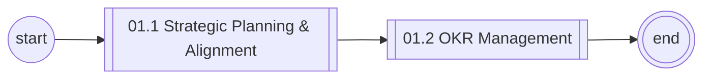
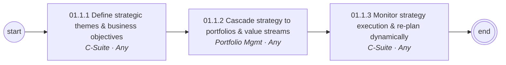
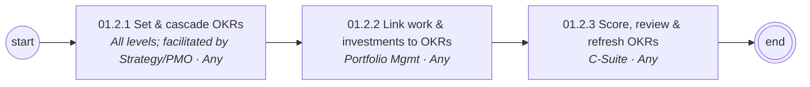

# 01 Strategy & Goal Management — L1/L2 Diagrams

Generated — edit `data/catalog.yaml`.

## L1 process chain

```mermaid
flowchart LR
  S((start))
  N01_1[["01.1 Strategic Planning & Alignment"]]
  S --> N01_1
  N01_2[["01.2 OKR Management"]]
  N01_1 --> N01_2
  N01_2 --> E(((end)))
```

## 01.1 Strategic Planning & Alignment (L2)

```mermaid
flowchart LR
  S((start))
  N01_1_1["01.1.1 Define strategic themes & business objectives<br/><i>C-Suite · Any</i>"]
  S --> N01_1_1
  N01_1_2["01.1.2 Cascade strategy to portfolios & value streams<br/><i>Portfolio Mgmt · Any</i>"]
  N01_1_1 --> N01_1_2
  N01_1_3["01.1.3 Monitor strategy execution & re-plan dynamically<br/><i>C-Suite · Any</i>"]
  N01_1_2 --> N01_1_3
  N01_1_3 --> E(((end)))
```

## 01.2 OKR Management (L2)

```mermaid
flowchart LR
  S((start))
  N01_2_1["01.2.1 Set & cascade OKRs<br/><i>All levels; facilitated by Strategy/PMO · Any</i>"]
  S --> N01_2_1
  N01_2_2["01.2.2 Link work & investments to OKRs<br/><i>Portfolio Mgmt · Any</i>"]
  N01_2_1 --> N01_2_2
  N01_2_3["01.2.3 Score, review & refresh OKRs<br/><i>C-Suite · Any</i>"]
  N01_2_2 --> N01_2_3
  N01_2_3 --> E(((end)))
```
