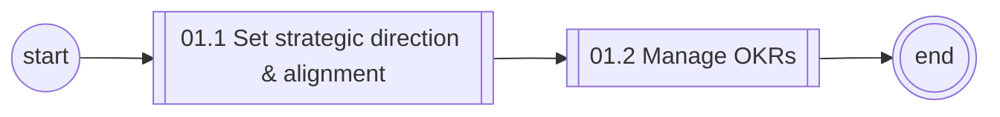
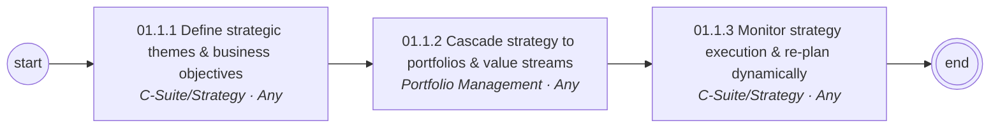
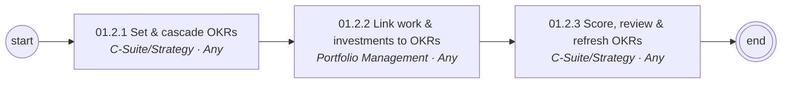

# 01 Strategy & Goal Management — L1/L2 diagrams

Generated from `data/catalog.json`. BPMN versions: see `../bpmn/generated/`.

## L1 process chain

## 01.1 Set strategic direction & alignment (L2)

## 01.2 Manage OKRs (L2)

