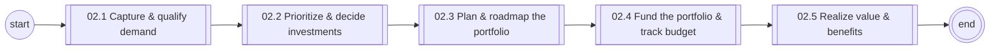
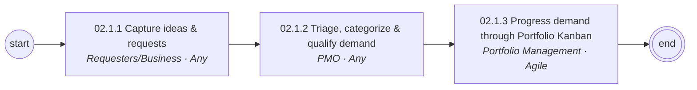
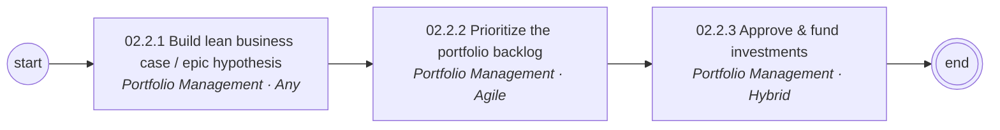
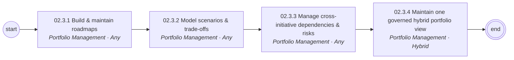
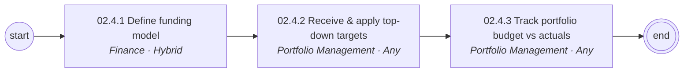
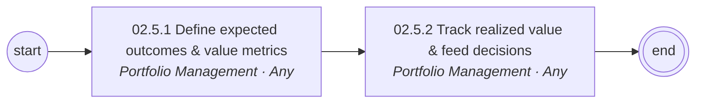

# 02 Demand & Portfolio Investment Management — L1/L2 diagrams

Generated from `data/catalog.json`. BPMN versions: see `../bpmn/generated/`.

## L1 process chain

## 02.1 Capture & qualify demand (L2)

## 02.2 Prioritize & decide investments (L2)

## 02.3 Plan & roadmap the portfolio (L2)

## 02.4 Fund the portfolio & track budget (L2)

## 02.5 Realize value & benefits (L2)

