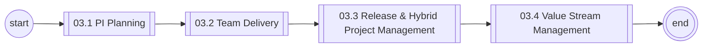
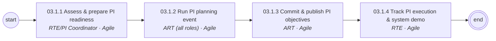
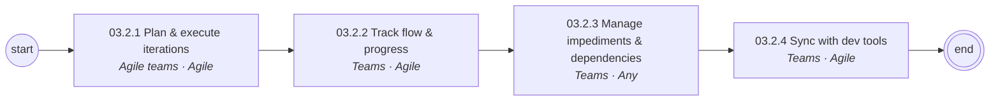
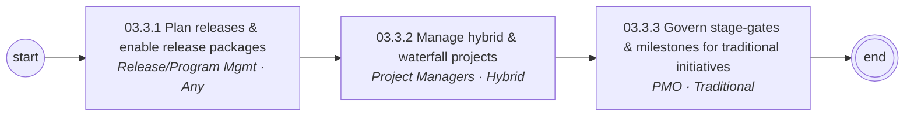
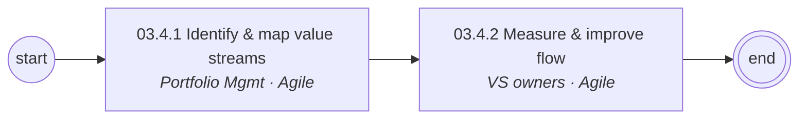

# 03 Agile Program & Delivery Management — L1/L2 Diagrams

Generated — edit `data/catalog.yaml`.

## L1 process chain

## 03.1 PI Planning (L2)

## 03.2 Team Delivery (L2)

## 03.3 Release & Hybrid Project Management (L2)

## 03.4 Value Stream Management (L2)

