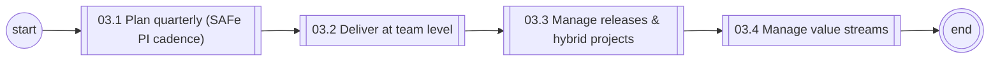
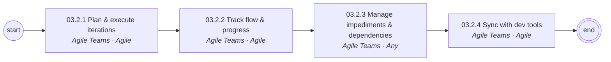
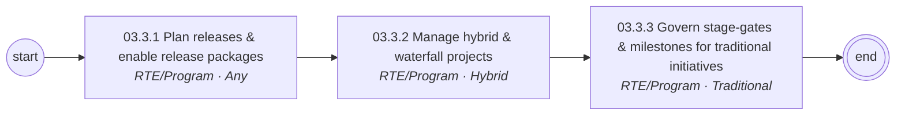
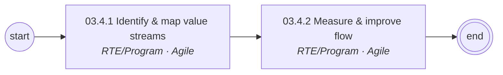

# 03 Agile Program & Delivery Management — L1/L2 diagrams

Generated from `data/catalog.json`. BPMN versions: see `../bpmn/generated/`.

## L1 process chain

## 03.1 Plan quarterly (SAFe PI cadence) (L2)

```mermaid
flowchart LR
  S((start))
  N03_1_1["03.1.1 Assess & prepare quarterly planning readiness<br/><i>RTE/Program · Agile</i>"]
  S --> N03_1_1
  N03_1_2["03.1.2 Run quarterly planning event<br/><i>Agile Teams · Agile</i>"]
  N03_1_1 --> N03_1_2
  N03_1_3["03.1.3 Commit & publish PI objectives<br/><i>Agile Teams · Agile</i>"]
  N03_1_2 --> N03_1_3
  N03_1_4["03.1.4 Baseline commitments & track PI execution<br/><i>RTE/Program · Agile</i>"]
  N03_1_3 --> N03_1_4
  N03_1_5["03.1.5 Manage PI risks (ROAM) & confidence vote<br/><i>RTE/Program · Agile</i>"]
  N03_1_4 --> N03_1_5
  N03_1_6["03.1.6 Run system demo & Inspect and Adapt<br/><i>RTE/Program · Agile</i>"]
  N03_1_5 --> N03_1_6
  N03_1_6 --> E(((end)))
```

## 03.2 Deliver at team level (L2)

## 03.3 Manage releases & hybrid projects (L2)

## 03.4 Manage value streams (L2)

