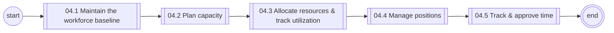
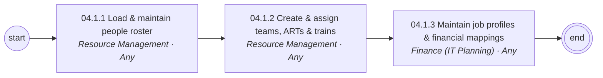
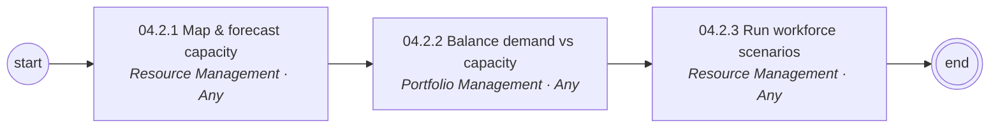
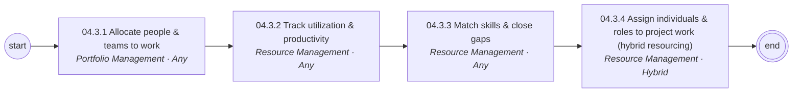
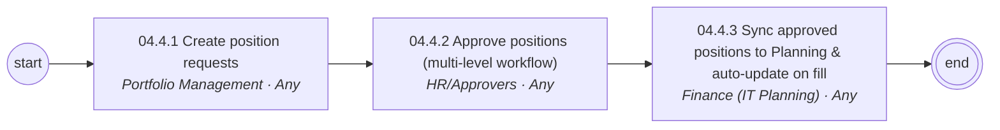
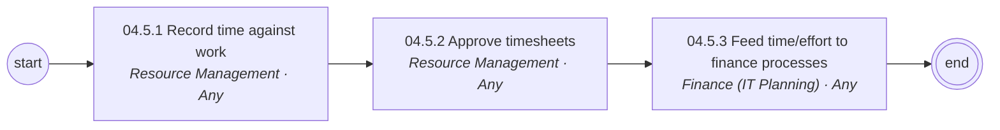

# 04 Workforce & Resource Management — L1/L2 diagrams

Generated from `data/catalog.json`. BPMN versions: see `../bpmn/generated/`.

## L1 process chain

## 04.1 Maintain the workforce baseline (L2)

## 04.2 Plan capacity (L2)

## 04.3 Allocate resources & track utilization (L2)

## 04.4 Manage positions (L2)

## 04.5 Track & approve time (L2)

