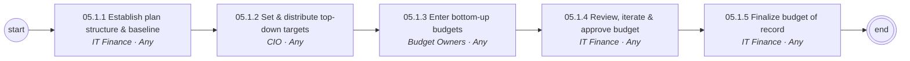
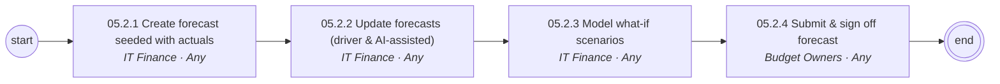
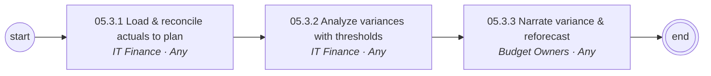
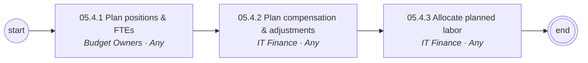
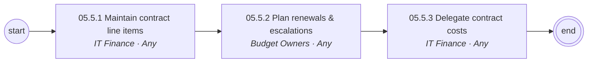
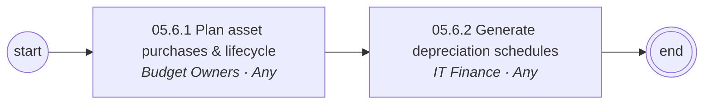
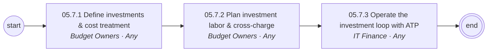
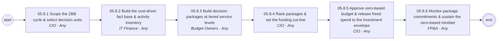

# 05 IT Financial Planning & Budgeting — L1/L2 diagrams

Generated from `data/catalog.json`. BPMN versions: see `../bpmn/generated/`.

## L1 process chain

```mermaid
flowchart LR
  S((start))
  N05_1[["05.1 Build the annual IT budget"]]
  S --> N05_1
  N05_2[["05.2 Forecast on a rolling cadence"]]
  N05_1 --> N05_2
  N05_3[["05.3 Analyze variance & reforecast"]]
  N05_2 --> N05_3
  N05_4[["05.4 Plan workforce & labor cost"]]
  N05_3 --> N05_4
  N05_5[["05.5 Plan vendors & contracts"]]
  N05_4 --> N05_5
  N05_6[["05.6 Plan capital & assets"]]
  N05_5 --> N05_6
  N05_7[["05.7 Plan project & investment finances"]]
  N05_6 --> N05_7
  N05_8[["05.8 Build & review a zero-based budget"]]
  N05_7 --> N05_8
  N05_8 --> E(((end)))
```

## 05.1 Build the annual IT budget (L2)

## 05.2 Forecast on a rolling cadence (L2)

## 05.3 Analyze variance & reforecast (L2)

## 05.4 Plan workforce & labor cost (L2)

## 05.5 Plan vendors & contracts (L2)

## 05.6 Plan capital & assets (L2)

## 05.7 Plan project & investment finances (L2)

## 05.8 Build & review a zero-based budget (L2)

