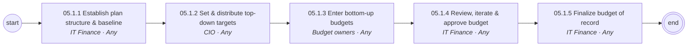
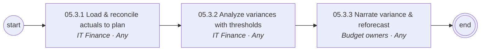
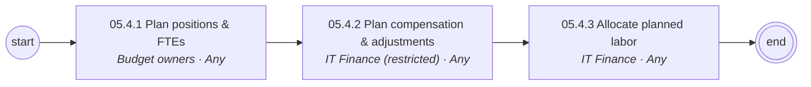
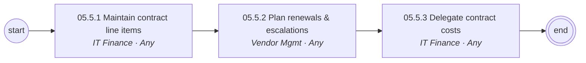
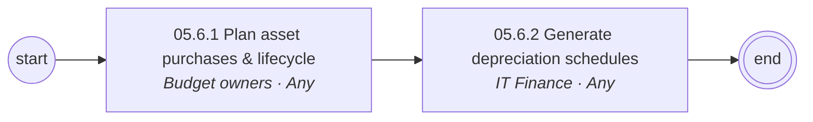
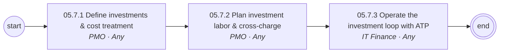

# 05 IT Financial Planning & Budgeting — L1/L2 Diagrams

Generated — edit `data/catalog.yaml`.

## L1 process chain

```mermaid
flowchart LR
  S((start))
  N05_1[["05.1 Annual IT Budgeting"]]
  S --> N05_1
  N05_2[["05.2 Rolling & Periodic Forecasting"]]
  N05_1 --> N05_2
  N05_3[["05.3 Variance Analysis & Reforecasting"]]
  N05_2 --> N05_3
  N05_4[["05.4 Workforce & Labor Cost Planning"]]
  N05_3 --> N05_4
  N05_5[["05.5 Vendor & Contract Planning"]]
  N05_4 --> N05_5
  N05_6[["05.6 Capital & Asset Planning"]]
  N05_5 --> N05_6
  N05_7[["05.7 Project & Investment Financial Planning"]]
  N05_6 --> N05_7
  N05_7 --> E(((end)))
```

## 05.1 Annual IT Budgeting (L2)

## 05.2 Rolling & Periodic Forecasting (L2)

## 05.3 Variance Analysis & Reforecasting (L2)

## 05.4 Workforce & Labor Cost Planning (L2)

## 05.5 Vendor & Contract Planning (L2)

## 05.6 Capital & Asset Planning (L2)

## 05.7 Project & Investment Financial Planning (L2)

