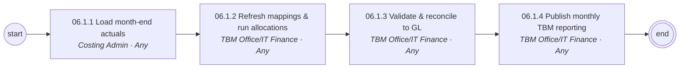
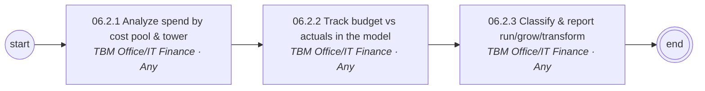
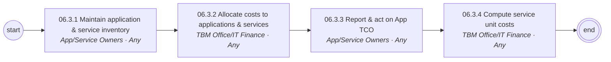
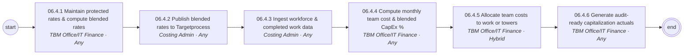
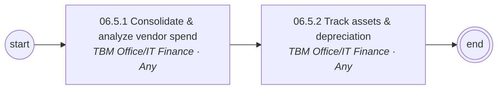
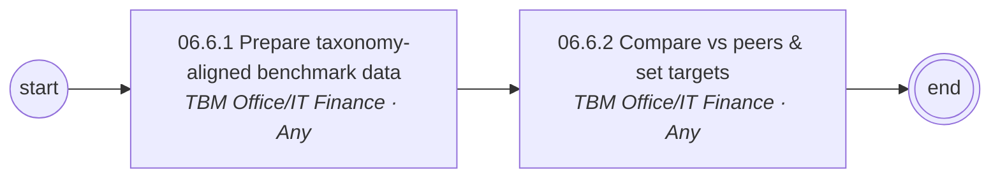

# 06 Cost Transparency & TBM Operations — L1/L2 diagrams

Generated from `data/catalog.json`. BPMN versions: see `../bpmn/generated/`.

## L1 process chain

```mermaid
flowchart LR
  S((start))
  N06_1[["06.1 Run the monthly allocation & close"]]
  S --> N06_1
  N06_2[["06.2 Analyze cost, variance & investment mix"]]
  N06_1 --> N06_2
  N06_3[["06.3 Compute application & service TCO"]]
  N06_2 --> N06_3
  N06_4[["06.4 Cost labor & capitalize"]]
  N06_3 --> N06_4
  N06_5[["06.5 Manage vendor & asset cost"]]
  N06_4 --> N06_5
  N06_6[["06.6 Benchmark against peers"]]
  N06_5 --> N06_6
  N06_6 --> E(((end)))
```

## 06.1 Run the monthly allocation & close (L2)

## 06.2 Analyze cost, variance & investment mix (L2)

## 06.3 Compute application & service TCO (L2)

## 06.4 Cost labor & capitalize (L2)

## 06.5 Manage vendor & asset cost (L2)

## 06.6 Benchmark against peers (L2)

