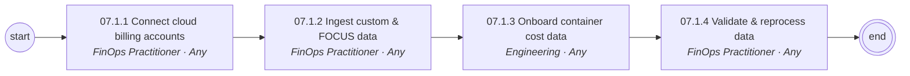
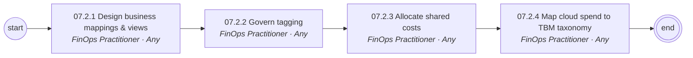
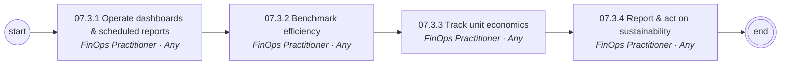
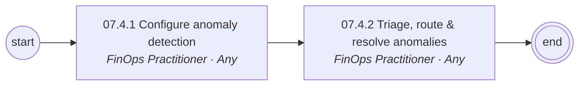
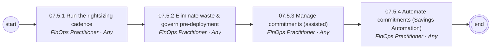
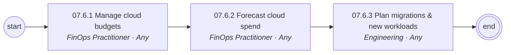

# 07 Cloud Financial Management (FinOps) — L1/L2 diagrams

Generated from `data/catalog.json`. BPMN versions: see `../bpmn/generated/`.

## L1 process chain

```mermaid
flowchart LR
  S((start))
  N07_1[["07.1 Establish the cloud cost data foundation"]]
  S --> N07_1
  N07_2[["07.2 Allocate cloud cost & govern tagging"]]
  N07_1 --> N07_2
  N07_3[["07.3 Report cloud cost, unit economics & sustainability"]]
  N07_2 --> N07_3
  N07_4[["07.4 Manage anomalies"]]
  N07_3 --> N07_4
  N07_5[["07.5 Optimize usage & rates"]]
  N07_4 --> N07_5
  N07_6[["07.6 Plan & forecast cloud spend"]]
  N07_5 --> N07_6
  N07_6 --> E(((end)))
```

## 07.1 Establish the cloud cost data foundation (L2)

## 07.2 Allocate cloud cost & govern tagging (L2)

## 07.3 Report cloud cost, unit economics & sustainability (L2)

## 07.4 Manage anomalies (L2)

## 07.5 Optimize usage & rates (L2)

## 07.6 Plan & forecast cloud spend (L2)

