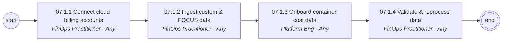
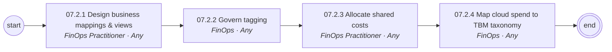
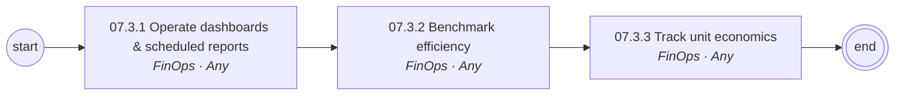
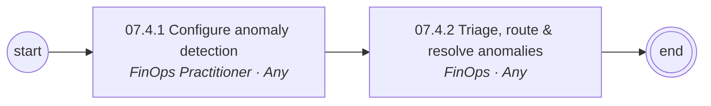
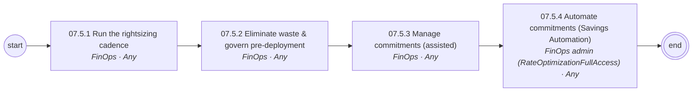
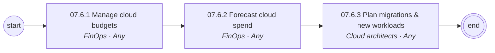
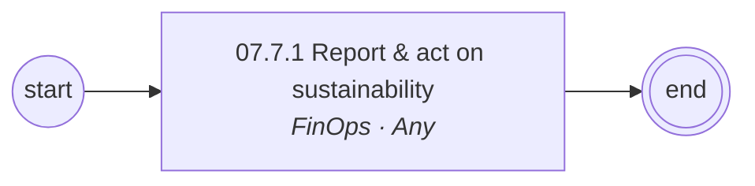

# 07 Cloud Financial Management (FinOps) — L1/L2 Diagrams

Generated — edit `data/catalog.yaml`.

## L1 process chain

```mermaid
flowchart LR
  S((start))
  N07_1[["07.1 Cloud Cost Data Foundation"]]
  S --> N07_1
  N07_2[["07.2 Cloud Allocation & Tagging Governance"]]
  N07_1 --> N07_2
  N07_3[["07.3 Cloud Reporting & Unit Economics"]]
  N07_2 --> N07_3
  N07_4[["07.4 Anomaly Management"]]
  N07_3 --> N07_4
  N07_5[["07.5 Usage & Rate Optimization"]]
  N07_4 --> N07_5
  N07_6[["07.6 Cloud Planning & Forecasting"]]
  N07_5 --> N07_6
  N07_7[["07.7 Cloud Sustainability"]]
  N07_6 --> N07_7
  N07_7 --> E(((end)))
```

## 07.1 Cloud Cost Data Foundation (L2)

## 07.2 Cloud Allocation & Tagging Governance (L2)

## 07.3 Cloud Reporting & Unit Economics (L2)

## 07.4 Anomaly Management (L2)

## 07.5 Usage & Rate Optimization (L2)

## 07.6 Cloud Planning & Forecasting (L2)

## 07.7 Cloud Sustainability (L2)

