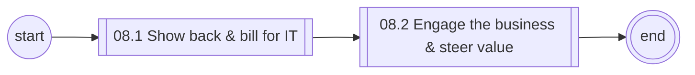
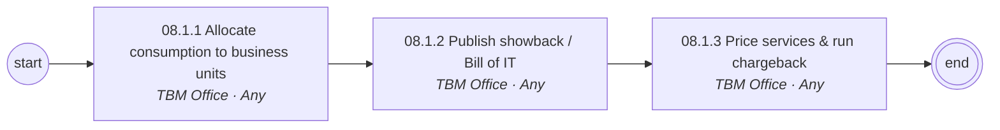
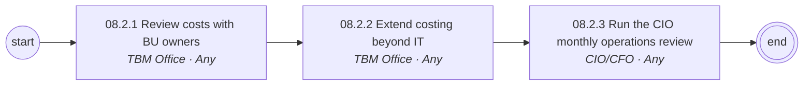

# 08 Consumption, Chargeback & Value Management — L1/L2 diagrams

Generated from `data/catalog.json`. BPMN versions: see `../bpmn/generated/`.

## L1 process chain

## 08.1 Show back & bill for IT (L2)

## 08.2 Engage the business & steer value (L2)

