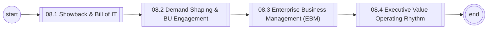
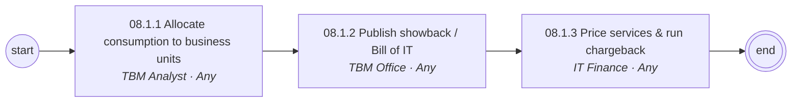
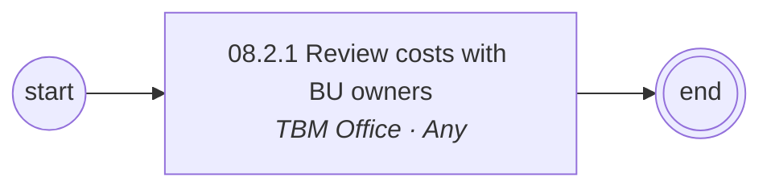
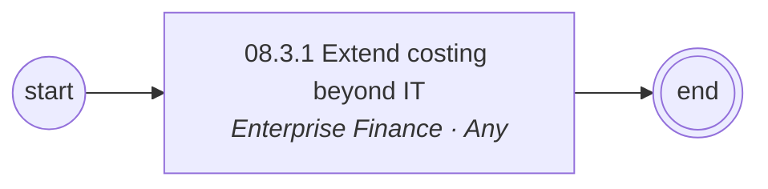
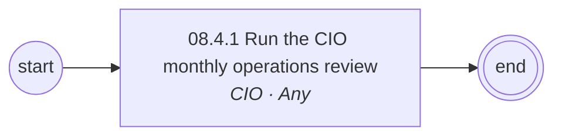

# 08 Consumption, Chargeback & Value Management — L1/L2 Diagrams

Generated — edit `data/catalog.yaml`.

## L1 process chain

## 08.1 Showback & Bill of IT (L2)

## 08.2 Demand Shaping & BU Engagement (L2)

## 08.3 Enterprise Business Management (EBM) (L2)

## 08.4 Executive Value Operating Rhythm (L2)

