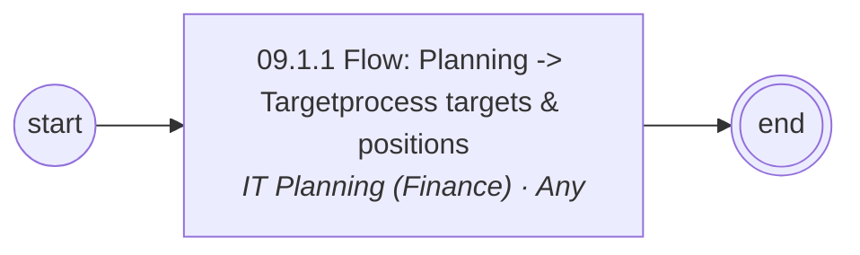
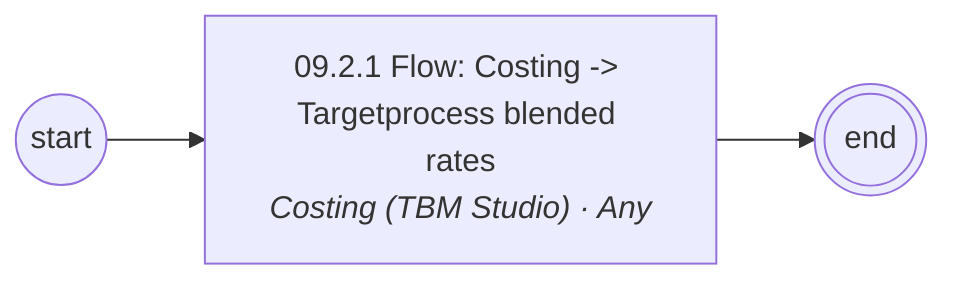
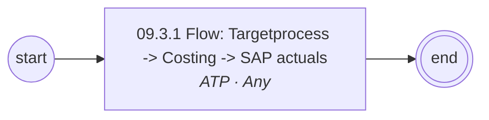
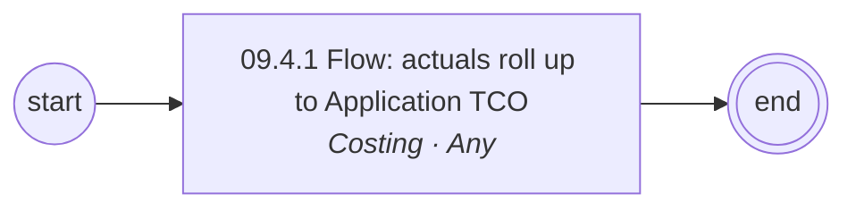
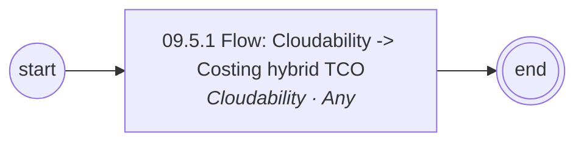
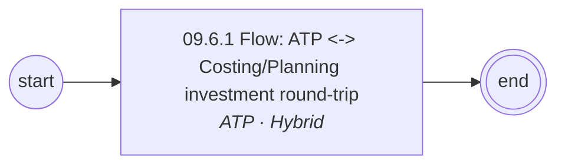

# 09 Cross-Tool End-to-End Flows — L1/L2 Diagrams

Generated — edit `data/catalog.yaml`.

## L1 process chain

```mermaid
flowchart LR
  S((start))
  N09_1[["09.1 UC3 - Portfolio Target Spend (targets down)"]]
  S --> N09_1
  N09_2[["09.2 UC2 - Work Allocation Rates (rates back)"]]
  N09_1 --> N09_2
  N09_3[["09.3 UC1 - Labor Capitalization (actuals in)"]]
  N09_2 --> N09_3
  N09_4[["09.4 UC4 - Cost Actuals to App TCO (TCO up)"]]
  N09_3 --> N09_4
  N09_5[["09.5 Cloud-to-TBM Flow"]]
  N09_4 --> N09_5
  N09_6[["09.6 Investment Loop"]]
  N09_5 --> N09_6
  N09_6 --> E(((end)))
```

## 09.1 UC3 - Portfolio Target Spend (targets down) (L2)

## 09.2 UC2 - Work Allocation Rates (rates back) (L2)

## 09.3 UC1 - Labor Capitalization (actuals in) (L2)

## 09.4 UC4 - Cost Actuals to App TCO (TCO up) (L2)

## 09.5 Cloud-to-TBM Flow (L2)

## 09.6 Investment Loop (L2)

