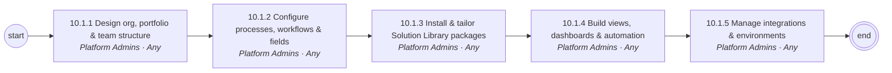
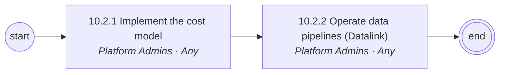
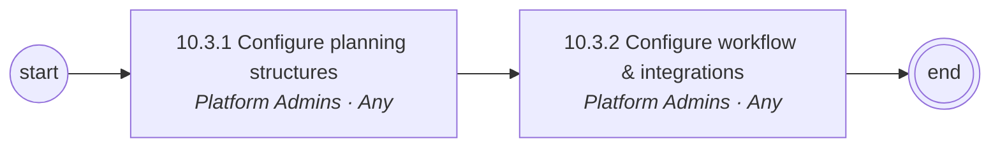
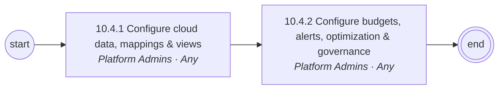
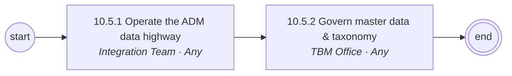
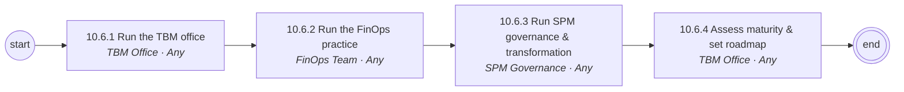
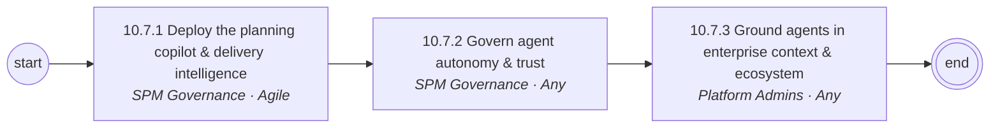

# 10 Platform Configuration, Data & Administration — L1/L2 diagrams

Generated from `data/catalog.json`. BPMN versions: see `../bpmn/generated/`.

## L1 process chain

```mermaid
flowchart LR
  S((start))
  N10_1[["10.1 Configure Targetprocess"]]
  S --> N10_1
  N10_2[["10.2 Configure Costing"]]
  N10_1 --> N10_2
  N10_3[["10.3 Configure Planning"]]
  N10_2 --> N10_3
  N10_4[["10.4 Configure Cloudability"]]
  N10_3 --> N10_4
  N10_5[["10.5 Operate cross-product data & integrations"]]
  N10_4 --> N10_5
  N10_6[["10.6 Run the practices & grow maturity"]]
  N10_5 --> N10_6
  N10_7[["10.7 Run AI-assisted planning & delivery intelligence"]]
  N10_6 --> N10_7
  N10_7 --> E(((end)))
```

## 10.1 Configure Targetprocess (L2)

## 10.2 Configure Costing (L2)

## 10.3 Configure Planning (L2)

## 10.4 Configure Cloudability (L2)

## 10.5 Operate cross-product data & integrations (L2)

## 10.6 Run the practices & grow maturity (L2)

## 10.7 Run AI-assisted planning & delivery intelligence (L2)

