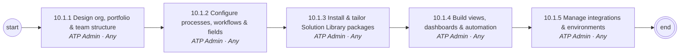
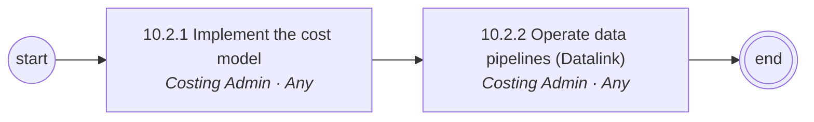
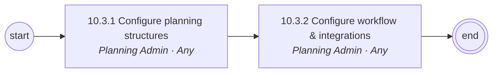
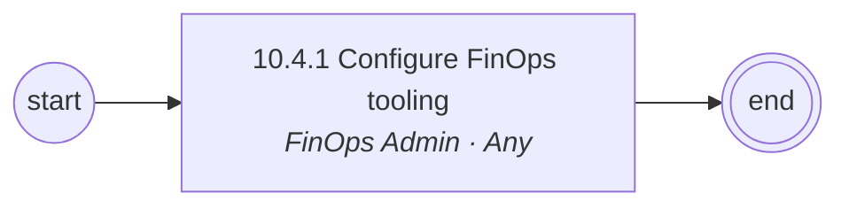
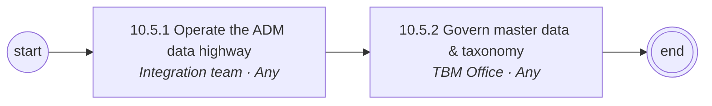

# 10 Platform Configuration, Data & Administration — L1/L2 Diagrams

Generated — edit `data/catalog.yaml`.

## L1 process chain

```mermaid
flowchart LR
  S((start))
  N10_1[["10.1 Targetprocess Configuration"]]
  S --> N10_1
  N10_2[["10.2 Costing Configuration"]]
  N10_1 --> N10_2
  N10_3[["10.3 Planning Configuration"]]
  N10_2 --> N10_3
  N10_4[["10.4 Cloudability Configuration"]]
  N10_3 --> N10_4
  N10_5[["10.5 Cross-Product Data & Integration Operations"]]
  N10_4 --> N10_5
  N10_6[["10.6 Practice Operations & Maturity"]]
  N10_5 --> N10_6
  N10_6 --> E(((end)))
```

## 10.1 Targetprocess Configuration (L2)

## 10.2 Costing Configuration (L2)

## 10.3 Planning Configuration (L2)

## 10.4 Cloudability Configuration (L2)

## 10.5 Cross-Product Data & Integration Operations (L2)

## 10.6 Practice Operations & Maturity (L2)

