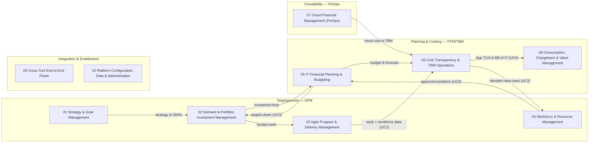

# L0 Process Landscape

Generated — edit `data/l0.yaml` / `data/l0-links.yaml`.

```mermaid
flowchart LR
  subgraph SPM["Targetprocess — SPM"]
    A01["01 Strategy & Goal Management"]
    A02["02 Demand & Portfolio Investment Management"]
    A03["03 Agile Program & Delivery Management"]
    A04["04 Workforce & Resource Management"]
  end
  subgraph ITFM["Planning & Costing — ITFM/TBM"]
    A05["05 IT Financial Planning & Budgeting"]
    A06["06 Cost Transparency & TBM Operations"]
    A08["08 Consumption, Chargeback & Value Management"]
  end
  subgraph FINOPS["Cloudability — FinOps"]
    A07["07 Cloud Financial Management (FinOps)"]
  end
  subgraph ENABLE["Integration & Enablement"]
    A09["09 Cross-Tool End-to-End Flows"]
    A10["10 Platform Configuration, Data & Administration"]
  end
  A05 -- "targets down (UC3)" --> A02
  A04 -- "approved positions (UC3)" --> A05
  A06 -- "blended rates back (UC2)" --> A04
  A03 -- "work + workforce data (UC1)" --> A06
  A06 -- "App TCO & Bill of IT (UC4)" --> A08
  A07 -- "cloud cost to TBM" --> A06
  A02 -- "investment loop" --> A05
  A01 -- "strategy & OKRs" --> A02
  A02 -- "funded work" --> A03
  A05 -- "budget & forecast" --> A06
```
