# Full catalog — L0-L2 · v0.6.0

Generated from `data/catalog.json` — **edit the JSON, not this file.** 9 areas · 45 groups · 149 processes. Each group links to its BPMN diagram; every process shows its BPMN lane and task type.

## L0-01 Strategy & Goal Management

*Define enterprise strategy and cascade it as measurable objectives so every portfolio, program and team has line of sight from work to strategic intent.* Primary: **Targetprocess**. Band: steer. Lanes: C-Suite/Strategy; Portfolio Management; Finance.

Diagrams: [BPMN](../diagrams/bpmn/generated/L0-01.bpmn) · [Mermaid](../diagrams/mermaid/area-01.md)

### 01.1 Set strategic direction & alignment `G-011`

Original name: Strategic Planning & Alignment. BPMN: [`01.1.bpmn`](../diagrams/bpmn/generated/01.1.bpmn) · 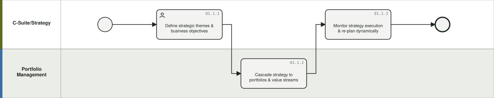

**01.1.1 Define strategic themes & business objectives** `P-0001` — Capture enterprise strategy as strategic themes/objectives that will govern portfolio investment.
- What you get: strategic themes, objective hierarchy
- BPMN: lane *C-Suite/Strategy*, User task | Delivery model: Any | Product: Targetprocess | Who: Executive leadership, Portfolio management (C-Suite, VP Strategy, Portfolio Mgmt) | When: Quarterly (Annual + quarterly refresh)
- Inputs: Corporate strategy, market context → Outputs: Strategic themes, objective hierarchy
- Config: Objective entity (OKR solution), Group/portfolio hierarchy, roadmap views
- Framework: SPM: Strategic Planning | SAFe: Strategic Themes | Flows: — | Evidence: SPM CFD; WFM deck; IBM Docs OKR solution

**01.1.2 Cascade strategy to portfolios & value streams** `P-0002` — Link objectives to portfolios, value streams and ARTs so investment and work align top-down (line of sight). Validate the full traceability chain (Strategic Objective > Portfolio Priority > Product/Value Stream > PI Objective > Epic > Feature > Story > Delivery > Outcome) and flag breaks: objectives with no execution, work with no strategic linkage, delivered work with no outcome.
- What you get: objective-portfolio linkage, funded value streams
- BPMN: lane *Portfolio Management*, Task | Delivery model: Any | Product: Targetprocess | Who: Portfolio management (Portfolio Mgmt, Value Stream owners) | When: Continuous (Annual + on change)
- Inputs: Strategic themes → Outputs: Objective-portfolio linkage, funded value streams
- Config: Portfolio/ART (Group) structure, relations objectives->portfolio epics, OKR cascade (Ultimate>Strategic>Tactical)
- Framework: SPM: Strategic Planning | SAFe: LPM | Flows: — | Evidence: TBMC25 Client Zero OKR cascade; EAP CFD 5-step strategic planning; PI Planning/EVD Agent requirements (IBM, anonymized) §6.1

**01.1.3 Monitor strategy execution & re-plan dynamically** `P-0003` — Track progress of strategy in real time via dashboards and re-plan objectives and allocations as conditions change.
- What you get: strategy course corrections
- BPMN: lane *C-Suite/Strategy*, Task | Delivery model: Any | Product: Targetprocess (+ Costing) | Who: Executive leadership, Portfolio management (C-Suite, Portfolio Mgmt) | When: Continuous (Quarterly + continuous)
- Inputs: OKR progress, delivery rollups, financials → Outputs: Strategy course corrections
- Config: Corporate Strategy Dashboard, OKR hierarchy views, dashboards fed to leadership reporting (CT Leadership Review)
- Framework: SPM: Strategic Planning | SAFe: Measure & Grow | Flows: — | Evidence: LFM demo (Value Realization tab); EAP CFD step 4-5

### 01.2 Manage OKRs `G-012`

Original name: OKR Management. BPMN: [`01.2.bpmn`](../diagrams/bpmn/generated/01.2.bpmn) · 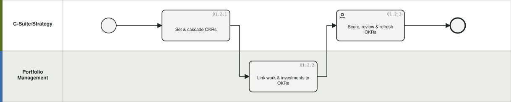

**01.2.1 Set & cascade OKRs** `P-0004` — Define objectives and measurable key results at enterprise/portfolio/ART/team levels (3-level or SAFe model) per period.
- What you get: oKR tree with owners & periods
- BPMN: lane *C-Suite/Strategy*, Task | Delivery model: Any | Product: Targetprocess | Who: Portfolio management, PMO & project managers (All levels; facilitated by Strategy/PMO) | When: Quarterly (Quarterly/annual)
- Inputs: Strategic themes → Outputs: OKR tree with owners & periods
- Config: OKR solution: Objective & Key Result entities, period assignment, weighted scoring; objective-writing standards (outcome- not task-phrased, measurable, sufficient supporting features)
- Framework: SPM: Strategic Planning | SAFe: OKRs | Flows: — | Evidence: IBM Docs/TP guide OKR solution; Client Zero cascade; PI Planning/EVD Agent requirements (IBM, anonymized) §7.6

**01.2.2 Link work & investments to OKRs** `P-0005` — Relate portfolio epics, features and budgets to objectives so funding and delivery inherit strategic alignment.
- What you get: work-to-objective traceability
- BPMN: lane *Portfolio Management*, Task | Delivery model: Any | Product: Targetprocess | Who: Portfolio management, Product management (Portfolio Mgmt, Product) | When: Continuous (Continuous)
- Inputs: OKR tree, portfolio backlog → Outputs: Work-to-objective traceability
- Config: Relations work items->Objectives, KPI-linked key results, alignment views
- Framework: SPM: Strategic Planning | Flows: — | Evidence: WFM deck (align resources to OKRs); LFM demo

**01.2.3 Score, review & refresh OKRs** `P-0006` — Measure key results (KPI-driven), run quarterly reviews, score and reset objectives.
- What you get: oKR scores, refreshed OKRs
- BPMN: lane *C-Suite/Strategy*, User task | Delivery model: Any | Product: Targetprocess | Who: Executive leadership, Portfolio management, Agile teams & RTEs (C-Suite, Portfolio Mgmt, Teams) | When: Quarterly (Quarterly)
- Inputs: KR measurements, delivery data → Outputs: OKR scores, refreshed OKRs
- Config: KPI solution measurements, calculated fields, OKR dashboards & review views
- Framework: SPM: Strategic Planning | SAFe: Measure & Grow | Flows: — | Evidence: TP guide OKR; SPM maturity model (Strategic Planning lens)

## L0-02 Demand & Portfolio Investment Management

*Capture all demand into one funnel, qualify and prioritize it against strategy and capacity, fund the winning investments, and manage the portfolio roadmap and its value realization.* Primary: **Targetprocess**. Band: core. Lanes: Requesters/Business; Portfolio Management; PMO; Finance.

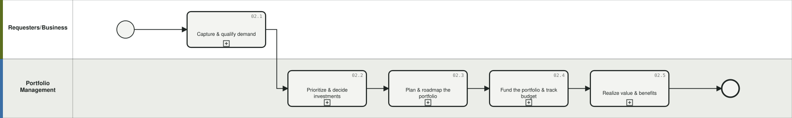

Diagrams: [BPMN](../diagrams/bpmn/generated/L0-02.bpmn) · [Mermaid](../diagrams/mermaid/area-02.md)

### 02.1 Capture & qualify demand `G-021`

Original name: Demand Intake & Qualification. BPMN: [`02.1.bpmn`](../diagrams/bpmn/generated/02.1.bpmn) · 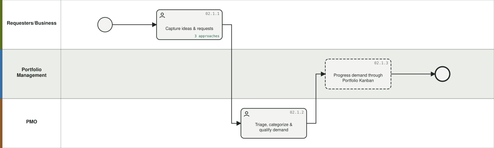

**02.1.1 Capture ideas & requests** `P-0007` — Collect demand from all channels - Service Desk portal, email, ServiceNow ideation - into Request/idea entities.
- What you get: logged demand records
- BPMN: lane *Requesters/Business*, User task | Delivery model: Any | Product: Targetprocess (+ ServiceNow) | Who: Business, app & service owners, Requesters (Requesters (any), Service Desk users) | When: Continuous (Continuous)
- Inputs: Ideas, requests, mandates → Outputs: Logged demand records
- Config: Service Desk portal, Request entity + request types, email integration, voting; ServiceNow intake integration
- Framework: SPM: Demand Intake | FinOps n/a | Flows: — | Evidence: TP guide Service Desk; WFM deck (ServiceNow ideation front-end)

**02.1.2 Triage, categorize & qualify demand** `P-0008` — Route, categorize (work item taxonomy, BAU vs change, CapEx/OpEx) and qualify requests against strategy before they enter the portfolio funnel. Includes detecting materially similar or duplicate demand (overlapping investments, teams pursuing similar outcomes) beyond title matching.
- What you get: qualified demand in funnel
- BPMN: lane *PMO*, User task | Delivery model: Any | Product: Targetprocess | Who: Portfolio management, PMO & project managers (PMO, Portfolio Mgmt) | When: Weekly (Weekly cadence)
- Inputs: Demand records → Outputs: Qualified demand in funnel
- Config: Request workflow states, triage boards, automation rules (routing/auto-reply/linked entities), work-intake taxonomy (categories, CapEx/OpEx, non-labor categories); duplicate/overlap detection across descriptions, outcomes, journeys, capabilities
- Framework: SPM: Demand Intake | Flows: — | Evidence: SPM journey map (work-intake model taxonomy); TP guide; PI Planning/EVD Agent requirements (IBM, anonymized) §6.2, §8.3

**02.1.3 Progress demand through Portfolio Kanban** `P-0009` — Move epics Funnel-Reviewing-Analyzing-Backlog-Implementing-Done with WIP limits and visible decision states.
- What you get: decided/scheduled portfolio backlog
- BPMN: lane *Portfolio Management*, Task | Delivery model: Agile | Product: Targetprocess | Who: Portfolio management (Portfolio Mgmt, LPM function) | When: Continuous (Continuous)
- Inputs: Qualified demand → Outputs: Decided/scheduled portfolio backlog
- Config: Portfolio Epic workflow states, Kanban board views, WIP limits, per-state permissions
- Framework: SAFe: Portfolio Kanban | SPM: Demand Intake | Flows: — | Evidence: SAFe LPM; TP entity workflows

### 02.2 Prioritize & decide investments `G-022`

Original name: Prioritization & Investment Decision. BPMN: [`02.2.bpmn`](../diagrams/bpmn/generated/02.2.bpmn) · 

**02.2.1 Build lean business case / epic hypothesis** `P-0010` — Estimate outcomes, effort and MVP for candidate investments; capture hypothesis and benefit model. Decomposition runs opportunities > portfolio epics > features > stories with sequenced delivery increments.
- What you get: lean business cases with estimates
- BPMN: lane *Portfolio Management*, User task | Delivery model: Any | Product: Targetprocess | Who: Portfolio management, IT Finance & FP&A (Epic owners, Portfolio Mgmt, Finance) | When: Event-driven (Per candidate epic)
- Inputs: Qualified epics → Outputs: Lean business cases with estimates
- Config: Budgeting solution templates (epic hypothesis, lean business case), rich-text/custom fields, Portfolio Epic Score report
- Framework: SAFe: Epic/LPM | SPM: Demand Intake | Flows: — | Evidence: TP Budgeting solution; LFM demo (epic scoring); PI Planning/EVD Agent requirements (IBM, anonymized) §6.3

**02.2.2 Prioritize by value (WSJF / scoring)** `P-0011` — Rank the portfolio backlog by WSJF or configurable value scoring against strategy. Hybrid alternative: manual or objective-scoring prioritization for non-agile work.
- What you get: ranked backlog
- BPMN: lane *Portfolio Management*, User task | Delivery model: Agile | Product: Targetprocess | Who: Executive leadership, Portfolio management (Portfolio Mgmt, Business owners) | When: Event-driven (Per planning cadence)
- Inputs: Business cases, capacity signal → Outputs: Ranked backlog
- Config: Numeric custom fields (BV, TC, RR/OE, size), calculated field/metric for WSJF, prioritized list views, objective-scoring
- Framework: SAFe: WSJF | SPM: Demand Intake | Flows: — | Evidence: TP calculated fields; WFM deck prioritization

**02.2.3 Approve & fund investments** `P-0012` — Make funding decisions - stage-gate approval or lean value-stream funding - and record approved budget against the investment. Supports both stage-gate (phase approvals via entity states) and lean value-stream funding.
- What you get: funded investments/epics
- BPMN: lane *Portfolio Management*, User task | Delivery model: Hybrid | Product: Targetprocess (+ Costing, Planning) | Who: Portfolio management, IT Finance & FP&A, PMO & project managers (Portfolio Mgmt, Finance, PMO) | When: Quarterly (Quarterly/participatory budgeting)
- Inputs: Ranked backlog, budget envelope → Outputs: Funded investments/epics
- Config: Entity states + per-state role permissions (gates), automation rules for approvals, Budgeting solution (fund Portfolios/Work/People/Products), A1 approved-investment-budget feed
- Framework: SAFe: Lean Budgets & Guardrails | TBM: Investment in Innovation | Flows: INV, ZBB | Evidence: TP Budgeting; ApptioOne CFD IIP bi-directional loop

### 02.3 Plan & roadmap the portfolio `G-023`

Original name: Portfolio Planning & Roadmapping. BPMN: [`02.3.bpmn`](../diagrams/bpmn/generated/02.3.bpmn) · 

**02.3.1 Build & maintain roadmaps** `P-0013` — Publish time-based portfolio/product/program roadmaps against releases and PIs at multiple levels.
- What you get: multi-level roadmaps
- BPMN: lane *Portfolio Management*, User task | Delivery model: Any | Product: Targetprocess | Who: Portfolio management, Product management (Portfolio Mgmt, Product) | When: Continuous (Quarterly + continuous)
- Inputs: Funded epics, PI calendar → Outputs: Multi-level roadmaps
- Config: Timeline/Roadmap views on Portfolio Epics/Epics/Features vs Releases/PIs, multi-level roadmaps
- Framework: SPM: Portfolio Mgmt | Flows: — | Evidence: TP view modes; Solution Overview deck

**02.3.2 Model scenarios & trade-offs** `P-0014` — Evaluate alternative portfolio mixes (scope, timing, capacity, budget) and promote the chosen scenario to the plan of record. Scenario questions include capacity loss, feature slip, objective re-prioritization, approval delays, platform constraints and the financial impact of moving scope.
- What you get: selected scenario/baseline
- BPMN: lane *Portfolio Management*, Task | Delivery model: Any | Product: Targetprocess (+ Planning) | Who: Portfolio management, IT Finance & FP&A (Portfolio Mgmt, Finance) | When: Annual / per cycle (Planning cycles + ad hoc)
- Inputs: Backlog, capacity, targets → Outputs: Selected scenario/baseline
- Config: Scenario Planning solution (plan variants, promote scenario to baseline), demand vs capacity data, budget dashboards
- Framework: SPM: Portfolio Mgmt | SAFe: Participatory Budgeting | Flows: — | Evidence: Customer PowerUp (scenario planning, baselines); TP solutions; PI Planning/EVD Agent requirements (IBM, anonymized) §8.4

**02.3.3 Manage cross-initiative dependencies & risks** `P-0015` — Identify, visualize and resolve dependencies and portfolio-level risks across initiatives and trains - including cross-ART/cross-portfolio dependencies, shared-service contention, platform bottlenecks, missing predecessors, insufficient lead time and aging dependencies.
- What you get: dependency/risk register & resolutions
- BPMN: lane *Portfolio Management*, Task | Delivery model: Any | Product: Targetprocess | Who: Portfolio management, Agile teams & RTEs (Portfolio Mgmt, RTEs) | When: Continuous (Continuous)
- Inputs: Roadmaps, PI plans → Outputs: Dependency/risk register & resolutions
- Config: Dependency/Impediment entities, relations, ART Planning Board, Risk Management solution; dependency graph & prioritized heatmap, dependency ownership & aging tracking
- Framework: SAFe: Program risks/ROAM | SPM: Portfolio Mgmt | Flows: — | Evidence: TP entities; PI Planning solution; PI Planning/EVD Agent requirements (IBM, anonymized) §7.3, §11

**02.3.4 Maintain one governed hybrid portfolio view** `P-0016` — View and manage all work across hybrid programs - agile (epics/features from teams' tools) and waterfall projects - in a single governed environment with common categorization (BAU vs Change, CapEx/OpEx).
- What you get: unified hybrid portfolio views & status
- BPMN: lane *Portfolio Management*, Task | Delivery model: Hybrid | Product: Targetprocess (+ Jira/ADO) | Who: Portfolio management, PMO & project managers (Portfolio Mgmt, PMO) | When: Continuous (Continuous)
- Inputs: Agile work (synced), project plans → Outputs: Unified hybrid portfolio views & status
- Config: Hybrid portfolio views (agile + waterfall side by side), Hybrid Project Management solution, common work categorization fields, Jira/ADO sync for agile initiatives
- Framework: SPM: Hybrid Portfolio Mgmt (HPM solution area) | Flows: — | Evidence: WFM deck (View all work across Hybrid Programs); Customer PowerUp (hybrid planning)

### 02.4 Fund the portfolio & track budget `G-024`

Original name: Portfolio Funding & Budget Tracking. BPMN: [`02.4.bpmn`](../diagrams/bpmn/generated/02.4.bpmn) · 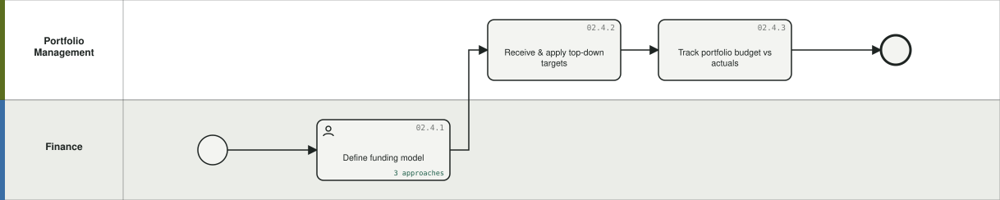

**02.4.1 Define funding model** `P-0017` — Choose and configure project-based, product/value-stream (continuous) or hybrid funding with planning periods. Hybrid organizations typically run project-based and product-based funding side by side during transition. Where IT Finance runs ZBB (05.8), the value-stream envelope is the *change* budget that receives freed run spend - value streams are not themselves re-justified from zero.
- What you get: configured funding structure
- BPMN: lane *Finance*, User task | Delivery model: Hybrid | Budgeting method: Lean / participatory (value-stream) or project-based | Product: Targetprocess (+ Planning) | Who: Portfolio management, IT Finance & FP&A, PMO & project managers (Finance, Portfolio Mgmt, PMO) | When: Annual / per cycle (Annual (model), evolving)
- Inputs: Operating model decisions → Outputs: Configured funding structure
- Config: Budgeting solution (annual or custom periods, value-stream funding), portfolio structure, budget guardrails by horizon/capacity/initiative
- Framework: SAFe: Lean Budgets | SPM: Financial Mgmt | Flows: — | Evidence: EAP CFD (annual->continuous); TP Budgeting

**02.4.2 Receive & apply top-down targets** `P-0018` — Consume target spend/budget artifacts from IT Planning and apply them as portfolio budget targets (UC3 receive side). In a ZBB cycle the target carries the freed-spend uplift from 05.8.5.
- What you get: top-down budget/target artifacts in ATP
- BPMN: lane *Portfolio Management*, Task | Delivery model: Any | Budgeting method: Any | Product: Targetprocess (+ Planning) | Who: Portfolio management, IT Finance & FP&A (Portfolio Mgmt, Finance) | When: Annual / per cycle (Per planning cycle)
- Inputs: Portfolio spend targets (ADM from Planning) → Outputs: Top-down budget/target artifacts in ATP
- Config: Budget Targets report, target budget entities, ADM/data highway feed
- Framework: SPM: Financial Mgmt | TBM: Plan & Govern | Flows: UC3, INV, ZBB | Evidence: E2E BPMN UC3; LFM demo (Target Budget from planning solution)

**02.4.3 Track portfolio budget vs actuals** `P-0019` — Compare proposed/funded budgets against costed work and actuals; adjust funding in-year.
- What you get: variance signals, funding adjustments
- BPMN: lane *Portfolio Management*, Task | Delivery model: Any | Budgeting method: Any | Product: Targetprocess (+ Costing) | Who: Portfolio management, IT Finance & FP&A (Portfolio Mgmt, Finance) | When: Monthly (Monthly)
- Inputs: Costed allocations, actuals, budgets → Outputs: Variance signals, funding adjustments
- Config: Budget vs actuals dashboards, money custom fields, blended-rate costed work allocations, Budgeting view (Proposed Labor vs Target)
- Framework: SPM: Financial Mgmt | Flows: UC3, UC2 | Evidence: LFM demo; WFM deck Finance Manager activities

### 02.5 Realize value & benefits `G-025`

Original name: Value & Benefits Realization. BPMN: [`02.5.bpmn`](../diagrams/bpmn/generated/02.5.bpmn) · 

**02.5.1 Define expected outcomes & value metrics** `P-0020` — Set benefit hypotheses, KPIs and leading indicators for each funded investment.
- What you get: outcome metrics per investment
- BPMN: lane *Portfolio Management*, User task | Delivery model: Any | Product: Targetprocess | Who: Portfolio management, IT Finance & FP&A (Epic owners, Finance, Strategy) | When: Event-driven (At funding)
- Inputs: Business cases → Outputs: Outcome metrics per investment
- Config: KPI solution, key results on epics, money/number custom fields
- Framework: SPM: Value Realization | TBM: Delivering Value | Flows: — | Evidence: SPM maturity model; TP KPI solution

**02.5.2 Track realized value & feed decisions** `P-0021` — Measure delivered outcomes vs hypothesis after release and feed results into ongoing funding and portfolio reviews.
- What you get: value realization reports, kill/persevere/pivot decisions
- BPMN: lane *Portfolio Management*, Task | Delivery model: Any | Product: Targetprocess (+ Costing) | Who: Portfolio management, IT Finance & FP&A (Portfolio Mgmt, Finance) | When: Quarterly (Quarterly)
- Inputs: KPI measurements, cost actuals → Outputs: Value realization reports, kill/persevere/pivot decisions
- Config: KPI measurements, dashboards, Value Realization tab in leadership reporting, ROI/margin analysis
- Framework: SPM: Value Realization | TBM: four value conversations | Flows: — | Evidence: WFM closed loop (Analyze & Act); LFM demo

## L0-03 Agile Program & Delivery Management

*Plan and execute work on a PI and iteration cadence across ARTs, solution trains and teams, including hybrid/waterfall delivery, release management and value stream flow.* Primary: **Targetprocess**. Band: core. Lanes: RTE/Program; Agile Teams; Product Management; Dev tools (Jira/ADO).

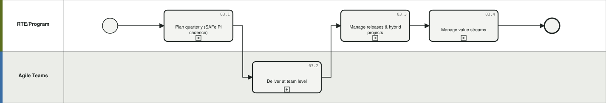

Diagrams: [BPMN](../diagrams/bpmn/generated/L0-03.bpmn) · [Mermaid](../diagrams/mermaid/area-03.md)

### 03.1 Plan quarterly (SAFe PI cadence) `G-031`

Original name: Quarterly Planning (SAFe PI cadence). BPMN: [`03.1.bpmn`](../diagrams/bpmn/generated/03.1.bpmn) · 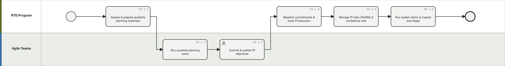

**03.1.1 Assess & prepare quarterly planning readiness** `P-0022` — Run readiness checks (PI/ART entities, objectives, features, team objectives, estimates, owners, dependencies, definition-of-ready) with a scored readiness verdict at team/ART/solution-train/portfolio level, resolution recommendations for each gap, and the 4-phase preparation plan.
- What you get: rEADY verdict, prepared backlog & objectives
- BPMN: lane *RTE/Program*, Task | Delivery model: Agile | Product: Targetprocess | Who: Agile teams & RTEs, Product management (RTE/PI Coordinator, Product Owners, System Architect, Scrum Masters) | When: Event-driven (Per PI (8-12 wks))
- Inputs: Portfolio backlog, ART/team structure → Outputs: READY verdict, prepared backlog & objectives
- Config: PI & ART entities with dates, ART/Program PI Objectives, Team PI Objectives, features assigned to PI release, capacity fields (velocity = people x 8 rule; 80/20 allocation), PI Planning solution Pre-Plan views; readiness scoring & gap-resolution workflow (assign owner, add estimate, split feature, escalate decision), definition-of-ready rules
- Framework: SAFe: PI Planning | Flows: — | Evidence: PI Planning Demo Script (readiness + 20-day plan); PI Planning solution 1.0.0; PI Planning/EVD Agent requirements (IBM, anonymized) §7.1-7.2

**03.1.2 Run quarterly planning event** `P-0023` — Facilitate big-room planning: teams plan features/stories into iterations, map dependencies, ROAM risks.
- What you get: draft team plans, dependency board
- BPMN: lane *Agile Teams*, Task | Delivery model: Agile | Product: Targetprocess | Who: Executive leadership, Agile teams & RTEs (ART (all roles), Business Owners) | When: Event-driven (Per PI)
- Inputs: Prepared backlog, capacity → Outputs: Draft team plans, dependency board
- Config: PI Planning Board, ART Planning Board (dependencies), Team Iteration assignment, WSJF-ordered features, risk entities
- Framework: SAFe: PI Planning | Flows: — | Evidence: PI Planning solution; EAP CFD program mgmt 4-step

**03.1.3 Commit & publish PI objectives** `P-0024` — Finalize team/ART PI objectives with business value, confidence vote, and publish the program board.
- What you get: committed PI objectives & program board
- BPMN: lane *Agile Teams*, User task | Delivery model: Agile | Product: Targetprocess | Who: Executive leadership, Agile teams & RTEs (ART, Business Owners) | When: Event-driven (Per PI)
- Inputs: Draft plans → Outputs: Committed PI objectives & program board
- Config: Team PI Objectives (Committed/Stretch, confidence %, BV points), PI Dashboard, Program Board
- Framework: SAFe: PI Planning | Flows: — | Evidence: PI Planning Demo Script

**03.1.4 Baseline commitments & track PI execution** `P-0025` — Baseline what was committed at PI planning (objectives, features, capacity and funding assumptions, accepted risks, confidence results) as an auditable record, then continuously validate delivery against it - velocity, slippage, blocked dependencies, carryover, flow metrics - distinguishing normal variation from likely missed commitments; run system demos and RTE briefings.
- What you get: progress/flow reporting, I&A actions
- BPMN: lane *RTE/Program*, Task | Delivery model: Agile | Product: Targetprocess (+ Jira/ADO) | Who: Agile teams & RTEs (RTE, teams, stakeholders) | When: Event-driven (Iteration cadence)
- Inputs: Committed plan, delivery data → Outputs: Progress/flow reporting, I&A actions
- Config: PI Dashboard, dependency & risk boards, progress rollup metrics, burndown/CFD reports; commitment baseline snapshot, planned-vs-actual objective tracking, predictive ART health (flow time/efficiency/load, WIP, dependency aging), RTE/STE daily briefing views
- Framework: SAFe: PI execution | Flows: — | Evidence: TP reports; PI Planning solution Coordinate & Deliver views; PI Planning/EVD Agent requirements (IBM, anonymized) §9.1-9.4

**03.1.5 Manage PI risks (ROAM) & confidence vote** `P-0145` — Capture and classify program risks (Resolved/Owned/Accepted/Mitigated) with owners and mitigation actions, monitor aging and severity, and run the confidence vote - correlating votes with capacity, readiness and dependency data, and recording remediation when confidence is low.
- What you get: rOAMed risk register, confidence results & remediation actions
- BPMN: lane *RTE/Program*, Task | Delivery model: Agile | Product: Targetprocess | Who: Executive leadership, Agile teams & RTEs, Business, app & service owners (RTE, teams, Business Owners) | When: Continuous (Per PI + continuous)
- Inputs: Identified risks, plan data → Outputs: ROAMed risk register, confidence results & remediation actions
- Config: Risk entities with ROAM classification fields, risk boards, owners & due dates, confidence-vote capture, risk aging/escalation automation rules
- Framework: SAFe: ROAM, confidence vote | Flows: — | Evidence: PI Planning/EVD Agent requirements (IBM, anonymized) §8.5-8.6

**03.1.6 Run system demo & Inspect and Adapt** `P-0146` — Prepare and run the system demo (demo candidates showing progress toward objectives, outcome summaries) and the Inspect & Adapt event - aggregating missed objectives, carryover, dependency failures, estimation variance and flow metrics into improvement themes with measurable actions.
- What you get: demo, I&A findings, improvement backlog
- BPMN: lane *RTE/Program*, Task | Delivery model: Agile | Product: Targetprocess (+ Jira/ADO) | Who: Agile teams & RTEs (RTE, teams, stakeholders) | When: Event-driven (Per PI)
- Inputs: Completed features, PI metrics → Outputs: Demo, I&A findings, improvement backlog
- Config: Demo readiness views, PI metrics dashboards (predictability, flow, carryover), retrospective/improvement work items, pattern analysis (recurring dependency failures, chronic overcommitment)
- Framework: SAFe: System Demo, Inspect & Adapt | Flows: — | Evidence: PI Planning/EVD Agent requirements (IBM, anonymized) §10

### 03.2 Deliver at team level `G-032`

Original name: Team Delivery. BPMN: [`03.2.bpmn`](../diagrams/bpmn/generated/03.2.bpmn) · 

**03.2.1 Plan & execute iterations** `P-0026` — Teams plan sprints/iterations and execute stories, bugs and tasks through their workflow.
- What you get: working increments, updated states
- BPMN: lane *Agile Teams*, Task | Delivery model: Agile | Product: Targetprocess (+ Jira/ADO) | Who: Agile teams & RTEs (Agile teams, Scrum Masters) | When: Event-driven (Per iteration)
- Inputs: Team backlog, capacity → Outputs: Working increments, updated states
- Config: Team Iteration entities, Scrum/Kanban team boards, story/bug/task workflows, estimation fields
- Framework: SAFe/Scrum/Kanban | Flows: — | Evidence: TP entity model

**03.2.2 Track flow & progress** `P-0027` — Measure velocity, cycle/lead time, cumulative flow and rollups to features/epics/releases.
- What you get: flow metrics, forecasts
- BPMN: lane *Agile Teams*, Task | Delivery model: Agile | Product: Targetprocess | Who: PMO & project managers, Agile teams & RTEs (Teams, RTE, PMO) | When: Continuous (Continuous)
- Inputs: Work item events → Outputs: Flow metrics, forecasts
- Config: Velocity/burn/CFD/cycle-time reports, Metrics engine rollups, Forecast reports
- Framework: SAFe: Metrics | VSM flow metrics | Flows: — | Evidence: TP reports; Solution Overview

**03.2.3 Manage impediments & dependencies** `P-0028` — Raise, track and resolve team-level impediments and cross-team dependencies.
- What you get: resolved blockers
- BPMN: lane *Agile Teams*, Task | Delivery model: Any | Product: Targetprocess | Who: Agile teams & RTEs (Teams, Scrum Masters, RTE) | When: Continuous (Continuous)
- Inputs: Delivery events → Outputs: Resolved blockers
- Config: Impediment/Dependency entities, boards, automation rule notifications
- Framework: SAFe | Flows: — | Evidence: TP entities

**03.2.4 Sync with dev tools** `P-0029` — Keep team-of-record tools (Jira, Azure DevOps, Git) bi-directionally synced so ATP is the aggregation layer, not a duplicate.
- What you get: unified hierarchy over team tools
- BPMN: lane *Agile Teams*, Send task | Delivery model: Agile | Product: Targetprocess (+ Jira, ADO, Git) | Who: Agile teams & RTEs, Platform admins & integration (Teams, Platform Admin) | When: Continuous (Continuous (auto))
- Inputs: Issues, commits, PRs → Outputs: Unified hierarchy over team tools
- Config: Native Jira/ADO bi-directional connectors (issue-level, area/iteration path), Git/GitHub/GitLab via automation rules/webhooks
- Framework: EAP: aggregation layer | Flows: — | Evidence: TP integrations; anti-pattern: no story-level Jira import to cost systems (e2e script)

### 03.3 Manage releases & hybrid projects `G-033`

Original name: Release & Hybrid Project Management. BPMN: [`03.3.bpmn`](../diagrams/bpmn/generated/03.3.bpmn) · 

**03.3.1 Plan releases & enable release packages** `P-0030` — Plan release scope/timing and manage release package enablement across trains.
- What you get: release plans
- BPMN: lane *RTE/Program*, Task | Delivery model: Any | Product: Targetprocess | Who: PMO & project managers (Release/Program Mgmt) | When: Event-driven (Per release)
- Inputs: Roadmap, PI plans → Outputs: Release plans
- Config: Release/Planning Interval entities, Release Package Enablement solution
- Framework: SAFe: Release on demand | Flows: — | Evidence: TP solutions

**03.3.2 Manage hybrid & waterfall projects** `P-0031` — Run traditional/hybrid projects (phases, milestones, Gantt) side-by-side with agile work in one governed portfolio.
- What you get: project plans & status
- BPMN: lane *RTE/Program*, Task | Delivery model: Hybrid | Product: Targetprocess | Who: PMO & project managers (Project Managers, PMO) | When: Event-driven (Per project)
- Inputs: Project charters → Outputs: Project plans & status
- Config: Traditional/Hybrid Project Management solutions, timeline views, milestones, hybrid portfolio views
- Framework: SPM: hybrid portfolio | Flows: — | Evidence: Customer PowerUp (hybrid); WFM deck

**03.3.3 Govern stage-gates & milestones for traditional initiatives** `P-0032` — Run phase-gate governance for waterfall/traditional initiatives: gate reviews as controlled state transitions, milestone tracking, and gate-approval evidence.
- What you get: gate decisions, milestone status
- BPMN: lane *RTE/Program*, Task | Delivery model: Traditional | Product: Targetprocess | Who: Resource management, HR & approvers, PMO & project managers (PMO, Gate approvers, Project Managers) | When: Event-driven (Per phase gate)
- Inputs: Project plans, gate criteria → Outputs: Gate decisions, milestone status
- Config: Entity states as gates with per-state role permissions, milestone entities, timeline/Gantt views, automation rules for gate notifications, Traditional Project Management solution
- Framework: Stage-gate governance | SPM: Portfolio Mgmt | Flows: — | Evidence: SPM/TP research (stage-gate vs lean funding); Traditional PM solution

### 03.4 Manage value streams `G-034`

Original name: Value Stream Management. BPMN: [`03.4.bpmn`](../diagrams/bpmn/generated/03.4.bpmn) · 

**03.4.1 Identify & map value streams** `P-0033` — Define operational/development value streams and organize portfolios, ARTs and funding around them.
- What you get: value stream model in tool structure
- BPMN: lane *RTE/Program*, Task | Delivery model: Agile | Product: Targetprocess | Who: Portfolio management, Agile teams & RTEs, Platform admins & integration (Portfolio Mgmt, LACE/Transformation) | When: Event-driven (Initial + periodic)
- Inputs: Org & product context → Outputs: Value stream model in tool structure
- Config: ART/Group structure as value streams, value stream workshops (journey map), portfolio mapping
- Framework: SAFe: VSM | SPM | Flows: — | Evidence: SPM journey map (VSM pilot, workshops)

**03.4.2 Measure & improve flow** `P-0034` — Track value stream KPIs and flow metrics; run improvement actions.
- What you get: vS KPI dashboards, improvement backlog
- BPMN: lane *RTE/Program*, Task | Delivery model: Agile | Product: Targetprocess | Who: Portfolio management, Agile teams & RTEs (VS owners, RTEs) | When: Quarterly (Quarterly)
- Inputs: Flow data → Outputs: VS KPI dashboards, improvement backlog
- Config: Value stream KPIs (SAFe 6.0 solution), KPI solution, flow dashboards
- Framework: SAFe: VSM/flow | Flows: — | Evidence: Customer PowerUp (SAFe 6.0, value stream KPIs)

## L0-04 Workforce & Resource Management

*Maintain the workforce baseline (people, teams, involvements, job profiles), plan capacity against demand, allocate resources to work, govern position requests, and track time.* Primary: **Targetprocess**. Band: enable. Lanes: Resource Management; Portfolio Management; HR/Approvers; Finance (IT Planning).

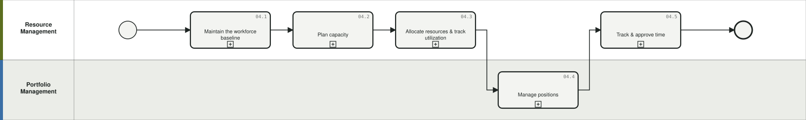

Diagrams: [BPMN](../diagrams/bpmn/generated/L0-04.bpmn) · [Mermaid](../diagrams/mermaid/area-04.md)

### 04.1 Maintain the workforce baseline `G-041`

Original name: Workforce Baseline & Team Structure. BPMN: [`04.1.bpmn`](../diagrams/bpmn/generated/04.1.bpmn) · 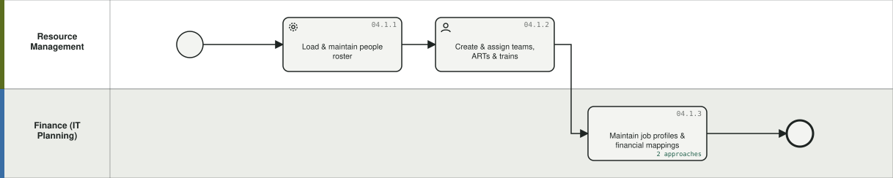

**04.1.1 Load & maintain people roster** `P-0035` — Establish the workforce baseline (employees, contractors, vendor service, consulting) from HR sources with per-source sync cadences.
- What you get: current people baseline with attributes
- BPMN: lane *Resource Management*, Service task | Delivery model: Any | Product: Targetprocess (+ Workday/HCM) | Who: Resource management, HR & approvers, Platform admins & integration (Resource Mgmt, HR, Platform Admin) | When: Continuous (Daily-monthly by source)
- Inputs: HCM/roster feeds (Workday, Fieldglass) → Outputs: Current people baseline with attributes
- Config: People/Users entities, employee type (internal/external/contingent, on/offshore, billable), locations, skills; sync cadence per source (Client Zero: employees+contractors daily, consulting monthly, other manual)
- Framework: SPM: WFM (baseline) | TBM: labor cost pools | Flows: — | Evidence: TBMC25 Load & Maintain People; WFM deck

**04.1.2 Create & assign teams, ARTs & trains** `P-0036` — Build the team-of-teams structure and assign people to teams with involvement percentages.
- What you get: team>ART>Solution Train structure with involvements
- BPMN: lane *Resource Management*, User task | Delivery model: Any | Product: Targetprocess | Who: Resource management, Agile teams & RTEs (Resource Mgmt, RTEs) | When: Continuous (On change)
- Inputs: People baseline, org design → Outputs: Team>ART>Solution Train structure with involvements
- Config: Team entities & hierarchy, ART/Solution Train, Involvements (% allocation, e.g. 50/75/100), team-project assignment
- Framework: SPM: WFM | SAFe: ART | Flows: UC1 | Evidence: TBMC25 Create & Assign Teams; e2e script (involvements)

**04.1.3 Maintain job profiles & financial mappings** `P-0037` — Keep job profiles (role x location) mapped to rates and CapEx/OpEx splits, and teams mapped to IT towers - the three ingredients of the labor model.
- What you get: job profiles with rate & CapEx/OpEx mapping; team-tower mapping
- BPMN: lane *Finance (IT Planning)*, Task | Delivery model: Any | Product: Targetprocess (+ Costing) | Who: IT Finance & FP&A, Resource management (Finance, Resource Mgmt) | When: Continuous (Quarterly + on change)
- Inputs: HR role data, finance rules → Outputs: Job profiles with rate & CapEx/OpEx mapping; team-tower mapping
- Config: Job Profile entities, CapEx/OpEx split mapping per profile, team->IT Tower mapping (fixed capacity rule), rate linkage (rates held in Costing)
- Framework: TBM: labor costing | SPM: WFM | Flows: UC1 | Evidence: E2E BPMN t_data; e2e script UC1 three ingredients

### 04.2 Plan capacity `G-042`

Original name: Capacity Planning. BPMN: [`04.2.bpmn`](../diagrams/bpmn/generated/04.2.bpmn) · 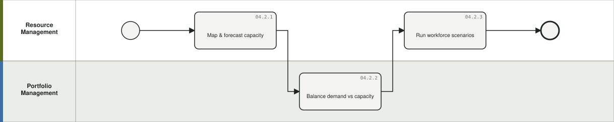

**04.2.1 Map & forecast capacity** `P-0038` — Model capacity by function, role, location, level, skills, BU and domain across the planning horizon, integrating vacation/holiday schedules. Agile contexts plan capacity team-based; hybrid/traditional contexts plan role- and individual-based - model both.
- What you get: capacity model & forward view
- BPMN: lane *Resource Management*, Task | Delivery model: Any | Product: Targetprocess | Who: Resource management (Resource Mgmt, Capacity planners) | When: Monthly (Monthly/quarterly)
- Inputs: Roster, involvements, calendars → Outputs: Capacity model & forward view
- Config: Capacity dashboards, availability (total/reserved/available), Vacation Tracking solution feeding availability, regional calendars
- Framework: SPM: WFM capacity | Flows: — | Evidence: SPM Framework WFM use cases; WFM deck capacity activities

**04.2.2 Balance demand vs capacity** `P-0039` — Compare bottom-up demand rollups against available capacity and targets; resolve over/under allocation (e.g. 'three months out, demand exceeds FTE').
- What you get: rebalanced allocations, hiring signals
- BPMN: lane *Portfolio Management*, Task | Delivery model: Any | Product: Targetprocess (+ Planning) | Who: Portfolio management, IT Finance & FP&A, Resource management (Portfolio Mgmt, Resource Mgmt, Finance) | When: Monthly (Monthly + planning cycles)
- Inputs: Work allocations/demand, capacity model, target spend → Outputs: Rebalanced allocations, hiring signals
- Config: Demand & Capacity Mgmt solution (Work Allocation entity %/hours/man-days, auto-generated Demand per period, load reports, demand processing screens), capacity/FTE reports vs targets
- Framework: SPM: WFM | SAFe: capacity | Flows: UC3 | Evidence: E2E BPMN t_cmp; TP Demand & Capacity solution

**04.2.3 Run workforce scenarios** `P-0040` — Model alternative workforce/demand scenarios (mix, location, hiring) and promote decisions into plans.
- What you get: chosen workforce scenario
- BPMN: lane *Resource Management*, Task | Delivery model: Any | Product: Targetprocess (+ Planning) | Who: IT Finance & FP&A, Resource management (Resource Mgmt, Finance) | When: Annual / per cycle (Planning cycles)
- Inputs: Capacity model, targets → Outputs: Chosen workforce scenario
- Config: Scenario planning (workforce scenarios, labor availabilities generation), HC scenario views
- Framework: SPM: WFM scenarios | Flows: — | Evidence: Customer PowerUp; WFM deck

### 04.3 Allocate resources & track utilization `G-043`

Original name: Resource Allocation & Utilization. BPMN: [`04.3.bpmn`](../diagrams/bpmn/generated/04.3.bpmn) · 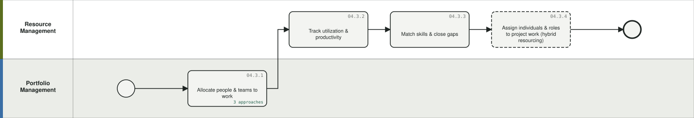

**04.3.1 Allocate people & teams to work** `P-0041` — Assign users, teams, ARTs and solution trains to portfolio work at any hierarchy level (bottom-up demand).
- What you get: work allocations (bottom-up demand)
- BPMN: lane *Portfolio Management*, Task | Delivery model: Any | Product: Targetprocess | Who: Portfolio management, Resource management (Portfolio Mgmt, Resource Mgmt) | When: Continuous (Continuous)
- Inputs: Funded work, capacity → Outputs: Work allocations (bottom-up demand)
- Config: Work Allocation entities, allocation timelines, team-to-work assignment at any level
- Framework: SPM: WFM | SAFe | Flows: UC3, UC2 | Evidence: E2E BPMN t_alloc; LFM demo work allocations

**04.3.2 Track utilization & productivity** `P-0042` — Compare planned vs actual utilization; monitor bottlenecks and efficiency by role/location/team.
- What you get: utilization & efficiency reports
- BPMN: lane *Resource Management*, Task | Delivery model: Any | Product: Targetprocess (+ Costing) | Who: Resource management (Resource Mgmt) | When: Monthly (Monthly)
- Inputs: Allocations, time/work data → Outputs: Utilization & efficiency reports
- Config: Resource Management Dashboard, Team Load report, Efficiency tab (completed items & effort MoM)
- Framework: SPM: WFM metrics | Flows: — | Evidence: LFM demo deep-dives

**04.3.3 Match skills & close gaps** `P-0043` — Compare work demand to skills supply; identify hiring/upskilling needs.
- What you get: gap analysis, hiring/upskill plan
- BPMN: lane *Resource Management*, Task | Delivery model: Any | Product: Targetprocess | Who: Resource management, HR & approvers (Resource Mgmt, HR) | When: Quarterly (Quarterly)
- Inputs: Skills data, demand → Outputs: Gap analysis, hiring/upskill plan
- Config: Skills fields, capacity by skill views, gap reports
- Framework: SPM: WFM | Flows: — | Evidence: SPM Framework WFM use case 5

**04.3.4 Assign individuals & roles to project work (hybrid resourcing)** `P-0044` — For traditional/hybrid work, assign named individuals or roles to projects with requested man-days - alongside team-based allocation used for agile work - so one capacity model covers both.
- What you get: individual/role assignments in the same capacity model
- BPMN: lane *Resource Management*, Task | Delivery model: Hybrid | Product: Targetprocess (+ Planning) | Who: Resource management, PMO & project managers (Resource Mgmt, Project Managers) | When: Continuous (Per project + continuous)
- Inputs: Project demand (roles, man-days), roster → Outputs: Individual/role assignments in the same capacity model
- Config: Work Allocations (person-level man-days/hours), role-based demand requests, New Requested Demand workflow, availability integration
- Framework: SPM: WFM | Hybrid resourcing | Flows: — | Evidence: LFM demo (requested man-days from individuals/teams); WFM deck

### 04.4 Manage positions `G-044`

Original name: Position Management. BPMN: [`04.4.bpmn`](../diagrams/bpmn/generated/04.4.bpmn) · 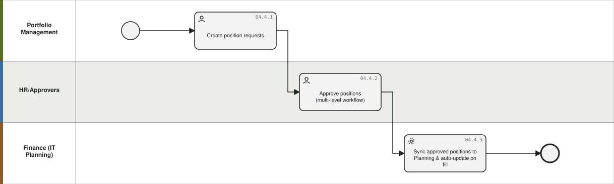

**04.4.1 Create position requests** `P-0045` — Raise governed requests for new positions (role, location, hours, type, department link to the finance budget line).
- What you get: position request records
- BPMN: lane *Portfolio Management*, User task | Delivery model: Any | Product: Targetprocess | Who: Portfolio management (Portfolio/Hiring managers) | When: Event-driven (On demand)
- Inputs: Capacity gaps, budget line → Outputs: Position request records
- Config: Position Request entity (role, location, hours, employment type, department link)
- Framework: SPM: WFM | ITFM: headcount | Flows: UC3 | Evidence: E2E BPMN t_pos; e2e script UC3

**04.4.2 Approve positions (multi-level workflow)** `P-0046` — Route position requests through HR > Department > Final approval with notifications, dependencies and escalations; reject or approve.
- What you get: approved/rejected positions
- BPMN: lane *HR/Approvers*, User task | Delivery model: Any | Product: Targetprocess | Who: HR & approvers (HR, Dept approvers, Final approver) | When: Event-driven (Per request)
- Inputs: Position requests → Outputs: Approved/rejected positions
- Config: Multi-level approval workflow (entity states + per-state permissions), automation rules (notifications, escalations), XOR outcome
- Framework: Governance | Flows: UC3 | Evidence: E2E BPMN t_appr/g_appr

**04.4.3 Sync approved positions to Planning & auto-update on fill** `P-0047` — Send only approved positions across the data highway to IT Planning for budgeting; when filled in ATP the Planning record updates automatically.
- What you get: budgeted open+filled positions, auto-updated
- BPMN: lane *Finance (IT Planning)*, Service task | Delivery model: Any | Product: Targetprocess (+ Planning) | Who: IT Finance & FP&A, Platform admins & integration (System (ADM), Finance) | When: Continuous (Daily/weekly sync)
- Inputs: Approved positions; fill events → Outputs: Budgeted open+filled positions, auto-updated
- Config: ADM/data highway position feed, open vs filled normalization in Planning, auto-update linkage
- Framework: ITFM: headcount planning | Flows: UC3 | Evidence: E2E BPMN t_send2/t_norm; e2e script round-trip

### 04.5 Track & approve time `G-045`

Original name: Time Tracking & Approval. BPMN: [`04.5.bpmn`](../diagrams/bpmn/generated/04.5.bpmn) · 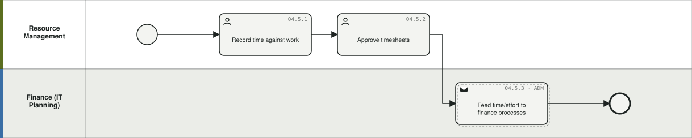

**04.5.1 Record time against work** `P-0048` — Log task-level time or use work allocations as the effort signal; capture estimate vs actual vs remaining, billable flags. Timesheets matter most for traditional/hybrid delivery; pure agile teams can rely on work allocations and completed-work signals instead.
- What you get: time entries / effort data
- BPMN: lane *Resource Management*, User task | Delivery model: Any | Product: Targetprocess | Who: Agile teams & RTEs (Team members) | When: Continuous (Daily/weekly)
- Inputs: Work items → Outputs: Time entries / effort data
- Config: Time entity, Time Tracking solution, timesheet views, billable/non-billable fields; alternative: work allocations instead of timesheets
- Framework: SPM: Financial Mgmt | capitalization input | Flows: — | Evidence: TP Time Tracking; Timesheet solution sheet; LFM demo

**04.5.2 Approve timesheets** `P-0049` — Managers review and approve weekly timesheets under governance rules.
- What you get: approved time
- BPMN: lane *Resource Management*, User task | Delivery model: Any | Product: Targetprocess | Who: Resource management (Managers) | When: Weekly (Weekly)
- Inputs: Time entries → Outputs: Approved time
- Config: Timesheet approval workflow (solution component), notifications
- Framework: Governance | Flows: — | Evidence: 2026.03 Timesheet with Approval Workflow solution sheet; Solution Overview (time recording)

**04.5.3 Feed time/effort to finance processes** `P-0050` — Deliver approved time or allocation-based effort to capitalization, costing and billing processes (or deprecate time writing via the UC1 model).
- What you get: effort data for costing & CapEx
- BPMN: lane *Finance (IT Planning)*, Send task (ADM) | Delivery model: Any | Product: Targetprocess (+ Costing) | Who: IT Finance & FP&A (Finance) | When: Monthly (Monthly)
- Inputs: Approved time / completed work → Outputs: Effort data for costing & CapEx
- Config: Time reports/exports, ADM feed to Costing, story-point/completed-work alternative (deprecates time writing)
- Framework: TBM: labor allocation options | Flows: UC1 | Evidence: E2E script UC1 payoff; Costing labor allocation options

## L0-05 IT Financial Planning & Budgeting

*Build the annual IT budget and rolling forecasts on the TBM taxonomy - labor, contracts, assets and investments - manage variance, and publish targets that drive portfolio behavior. The budget can be built incrementally/driver-based (05.1) or zero-based for selected decision units (05.8); both converge on the same review, approval, budget-of-record and target-publication steps.* Primary: **Planning**. Band: core. Lanes: IT Finance; Budget Owners; FP&A; CIO.

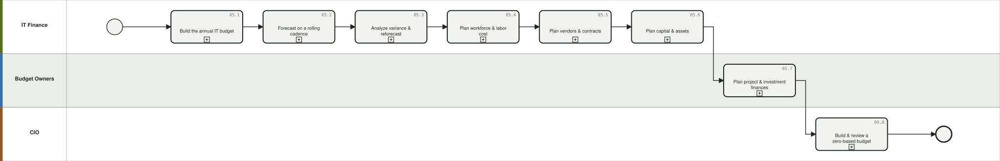

Diagrams: [BPMN](../diagrams/bpmn/generated/L0-05.bpmn) · [Mermaid](../diagrams/mermaid/area-05.md)

### 05.1 Build the annual IT budget `G-051`

Original name: Annual IT Budgeting. BPMN: [`05.1.bpmn`](../diagrams/bpmn/generated/05.1.bpmn) · 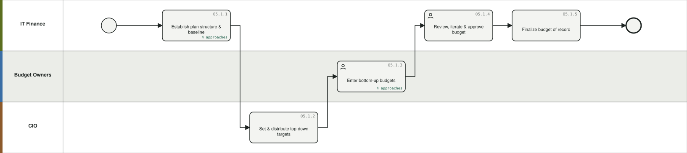

**05.1.1 Establish plan structure & baseline** `P-0051` — Create the plan, fiscal calendar and hierarchy; seed baseline from prior plan or actuals. Under ZBB (05.8) in-scope decision units are seeded at zero or driver-only instead of prior-year values.
- What you get: open plan with baseline
- BPMN: lane *IT Finance*, Task | Delivery model: Any | Budgeting method: Incremental / Driver-based (ZBB: zero or driver-only seed) | Product: Planning (+ Costing) | Who: IT Finance & FP&A (IT Finance) | When: Annual / per cycle (Annual)
- Inputs: Prior plan, actuals, reference data → Outputs: Open plan with baseline
- Config: Plan creation, plan folders, working calendar, Adjust Baseline Values, actuals import, cost center/account hierarchies
- Framework: ITFM: budgeting | TBM: Plan & Govern | Flows: — | Evidence: IBM Docs Planning; planning research

**05.1.2 Set & distribute top-down targets** `P-0052` — Set target spend and headcount envelopes by department/cost center/ART and distribute to budget owners. Targets are the same regardless of method; under ZBB they become the funding cut-line reference for 05.8.4.
- What you get: distributed targets
- BPMN: lane *CIO*, Task | Delivery model: Any | Budgeting method: Any | Product: Planning (+ Targetprocess) | Who: Executive leadership, IT Finance & FP&A (CIO, IT Finance, FP&A) | When: Annual / per cycle (Annual)
- Inputs: Corporate targets → Outputs: Distributed targets
- Config: Set Targets, Labor Headcount Targets, cost object permissions; target feed to ATP (UC3)
- Framework: ITFM | SPM: Financial Mgmt | Flows: UC3 | Evidence: Planning docs; E2E BPMN t_wfp/t_send1

**05.1.3 Enter bottom-up budgets** `P-0053` — Budget owners build OpEx/CapEx line items and transactions per cost center in resource-based views. ZBB alternative for in-scope units: decision packages at tiered service levels (05.8.3) replace line-item entry against a prior-year baseline.
- What you get: submitted budgets
- BPMN: lane *Budget Owners*, User task | Delivery model: Any | Budgeting method: Incremental / Driver-based (ZBB alternative: 05.8.3) | Product: Planning | Who: Budget & cost-category owners (Budget owners) | When: Annual / per cycle (Annual (cycle))
- Inputs: Targets, driver data → Outputs: Submitted budgets
- Config: Worksheets/line items, cost categorization, multi-currency, transaction-level entry
- Framework: ITFM | Flows: — | Evidence: Planning docs

**05.1.4 Review, iterate & approve budget** `P-0054` — Run submit/review/approve/return cycles until targets and bottom-up plans reconcile. ZBB units arrive ranked with a cut-line (05.8.4-05.8.5) and are approved through the same workflow.
- What you get: approved budget
- BPMN: lane *IT Finance*, User task | Delivery model: Any | Budgeting method: Any | Product: Planning | Who: Executive leadership, IT Finance & FP&A, Budget & cost-category owners (IT Finance, leadership, budget owners) | When: Annual / per cycle (Annual (cycle))
- Inputs: Submitted budgets → Outputs: Approved budget
- Config: Approval workflow (submit/review/approve/return), plan states New>Open>Final, conversational insights
- Framework: ITFM governance | Flows: ZBB | Evidence: Planning docs

**05.1.5 Finalize budget of record** `P-0055` — Lock the approved plan as budget of record with a snapshot for variance baselines (and, in a ZBB year, as the savings baseline for 05.8.6).
- What you get: budget of record + snapshot
- BPMN: lane *IT Finance*, Task | Delivery model: Any | Budgeting method: Any | Product: Planning | Who: IT Finance & FP&A (IT Finance) | When: Annual / per cycle (Annual)
- Inputs: Approved budget → Outputs: Budget of record + snapshot
- Config: Plan state Final, snapshots/version compare
- Framework: ITFM | Flows: ZBB | Evidence: Planning docs

### 05.2 Forecast on a rolling cadence `G-052`

Original name: Rolling & Periodic Forecasting. BPMN: [`05.2.bpmn`](../diagrams/bpmn/generated/05.2.bpmn) · 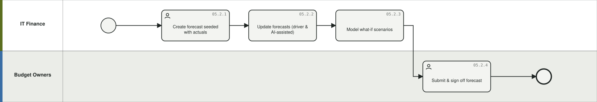

**05.2.1 Create forecast seeded with actuals** `P-0056` — Open a forecast version seeded with YTD actuals plus remaining plan.
- What you get: forecast version
- BPMN: lane *IT Finance*, User task | Delivery model: Any | Product: Planning (+ Costing) | Who: IT Finance & FP&A (IT Finance) | When: Monthly (Monthly/quarterly)
- Inputs: Actuals (Costing/GL), plan → Outputs: Forecast version
- Config: Actuals import, Costing integration, snapshots, multi-year plans
- Framework: ITFM: rolling forecast | Flows: — | Evidence: Planning docs; Apptio 5-step rolling forecast

**05.2.2 Update forecasts (driver & AI-assisted)** `P-0057` — Focus on largest controllable variance drivers; use Intelligent Forecasting and contract auto-extension to update lines.
- What you get: updated forecast
- BPMN: lane *IT Finance*, Task | Delivery model: Any | Product: Planning | Who: IT Finance & FP&A, Budget & cost-category owners (IT Finance, budget owners) | When: Monthly (Monthly)
- Inputs: Historical data, drivers → Outputs: Updated forecast
- Config: Intelligent Forecasting (multi-model AI), contract auto-extension, driver-based lines
- Framework: ITFM | FinOps: Forecasting (intersect) | Flows: — | Evidence: Planning release notes; rolling-forecast method

**05.2.3 Model what-if scenarios** `P-0058` — Compare versions/plans and model scenario impacts; sync enterprise scenarios with corporate FP&A.
- What you get: scenario comparisons
- BPMN: lane *IT Finance*, Task | Delivery model: Any | Product: Planning (+ Planning Analytics) | Who: IT Finance & FP&A (IT Finance, FP&A) | When: Event-driven (Ad hoc)
- Inputs: Forecast, scenario drivers → Outputs: Scenario comparisons
- Config: Compare Versions/Plans, what-if modeling, IBM Planning Analytics bi-directional connector
- Framework: ITFM | Flows: — | Evidence: Planning docs; McGraw Hill pattern

**05.2.4 Submit & sign off forecast** `P-0059` — Budget owners submit forecasts for review and sign-off on cadence.
- What you get: approved forecast of record
- BPMN: lane *Budget Owners*, User task | Delivery model: Any | Product: Planning | Who: IT Finance & FP&A, Budget & cost-category owners (Budget owners, IT Finance) | When: Monthly (Monthly/quarterly)
- Inputs: Updated forecasts → Outputs: Approved forecast of record
- Config: Approval workflow, plan status tracking
- Framework: ITFM governance | Flows: — | Evidence: Planning docs

### 05.3 Analyze variance & reforecast `G-053`

Original name: Variance Analysis & Reforecasting. BPMN: [`05.3.bpmn`](../diagrams/bpmn/generated/05.3.bpmn) · 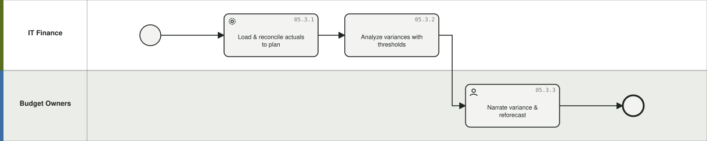

**05.3.1 Load & reconcile actuals to plan** `P-0060` — Bring closed actuals from Costing/GL into the plan and reconcile mappings (plan-to-actuals).
- What you get: reconciled plan-vs-actuals dataset
- BPMN: lane *IT Finance*, Service task | Delivery model: Any | Product: Planning (+ Costing) | Who: IT Finance & FP&A (IT Finance) | When: Monthly (Monthly close)
- Inputs: Closed actuals → Outputs: Reconciled plan-vs-actuals dataset
- Config: Costing/Cost Transparency integration, actuals import, GL-to-IT category mappings
- Framework: ITFM | TBM | Flows: ZBB | Evidence: Planning docs

**05.3.2 Analyze variances with thresholds** `P-0061` — Analyze budget-vs-actuals and plan-vs-plan variance by cost pool/tower/CC with materiality thresholds.
- What you get: material variance list
- BPMN: lane *IT Finance*, Task | Delivery model: Any | Product: Planning (+ Costing) | Who: IT Finance & FP&A, Budget & cost-category owners (IT Finance, budget owners) | When: Monthly (Monthly)
- Inputs: Reconciled data → Outputs: Material variance list
- Config: Variance analysis, Plan vs Plan variance with thresholds, variance REST APIs, exports
- Framework: ITFM | TBM: Cost Pool variance monthly | Flows: ZBB | Evidence: Planning docs; TBM assessment (reporting)

**05.3.3 Narrate variance & reforecast** `P-0062` — Capture commentary and corrective actions on material variances, then reforecast remaining periods (<1% variance ambition).
- What you get: commentary, updated forecast
- BPMN: lane *Budget Owners*, User task | Delivery model: Any | Product: Planning | Who: IT Finance & FP&A, Budget & cost-category owners (Budget owners, IT Finance) | When: Monthly (Monthly)
- Inputs: Variance list → Outputs: Commentary, updated forecast
- Config: Comments, change-history audit, forecast update workflow
- Framework: ITFM | Flows: — | Evidence: Planning docs; ApptioOne virtuous cycle (Control)

### 05.4 Plan workforce & labor cost `G-054`

Original name: Workforce & Labor Cost Planning. BPMN: [`05.4.bpmn`](../diagrams/bpmn/generated/05.4.bpmn) · 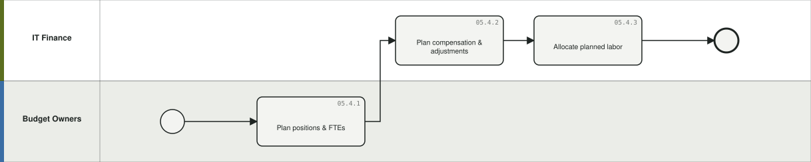

**05.4.1 Plan positions & FTEs** `P-0063` — Plan filled and open positions by cost center with hire/term dating; normalize positions received from ATP.
- What you get: position-level labor plan (open + filled)
- BPMN: lane *Budget Owners*, Task | Delivery model: Any | Product: Planning (+ Targetprocess) | Who: IT Finance & FP&A, Budget & cost-category owners, HR & approvers (Budget owners, HR, IT Finance) | When: Continuous (Annual + continuous)
- Inputs: Roster, approved position requests → Outputs: Position-level labor plan (open + filled)
- Config: Labor planning module, headcount targets, working calendar, position normalization from ATP feed (UC3)
- Framework: ITFM: headcount | SPM: WFM | Flows: UC3 | Evidence: Planning docs; E2E BPMN t_norm

**05.4.2 Plan compensation & adjustments** `P-0064` — Model base compensation, merit/bonus/burden and monthly variable adjustments under restricted access.
- What you get: labor cost plan
- BPMN: lane *IT Finance*, Task | Delivery model: Any | Product: Planning | Who: IT Finance & FP&A (IT Finance (restricted)) | When: Continuous (Annual + on change)
- Inputs: Comp data → Outputs: Labor cost plan
- Config: Compensation adjustments, variable workforce adjustments, field-level Restricted Access (sensitive salary)
- Framework: ITFM | Flows: — | Evidence: Planning docs

**05.4.3 Allocate planned labor** `P-0065` — Apply labor allocation rules so planned labor lands on cost centers, projects and TBM categories like actuals will.
- What you get: allocated labor plan
- BPMN: lane *IT Finance*, Task | Delivery model: Any | Product: Planning (+ Costing) | Who: IT Finance & FP&A, PMO & project managers (IT Finance, PMO) | When: Annual / per cycle (Per plan cycle)
- Inputs: Labor plan → Outputs: Allocated labor plan
- Config: Labor allocation rules, project labor activity (role-based), plan-side cost model
- Framework: ITFM | TBM taxonomy | Flows: — | Evidence: Planning docs

### 05.5 Plan vendors & contracts `G-055`

Original name: Vendor & Contract Planning. BPMN: [`05.5.bpmn`](../diagrams/bpmn/generated/05.5.bpmn) · 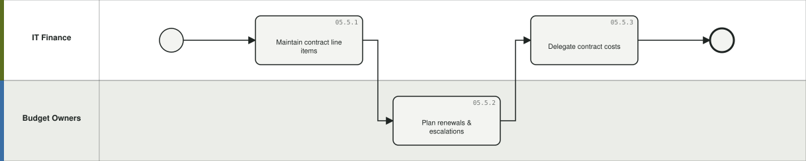

**05.5.1 Maintain contract line items** `P-0066` — Load and maintain contracts with terms, amortization approach and VAT.
- What you get: contract plan lines
- BPMN: lane *IT Finance*, Task | Delivery model: Any | Product: Planning | Who: IT Finance & FP&A, Vendor management & procurement (IT Finance, Vendor Mgmt) | When: Continuous (Continuous)
- Inputs: Contract register → Outputs: Contract plan lines
- Config: Contract planning, amortization approaches, VAT handling
- Framework: ITFM: committed spend | Flows: — | Evidence: Planning docs

**05.5.2 Plan renewals & escalations** `P-0067` — Time renewals into the forecast with per-renewal compounding escalations; align forecast cadence to renewal periods.
- What you get: renewal-aware forecast
- BPMN: lane *Budget Owners*, Task | Delivery model: Any | Product: Planning | Who: Vendor management & procurement (Vendor Mgmt) | When: Event-driven (Per renewal cycle)
- Inputs: Contract terms → Outputs: Renewal-aware forecast
- Config: Contract extensions/renewals with compounding % adjustments, renewal comments, auto-extension
- Framework: ITFM | Flows: — | Evidence: Planning docs; rolling-forecast step 2

**05.5.3 Delegate contract costs** `P-0068` — Delegate contract costs to the consuming budget owners' plans.
- What you get: delegated cost ownership
- BPMN: lane *IT Finance*, Task | Delivery model: Any | Product: Planning | Who: IT Finance & FP&A (IT Finance) | When: Annual / per cycle (Per plan cycle)
- Inputs: Contract lines → Outputs: Delegated cost ownership
- Config: Contract cost delegation
- Framework: ITFM accountability | Flows: — | Evidence: Planning docs

### 05.6 Plan capital & assets `G-056`

Original name: Capital & Asset Planning. BPMN: [`05.6.bpmn`](../diagrams/bpmn/generated/05.6.bpmn) · 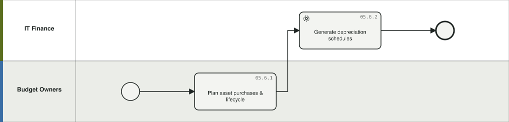

**05.6.1 Plan asset purchases & lifecycle** `P-0069` — Plan CapEx purchases, in-service dates and refresh; identify fully depreciated assets.
- What you get: asset purchase plan
- BPMN: lane *Budget Owners*, Task | Delivery model: Any | Product: Planning (+ Costing) | Who: Budget & cost-category owners, Engineering (Budget owners, Infrastructure) | When: Quarterly (Annual + quarterly)
- Inputs: Asset register, refresh needs → Outputs: Asset purchase plan
- Config: Asset planning module, Fixed Asset Ledger linkage, refresh planning
- Framework: ITFM: CapEx | Flows: — | Evidence: Planning docs; ApptioOne CFD asset lifecycle

**05.6.2 Generate depreciation schedules** `P-0070` — Configure depreciation methods so planned CapEx flows into future-period OpEx correctly.
- What you get: depreciation schedule in plan
- BPMN: lane *IT Finance*, Service task | Delivery model: Any | Product: Planning | Who: IT Finance & FP&A (IT Finance) | When: Annual / per cycle (Per plan cycle)
- Inputs: Asset plan → Outputs: Depreciation schedule in plan
- Config: Depreciation methods configuration, Delegate Asset Costs
- Framework: ITFM | Flows: — | Evidence: Planning docs

### 05.7 Plan project & investment finances `G-057`

Original name: Project & Investment Financial Planning. BPMN: [`05.7.bpmn`](../diagrams/bpmn/generated/05.7.bpmn) · 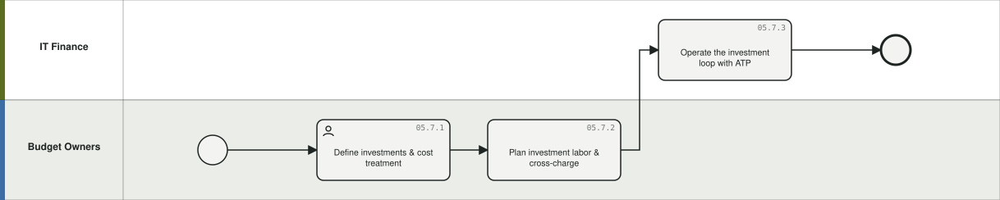

**05.7.1 Define investments & cost treatment** `P-0071` — Set up investments/projects with CapEx/OpEx (build vs run) treatment and permissions; tag budget lines to investments.
- What you get: investment financial structures
- BPMN: lane *Budget Owners*, User task | Delivery model: Any | Product: Planning (+ Costing) | Who: IT Finance & FP&A, PMO & project managers (PMO, IT Finance) | When: Event-driven (Per investment)
- Inputs: Funded investments (from ATP) → Outputs: Investment financial structures
- Config: Integrated Investment Planning: investment tags on budget lines, Project Cost Type (build/run), Project Total & Charges KPIs, project permissions
- Framework: TBM: run/grow/transform | SPM: Financial Mgmt | Flows: INV | Evidence: ApptioOne CFD IIP

**05.7.2 Plan investment labor & cross-charge** `P-0072` — Plan labor effort (hours/days/FTE) by role or named resource with rate cards; configure internal cross-charge to avoid double counting. Pre-PI financial validation checks planned work against approved funding, guardrails and capitalization policy, flagging unfunded commitments and funding shortfalls.
- What you get: investment labor plan
- BPMN: lane *Budget Owners*, Task | Delivery model: Any | Product: Planning (+ Targetprocess) | Who: IT Finance & FP&A, Resource management, PMO & project managers (PMO, Resource Mgmt, IT Finance) | When: Annual / per cycle (Per plan cycle)
- Inputs: Labor demand from portfolio → Outputs: Investment labor plan
- Config: Labor resource planning (rates x effort), flexible rate cards, configurable cross-charge, demand vs capacity balancing
- Framework: ITFM | SPM: WFM | Flows: — | Evidence: ApptioOne CFD IIP; PI Planning/EVD Agent requirements (IBM, anonymized) §7.5

**05.7.3 Operate the investment loop with ATP** `P-0073` — Exchange approved budgets and budget-change requests with Targetprocess; receive planned allocations and actual effort back.
- What you get: approved budgets & changes (to ATP)
- BPMN: lane *IT Finance*, Task | Delivery model: Any | Product: Planning (+ Targetprocess, Costing) | Who: Portfolio management, IT Finance & FP&A (IT Finance, Portfolio Mgmt) | When: Continuous (Continuous)
- Inputs: Investments, allocations, actual effort (ATP) → Outputs: Approved budgets & changes (to ATP)
- Config: Bi-directional A1<->ATP integration (A1->ATP: approved investment budget, budget changes; ATP->A1: investments, planned labor allocations, actual labor effort, change requests)
- Framework: SPM+TBM integration | Flows: INV | Evidence: ApptioOne CFD; Desjardins architecture

### 05.8 Build & review a zero-based budget `G-058`

Original name: Zero-Based Budget Build & Review. BPMN: [`05.8.bpmn`](../diagrams/bpmn/generated/05.8.bpmn) · 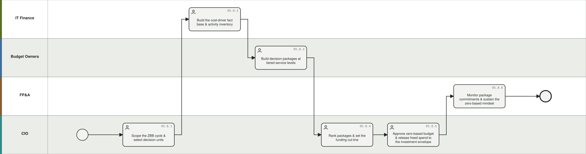

**05.8.1 Scope the ZBB cycle & select decision units** `P-0074` — Decide which cost centers / towers / services / apps are zero-based this cycle (rotation, cost pressure, misalignment with strategy), define the "zero base" (minimum viable service level, not literally zero), name cost-category owners paired with budget owners (dual ownership) and publish the ZBB calendar and training.
- What you get: zBB scope list, decision-unit register, owner matrix (cost category x budget owner), cycle calendar
- BPMN: lane *CIO*, User task | Delivery model: Any | Budgeting method: ZBB | Product: Planning (+ Costing) | Who: Executive leadership, IT Finance & FP&A, Budget & cost-category owners (CIO/CFO sponsor, IT Finance, FP&A partners, cost-category owners) | When: Annual / per cycle (Annual, pre-cycle (each unit every 2-3 yrs))
- Inputs: Prior-cycle rotation, benchmark gaps (06.6.2), run/grow/transform mix (06.2.3), corporate cost targets → Outputs: ZBB scope list, decision-unit register, owner matrix (cost category x budget owner), cycle calendar
- Config: Dedicated ZBB plan/folder per cycle, cost object permissions per decision unit, custom list 'Cost Category Owner', decision-unit hierarchy sourced from Costing towers/services/cost centers, 'ZBB Rotation Year' attribute on cost objects
- Framework: TBM: Plan & Govern; Benchmarking (target-setting) | Gartner: choose departments selectively, rotate 2-3 yrs | McKinsey: dual-ownership governance | Flows: ZBB | Evidence: Gartner ZBB rightsizing; McKinsey 'return of zero-base budgeting'; Apptio ZBB blog

**05.8.2 Build the cost-driver fact base & activity inventory** `P-0075` — For each in-scope decision unit, assemble what it does and what it costs from the TBM model: cost pools x towers x services x apps, fixed vs variable, discretionary flags, vendor/contract lines, labor FTE and positions; identify redundancies (duplicate apps, overlapping vendor services, underused contracts) before any package is written.
- What you get: activity inventory with unit costs and drivers per decision unit; redundancy list; 'zero-base' floor per unit
- BPMN: lane *IT Finance*, User task | Delivery model: Any | Budgeting method: ZBB | Product: Costing (+ Planning, Cloudability) | Who: IT Finance & FP&A, Budget & cost-category owners, TBM Office & analysts (TBM Analyst, IT Finance, budget owners) | When: Annual / per cycle (Per ZBB cycle (from latest close))
- Inputs: Allocated cost model (06.1), App TCO (06.3.3), vendor insights (06.5.1), cloud utilization/rightsizing (07.5), roster & involvements (04.1) → Outputs: Activity inventory with unit costs and drivers per decision unit; redundancy list; 'zero-base' floor per unit
- Config: Cost Source fields (Fixed/Variable, Discretionary, Is Depr), Applications Overview / App TCO & AppRat reports, vendor consolidation reports, Cloudability rightsizing & idle reports, Planning 'Adjust Baseline Values' set to zero or driver-only for in-scope units
- Framework: TBM: Cost Transparency as the ZBB fact base (McKinsey 'cost-driver visibility') | FinOps: Usage Optimization feeds the cloud zero base | Flows: ZBB | Evidence: McKinsey; Deloitte/Anaplan ZBB (driver-based activity justification); Apptio ITFM foundation

**05.8.3 Build decision packages at tiered service levels** `P-0076` — Budget owners write decision packages per activity/service: minimum viable (zero base), current and enhanced levels - each with scope, driver assumptions, labor (positions/FTE), contracts, assets and cloud, the outcome/KPI delivered and the consequence of not funding. Change/investment demand is not re-justified here; it enters through 02.2.1 lean business cases.
- What you get: decision packages (3 tiers) per decision unit with costs, drivers, KPIs and justification
- BPMN: lane *Budget Owners*, User task | Delivery model: Any | Budgeting method: ZBB | Product: Planning (+ Targetprocess for positions/labor) | Who: IT Finance & FP&A, Budget & cost-category owners, Business, app & service owners (Budget owners, cost-category owners, FP&A partners, service/app owners) | When: Annual / per cycle (Per ZBB cycle (4-8 wk window))
- Inputs: Activity inventory, service catalog & SLAs, driver data, rate cards → Outputs: Decision packages (3 tiers) per decision unit with costs, drivers, KPIs and justification
- Config: Worksheets/line items tagged by custom lists 'Decision Package' and 'Service Level Tier' (Minimum/Current/Enhanced), driver-based line items, labor planning positions & comp (05.4), contract lines (05.5), asset lines (05.6), justification/comment fields, package templates
- Framework: Classic ZBB: decision-package formulation at alternative funding levels | TBM: cost pools & taxonomy as package structure | SPM: change demand stays in Demand Intake | Flows: ZBB | Evidence: Wikipedia/Pyhrr; CIO Wiki (3 funding levels); Deloitte

**05.8.4 Rank packages & set the funding cut-line** `P-0077` — Cost-category owners and budget owners jointly rank packages by business criticality, strategic alignment and value; cumulative cost is compared with the top-down target (05.1.2) and a cut-line drawn; estimates are pressure-tested; run spend freed below the line is earmarked for grow/transform.
- What you get: ranked package list, cut-line scenario, freed-spend figure, unfunded-package register
- BPMN: lane *CIO*, User task | Delivery model: Any | Budgeting method: ZBB | Product: Planning (+ Targetprocess) | Who: Executive leadership, IT Finance & FP&A, Budget & cost-category owners, TBM Office & analysts (CIO, cost-category owners, budget owners, FP&A, TBM Office) | When: Annual / per cycle (Per ZBB cycle (ranking forum))
- Inputs: Decision packages, targets, benchmarks, strategic themes (01.1.1) → Outputs: Ranked package list, cut-line scenario, freed-spend figure, unfunded-package register
- Config: Scoring custom fields (criticality, alignment, value, risk) on line items/packages, Compare Versions/Plans (one version per cut-line scenario), Set Targets, what-if modeling; Targetprocess objective-scoring for any change packages; unfunded initiatives list
- Framework: Classic ZBB: ranking & cut-line | TBM: Run/Grow/Transform; Benchmarking targets | SAFe: participatory budgeting is the analogous forum for change | Flows: ZBB | Evidence: Gartner (prioritize & allocate, pressure-test); Apptio ZBB blog (visibility into unfunded initiatives)

**05.8.5 Approve zero-based budget & release freed spend to the investment envelope** `P-0078` — Route the ranked, cut-line budget through approval; lock approved packages into the budget of record (05.1.5) merged with non-ZBB units from 05.1; publish the freed run spend as an uplift to portfolio targets (UC3) so grow/transform capacity increases without a net budget rise.
- What you get: approved zero-based budget merged into budget of record; revised portfolio targets to ATP; savings baseline
- BPMN: lane *CIO*, User task | Delivery model: Any | Budgeting method: ZBB | Product: Planning (+ Targetprocess) | Who: Executive leadership, Portfolio management, IT Finance & FP&A (CIO/CFO, IT Finance, Portfolio Mgmt) | When: Annual / per cycle (Per ZBB cycle (end))
- Inputs: Ranked packages & cut-line → Outputs: Approved zero-based budget merged into budget of record; revised portfolio targets to ATP; savings baseline
- Config: Approval workflow (submit/review/approve/return), plan state Final + snapshot as ZBB baseline, merge of ZBB plan into master plan, target feed to ATP (ADM), Budget Targets report in Targetprocess
- Framework: TBM: Investment in Innovation (run to grow/transform) | SPM/SAFe: Lean Budgets receive the uplift | Flows: ZBB | Evidence: E2E BPMN UC3; Apptio ZBB blog ('redirect run-the-business spend to grow-the-business innovation')

**05.8.6 Monitor package commitments & sustain the zero-based mindset** `P-0079` — Cost-category owners review actuals against package commitments monthly, track savings realization, block silent re-allocation of freed spend, and feed learnings into the next rotation. ZBx alternative: run this as a continuous zero-based review of cost categories rather than a cycle.
- What you get: savings-realization tracker, leakage exceptions, incentives/scorecard inputs, next-cycle rotation candidates
- BPMN: lane *FP&A*, Task | Delivery model: Any | Budgeting method: ZBB (ZBx as continuous variant) | Product: Planning + Costing (+ Cloudability) | Who: Executive leadership, IT Finance & FP&A, Budget & cost-category owners (Cost-category owners, budget owners, IT Finance, CIO) | When: Monthly (Monthly (with 05.3) + cycle retrospective)
- Inputs: Monthly actuals (06.1), variance analysis (05.3.2), cloud budget alerts (07.6.1) → Outputs: Savings-realization tracker, leakage exceptions, incentives/scorecard inputs, next-cycle rotation candidates
- Config: Variance thresholds per package/cost category, budget dataset in Costing (06.2.2), CIO Monthly Ops Dashboard financial-attainment tile (08.2.3), savings-tracking custom fields, snapshot compare vs ZBB baseline
- Framework: McKinsey: rigorous planning & monitoring, aligned incentives, mindset shift | Accenture ZBx: owner-operator ethos | FinOps: Budgeting (Run maturity: rolling review) | Flows: ZBB | Evidence: McKinsey; Accenture ZBx; FinOps Framework Budgeting capability

## L0-06 Cost Transparency & TBM Operations

*Run the monthly TBM engine: ingest actuals, allocate costs through cost pools and towers to applications, services and business units, cost labor defensibly, and analyze TCO.* Primary: **Costing**. Band: core. Lanes: TBM Office/IT Finance; Costing Admin; App/Service Owners; ERP-GL.

Diagrams: [BPMN](../diagrams/bpmn/generated/L0-06.bpmn) · [Mermaid](../diagrams/mermaid/area-06.md)

### 06.1 Run the monthly allocation & close `G-061`

Original name: Monthly Cost Allocation & Close. BPMN: [`06.1.bpmn`](../diagrams/bpmn/generated/06.1.bpmn) · 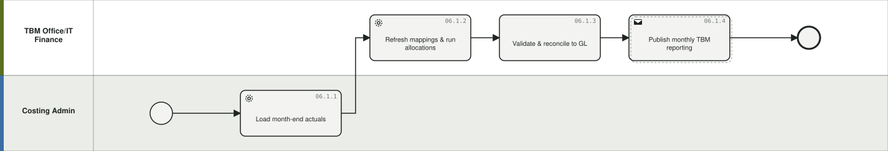

**06.1.1 Load month-end actuals** `P-0080` — Ingest GL, payroll, fixed assets, vendor invoices and cloud bills for the closed period.
- What you get: loaded period data
- BPMN: lane *Costing Admin*, Service task | Delivery model: Any | Product: Costing (+ Cloudability, ERP/GL) | Who: TBM Office & analysts, Platform admins & integration (Costing Admin, TBM Analyst) | When: Monthly (Monthly close)
- Inputs: GL extract, subledgers, cloud bills → Outputs: Loaded period data
- Config: Datalink connectors & schedules, Cost Source master data tables, ULS uploads
- Framework: TBM: Data | Cost Transparency | Flows: — | Evidence: IBM Docs Costing; TBM assessment (Data)

**06.1.2 Refresh mappings & run allocations** `P-0081` — Update account/cost-center mappings and run the allocation model for the period through pools, towers, apps and BUs.
- What you get: allocated cost model for period
- BPMN: lane *TBM Office/IT Finance*, Service task | Delivery model: Any | Product: Costing | Who: TBM Office & analysts (TBM Analyst) | When: Monthly (Monthly)
- Inputs: Loaded data, mapping tables → Outputs: Allocated cost model for period
- Config: Account mapping lookup tables, Cost Pool Reference List (ATUM), Model Studio allocation strategies (even/percent/weighted/consumption), allocation drivers
- Framework: TBM: taxonomy & model | Flows: — | Evidence: IBM Docs; ATUM

**06.1.3 Validate & reconcile to GL** `P-0082` — Validate allocations, analyze absorption (over/under allocation) and prove traceability back to the GL.
- What you get: validated, reconciled model
- BPMN: lane *TBM Office/IT Finance*, Task | Delivery model: Any | Product: Costing | Who: IT Finance & FP&A, TBM Office & analysts (TBM Analyst, IT Finance) | When: Monthly (Monthly)
- Inputs: Allocated model → Outputs: Validated, reconciled model
- Config: Model validation, absorption analysis, GL traceability drill-through
- Framework: TBM: defensibility | Flows: — | Evidence: IBM community absorption analysis; LFM 'allocations = defensibility'

**06.1.4 Publish monthly TBM reporting** `P-0083` — Release the monthly IT financial reports and executive dashboards.
- What you get: published dashboards/reports
- BPMN: lane *TBM Office/IT Finance*, Send task | Delivery model: Any | Product: Costing | Who: Executive leadership, TBM Office & analysts (TBM Office, CIO org) | When: Monthly (Monthly)
- Inputs: Validated model → Outputs: Published dashboards/reports
- Config: IT Financial Reports, Apptio BI, report subscriptions, CT Leadership Review
- Framework: TBM: Reporting & Metrics | Flows: UC4 | Evidence: IBM Docs; LFM demo

### 06.2 Analyze cost, variance & investment mix `G-062`

Original name: Cost Analysis & Variance (Actuals). Merged in: 06.7 Investment Mix Analysis. BPMN: [`06.2.bpmn`](../diagrams/bpmn/generated/06.2.bpmn) · 

**06.2.1 Analyze spend by cost pool & tower** `P-0084` — Slice actuals by cost pool/sub-pool, tower/sub-tower, OpEx/CapEx, fixed/variable, discretionary for insight and unit costs.
- What you get: spend insights, unit costs
- BPMN: lane *TBM Office/IT Finance*, Task | Delivery model: Any | Product: Costing | Who: IT Finance & FP&A, TBM Office & analysts (TBM Analyst, IT Finance) | When: Monthly (Monthly)
- Inputs: Allocated model → Outputs: Spend insights, unit costs
- Config: Cost pool & tower reports, Cost Source fields (Is Depr, Fixed Variable, Discretionary), tower unit costs
- Framework: TBM: Cost for Performance | Flows: — | Evidence: IBM Docs; TBM taxonomy

**06.2.2 Track budget vs actuals in the model** `P-0085` — Compare actuals against budget/forecast at cost pool level monthly, baselined to original budget and reforecasts.
- What you get: variance reporting
- BPMN: lane *TBM Office/IT Finance*, Task | Delivery model: Any | Product: Costing (+ Planning) | Who: IT Finance & FP&A (IT Finance) | When: Monthly (Monthly)
- Inputs: Budget (Planning), actuals → Outputs: Variance reporting
- Config: Budget dataset integration, variance reports, common data bus with Planning
- Framework: TBM: Reporting & Metrics | Flows: ZBB | Evidence: TBM assessment; ApptioOne CFD

**06.2.3 Classify & report run/grow/transform** `P-0086` (was 06.7.1) — Classify spend run/grow/transform (build vs run) and report innovation-vs-run mix to steer investment conversations.
- What you get: investment mix reporting
- BPMN: lane *TBM Office/IT Finance*, Task | Delivery model: Any | Product: Costing (+ Planning, Targetprocess) | Who: Executive leadership, TBM Office & analysts (TBM Office, CIO, CFO) | When: Quarterly (Quarterly)
- Inputs: Classified spend, project attributes → Outputs: Investment mix reporting
- Config: Run/grow/transform classification fields, Project Cost Type (build/run), Run-vs-Grow reports
- Framework: TBM: Investment in Innovation | Flows: UC4 | Evidence: ApptioOne CFD; CIO dashboard App & Run-vs-Grow reports

### 06.3 Compute application & service TCO `G-063`

Original name: Application & Service TCO. BPMN: [`06.3.bpmn`](../diagrams/bpmn/generated/06.3.bpmn) · 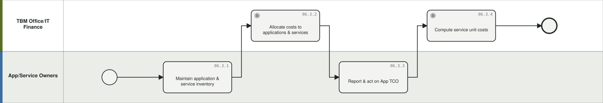

**06.3.1 Maintain application & service inventory** `P-0087` — Keep the app/service catalog and metadata current (functional groupings, owners, strategic alignment), aligned to ATUM service taxonomy.
- What you get: governed app/service master data
- BPMN: lane *App/Service Owners*, Task | Delivery model: Any | Product: Costing (+ CMDB/APM) | Who: TBM Office & analysts, Business, app & service owners (App/Service owners, TBM Office) | When: Continuous (Continuous)
- Inputs: CMDB/APM data, catalog → Outputs: Governed app/service master data
- Config: Applications & Services module master data, service catalog, ATUM Service Taxonomy (Service Type>Category>Service>Offering)
- Framework: TBM: taxonomy Solutions layer | Flows: — | Evidence: IBM Docs; TBMC25 ATUM product catalog

**06.3.2 Allocate costs to applications & services** `P-0088` — Flow tower, labor and vendor costs to apps/services using consumption drivers (servers, storage, tickets, effort).
- What you get: app/service costs (fully burdened)
- BPMN: lane *TBM Office/IT Finance*, Service task | Delivery model: Any | Product: Costing | Who: TBM Office & analysts (TBM Analyst) | When: Monthly (Monthly)
- Inputs: Tower costs, drivers → Outputs: App/service costs (fully burdened)
- Config: Tower->application allocation strategies, drivers (server counts, tickets, time/story points)
- Framework: TBM: Cost Transparency | Flows: UC4 | Evidence: IBM Docs; ATUM model

**06.3.3 Report & act on App TCO** `P-0089` — Publish Application TCO with run vs change attribution; drive rationalization (duplicates, long tail) and addressable-spend decisions.
- What you get: tCO reports, rationalization actions
- BPMN: lane *App/Service Owners*, Task | Delivery model: Any | Product: Costing (+ Targetprocess) | Who: TBM Office & analysts, Business, app & service owners (App owners, TBM Office, EA) | When: Monthly (Monthly/quarterly)
- Inputs: App costs, delivery data → Outputs: TCO reports, rationalization actions
- Config: Applications Overview / App TCO reports, run vs change attribution from work data (UC4), addressable vs committed spend, AppRat analysis
- Framework: TBM: Delivering Value | Flows: UC4, CLD | Evidence: E2E BPMN t_tco/t_run; ApptioOne Plus

**06.3.4 Compute service unit costs** `P-0090` — Calculate unit costs/unit economics for services to support pricing and benchmarking.
- What you get: service unit costs
- BPMN: lane *TBM Office/IT Finance*, Service task | Delivery model: Any | Product: Costing | Who: TBM Office & analysts (TBM Analyst) | When: Monthly (Monthly/quarterly)
- Inputs: Service costs, volumes → Outputs: Service unit costs
- Config: Service costing model, consumption metrics, Services NX Reports
- Framework: TBM: unit cost | FinOps: Unit Economics (intersect) | Flows: — | Evidence: IBM Docs; TBM assessment

### 06.4 Cost labor & capitalize `G-064`

Original name: Labor Costing & Capitalization. BPMN: [`06.4.bpmn`](../diagrams/bpmn/generated/06.4.bpmn) · 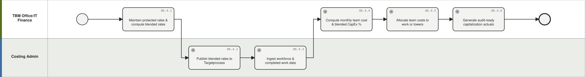

**06.4.1 Maintain protected rates & compute blended rates** `P-0091` — Keep individual rates protected inside Costing; compute blended team/ART/solution-train rates.
- What you get: blended rates by team/ART
- BPMN: lane *TBM Office/IT Finance*, Task | Delivery model: Any | Product: Costing | Who: IT Finance & FP&A, TBM Office & analysts (IT Finance, TBM Analyst) | When: Monthly (Monthly/quarterly)
- Inputs: HR comp data, org structure → Outputs: Blended rates by team/ART
- Config: ATP CM Rate Transform, protected rate tables, blending logic; rate-level exposure design decision (blended vs individual)
- Framework: TBM: labor | privacy | Flows: UC2 | Evidence: E2E BPMN t_rates; e2e script UC2

**06.4.2 Publish blended rates to Targetprocess** `P-0092` — Send blended rates to ATP on cadence so portfolio can cost work without exposing compensation.
- What you get: rates available in ATP
- BPMN: lane *Costing Admin*, Service task | Delivery model: Any | Product: Costing (+ Targetprocess) | Who: Platform admins & integration (System (ADM)) | When: Event-driven (Regular cadence)
- Inputs: Blended rates → Outputs: Rates available in ATP
- Config: ADM rate feed, rate cadence config; true-up pattern for blended-vs-actual reconciliation (design decision)
- Framework: Integration | Flows: UC2 | Evidence: E2E BPMN t_send4; e2e script

**06.4.3 Ingest workforce & completed work data** `P-0093` — Receive involvements, job profiles, CapEx/OpEx mappings, tower mappings and completed work from ATP.
- What you get: labor model inputs
- BPMN: lane *Costing Admin*, Service task | Delivery model: Any | Product: Costing (+ Targetprocess) | Who: TBM Office & analysts, Platform admins & integration (System (ADM), TBM Analyst) | When: Monthly (Monthly)
- Inputs: ATP workforce & work data → Outputs: Labor model inputs
- Config: ADM feed ATP->TBM Studio, involvement/profile/mapping datasets
- Framework: Integration | Flows: UC1 | Evidence: E2E BPMN t_send3

**06.4.4 Compute monthly team cost & blended CapEx %** `P-0094` — Combine involvements, profiles and protected rates into monthly cost and a blended CapEx percentage per team.
- What you get: team cost & CapEx % per team
- BPMN: lane *TBM Office/IT Finance*, Service task | Delivery model: Any | Product: Costing | Who: TBM Office & analysts (TBM Analyst (automated)) | When: Monthly (Monthly)
- Inputs: Labor model inputs → Outputs: Team cost & CapEx % per team
- Config: TBM Studio computation, job profile CapEx/OpEx splits, involvement math
- Framework: TBM: labor capitalization | Flows: UC1 | Evidence: E2E BPMN t_calc; e2e script UC1

**06.4.5 Allocate team costs to work or towers** `P-0095` — Allocate visible-backlog team costs to completed work (story points, weightage); allocate no-backlog teams (e.g. ServiceNow ops) to apps/towers by fixed capacity. Capitalization approaches span agile and traditional: Story Points, Story Count, Timesheet, or Project/Work Effort Unit.
- What you get: work-attached & tower-attached labor costs
- BPMN: lane *TBM Office/IT Finance*, Service task | Delivery model: Hybrid | Product: Costing (+ ServiceNow) | Who: TBM Office & analysts (TBM Analyst) | When: Monthly (Monthly)
- Inputs: Team costs, completed work / capacity rules → Outputs: Work-attached & tower-attached labor costs
- Config: Story-point/weightage allocation, fixed-capacity rules (team->app/tower), one normalized model for both team kinds
- Framework: TBM: allocation principles | Flows: UC1 | Evidence: E2E BPMN g_vis/t_work/t_tower; e2e script UC1

**06.4.6 Generate audit-ready capitalization actuals** `P-0096` — Produce the monthly SAP-ready file of actuals split CapEx/OpEx by user - accurate enough to deprecate time writing; validate fixed-bid/PS work against invoices.
- What you get: sAP-ready CapEx/OpEx actuals file
- BPMN: lane *TBM Office/IT Finance*, Service task | Delivery model: Any | Product: Costing (+ SAP/ERP) | Who: IT Finance & FP&A (IT Finance, Accounting) | When: Monthly (Monthly)
- Inputs: Allocated labor costs → Outputs: SAP-ready CapEx/OpEx actuals file
- Config: SAP-ready extract format, audit documentation, contractor/PS normalization
- Framework: Compliance: software capitalization | Flows: UC1 | Evidence: E2E BPMN t_sap; e2e script UC1 payoff

### 06.5 Manage vendor & asset cost `G-065`

Original name: Vendor & Asset Cost Management. BPMN: [`06.5.bpmn`](../diagrams/bpmn/generated/06.5.bpmn) · 

**06.5.1 Consolidate & analyze vendor spend** `P-0097` — Unify vendor spend across towers/apps/BUs; find duplicate services, consolidation and renewal opportunities, underspent contracts.
- What you get: vendor insights & actions
- BPMN: lane *TBM Office/IT Finance*, Task | Delivery model: Any | Product: Costing | Who: IT Finance & FP&A, Vendor management & procurement (Vendor Mgmt, IT Finance) | When: Monthly (Monthly/quarterly)
- Inputs: AP/vendor invoices, contracts → Outputs: Vendor insights & actions
- Config: Vendors master data, vendor insights reports, contract/PO feeds
- Framework: TBM: vendor spend | Flows: — | Evidence: ApptioOne CFD; CIO Vendor Report

**06.5.2 Track assets & depreciation** `P-0098` — Maintain the fixed asset ledger and depreciation/amortization flows in the cost model.
- What you get: asset cost & depreciation in model
- BPMN: lane *TBM Office/IT Finance*, Task | Delivery model: Any | Product: Costing | Who: IT Finance & FP&A (IT Finance) | When: Monthly (Monthly)
- Inputs: Fixed asset schedule → Outputs: Asset cost & depreciation in model
- Config: Fixed Asset Ledger, Is Depr flag, depreciation flows
- Framework: ITFM/TBM | Flows: — | Evidence: IBM Docs

### 06.6 Benchmark against peers `G-066`

Original name: Benchmarking. BPMN: [`06.6.bpmn`](../diagrams/bpmn/generated/06.6.bpmn) · 

**06.6.1 Prepare taxonomy-aligned benchmark data** `P-0099` — Ensure cost data aligns to ATUM/TBM taxonomy so peer comparison is valid.
- What you get: benchmark-ready dataset
- BPMN: lane *TBM Office/IT Finance*, Task | Delivery model: Any | Product: Costing | Who: TBM Office & analysts (TBM Office) | When: Quarterly (Annual/quarterly)
- Inputs: Allocated model → Outputs: Benchmark-ready dataset
- Config: ATUM mappings, benchmarking data prep
- Framework: TBM: Benchmarking | Flows: — | Evidence: Apptio Benchmarking

**06.6.2 Compare vs peers & set targets** `P-0100` — Benchmark cost pools/towers against peer groups; identify variance drivers and set improvement targets (spend archetypes).
- What you get: benchmark insights & targets
- BPMN: lane *TBM Office/IT Finance*, Task | Delivery model: Any | Product: Costing | Who: Executive leadership, TBM Office & analysts (TBM Office, CIO) | When: Annual / per cycle (Annual + refresh)
- Inputs: Benchmark data, peer groups → Outputs: Benchmark insights & targets
- Config: Benchmarking Essentials/Standard, custom peer groups, box plots, IT Benchmarking Review, Spend Archetypes
- Framework: TBM: Benchmarking | FinOps: KPIs & Benchmarking | Flows: — | Evidence: IBM Docs; Benchmarking product

## L0-07 Cloud Financial Management (FinOps)

*Operate the FinOps lifecycle - ingest and allocate multi-cloud and container spend, report it, respond to anomalies, optimize usage and rates, and plan cloud budgets and migrations.* Primary: **Cloudability**. Band: core. Lanes: FinOps Practitioner; Engineering; Finance; Cloud vendors.

Diagrams: [BPMN](../diagrams/bpmn/generated/L0-07.bpmn) · [Mermaid](../diagrams/mermaid/area-07.md)

### 07.1 Establish the cloud cost data foundation `G-071`

Original name: Cloud Cost Data Foundation. BPMN: [`07.1.bpmn`](../diagrams/bpmn/generated/07.1.bpmn) · 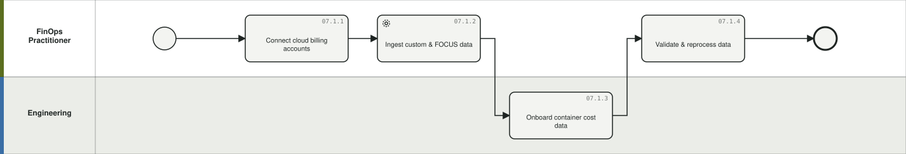

**07.1.1 Connect cloud billing accounts** `P-0101` — Onboard AWS/Azure/GCP/OCI billing exports under vendor credentials.
- What you get: normalized multi-cloud cost data
- BPMN: lane *FinOps Practitioner*, Task | Delivery model: Any | Product: Cloudability | Who: FinOps practitioners, Engineering (FinOps Practitioner, Cloud Eng) | When: Continuous (Once + on change)
- Inputs: Payer accounts, billing exports → Outputs: Normalized multi-cloud cost data
- Config: Vendor Credentials (AWS payer+CUR, Azure export, GCP BigQuery, OCI), amortization/cost-basis settings
- Framework: FinOps: Understand > Data Ingestion | Flows: — | Evidence: IBM Docs Cloudability

**07.1.2 Ingest custom & FOCUS data** `P-0102` — Bring non-native spend (SaaS, other platforms) in via FOCUS-compliant ingress.
- What you get: unified spend incl. non-cloud
- BPMN: lane *FinOps Practitioner*, Service task | Delivery model: Any | Product: Cloudability | Who: FinOps practitioners (FinOps Practitioner) | When: Continuous (On change)
- Inputs: FOCUS 1.0/1.1 datasets → Outputs: Unified spend incl. non-cloud
- Config: FOCUS Ingress (S3/Blob/GCS + manifest), FOCUS validator
- Framework: FinOps: Data Ingestion | FOCUS | Flows: — | Evidence: IBM Docs FOCUS ingress

**07.1.3 Onboard container cost data** `P-0103` — Install cluster agents and configure shared-cluster allocation for Kubernetes/OpenShift to namespace/label level.
- What you get: container cost allocation
- BPMN: lane *Engineering*, Task | Delivery model: Any | Product: Cloudability | Who: FinOps practitioners, Engineering (Platform Eng, FinOps) | When: Event-driven (Per cluster)
- Inputs: Cluster metrics → Outputs: Container cost allocation
- Config: IBM FinOps Agent (Helm), cluster credentials, shared cluster cost allocation rules
- Framework: FinOps: Allocation (containers) | Flows: — | Evidence: IBM Docs container agent

**07.1.4 Validate & reprocess data** `P-0104` — Reconcile ingested cost vs invoices; reprocess history after mapping changes.
- What you get: validated dataset
- BPMN: lane *FinOps Practitioner*, Task | Delivery model: Any | Product: Cloudability | Who: FinOps practitioners (FinOps Practitioner) | When: Continuous (Monthly + on change)
- Inputs: Ingested data → Outputs: Validated dataset
- Config: TrueCost Explorer reconciliation, Data Reprocess
- Framework: FinOps: Data Ingestion | Flows: — | Evidence: IBM Docs

### 07.2 Allocate cloud cost & govern tagging `G-072`

Original name: Cloud Allocation & Tagging Governance. BPMN: [`07.2.bpmn`](../diagrams/bpmn/generated/07.2.bpmn) · 

**07.2.1 Design business mappings & views** `P-0105` — Build rule-based business dimensions (cost center, app, product, environment) and scope views/account groups per audience.
- What you get: allocation dimensions & scoped views
- BPMN: lane *FinOps Practitioner*, Task | Delivery model: Any | Product: Cloudability | Who: FinOps practitioners (FinOps Practitioner) | When: Continuous (Initial + on change)
- Inputs: Org structures, tag data → Outputs: Allocation dimensions & scoped views
- Config: Business Mappings (match/value expressions), Business Metrics, Account Groups, Views
- Framework: FinOps: Allocation | Flows: — | Evidence: IBM Docs Business Mappings

**07.2.2 Govern tagging** `P-0106` — Define the tagging standard, monitor coverage, remediate untagged spend, enforce mandatory tags in CI/CD.
- What you get: tag hygiene & coverage
- BPMN: lane *FinOps Practitioner*, Task | Delivery model: Any | Product: Cloudability | Who: FinOps practitioners, Engineering (FinOps, Engineering) | When: Continuous (Continuous)
- Inputs: Tag standard → Outputs: Tag hygiene & coverage
- Config: Tags & Labels config, Tag Explorer, untagged-cost reports, Governance mandatory tag enforcement (Terraform/GitHub preview)
- Framework: FinOps: Allocation | TBM: Data (tagging) | Flows: — | Evidence: IBM Docs; TBM assessment tagging

**07.2.3 Allocate shared costs** `P-0107` — Split shared platform costs to consumers via cost sharing and telemetry rules for showback/chargeback.
- What you get: fully allocated cloud cost
- BPMN: lane *FinOps Practitioner*, Task | Delivery model: Any | Product: Cloudability | Who: FinOps practitioners (FinOps Practitioner) | When: Monthly (Monthly)
- Inputs: Shared cost pools, telemetry → Outputs: Fully allocated cloud cost
- Config: Cost Sharing & Telemetry rules, CSV rule import/export
- Framework: FinOps: Allocation, Invoicing & Chargeback | Flows: CLD | Evidence: Cloudability cost sharing

**07.2.4 Map cloud spend to TBM taxonomy** `P-0108` — Apply ATUM dimensions and share cloud cost/capacity data into Costing for hybrid TCO.
- What you get: tBM-aligned cloud spend in cost model
- BPMN: lane *FinOps Practitioner*, Task | Delivery model: Any | Product: Cloudability (+ Costing) | Who: TBM Office & analysts, FinOps practitioners (FinOps, TBM Office) | When: Monthly (Monthly)
- Inputs: Allocated cloud cost → Outputs: TBM-aligned cloud spend in cost model
- Config: ATUM Tower/Sub-Tower/Service dimensions, Cloudability->Costing data share
- Framework: FinOps: Intersecting (ITFM/TBM) | Flows: CLD | Evidence: IBM Docs ATUM dimensions; TBMC25 flow

### 07.3 Report cloud cost, unit economics & sustainability `G-073`

Original name: Cloud Reporting & Unit Economics. Merged in: 07.7 Cloud Sustainability. BPMN: [`07.3.bpmn`](../diagrams/bpmn/generated/07.3.bpmn) · 

**07.3.1 Operate dashboards & scheduled reports** `P-0109` — Maintain persona dashboards and scheduled reports for engineering, finance and leadership; include AI/GenAI spend.
- What you get: self-service visibility
- BPMN: lane *FinOps Practitioner*, Task | Delivery model: Any | Product: Cloudability | Who: FinOps practitioners (FinOps, all personas) | When: Continuous (Continuous/monthly)
- Inputs: Allocated cost data → Outputs: Self-service visibility
- Config: Dashboards & widgets, Reports (scheduled email), TrueCost Explorer, AI Services Dashboard, Views
- Framework: FinOps: Reporting & Analytics | Flows: — | Evidence: IBM Docs

**07.3.2 Benchmark efficiency** `P-0110` — Score teams/BUs against internal and peer benchmarks.
- What you get: scorecards
- BPMN: lane *FinOps Practitioner*, Task | Delivery model: Any | Product: Cloudability | Who: Executive leadership, FinOps practitioners (FinOps, Leadership) | When: Monthly (Monthly/quarterly)
- Inputs: Cost & usage data → Outputs: Scorecards
- Config: Scorecards (peer & internal)
- Framework: FinOps: KPIs & Benchmarking | Flows: — | Evidence: IBM Docs

**07.3.3 Track unit economics** `P-0111` — Define and monitor cost-per-business-unit-of-value metrics (cost per customer/transaction).
- What you get: unit cost trends
- BPMN: lane *FinOps Practitioner*, Task | Delivery model: Any | Product: Cloudability | Who: IT Finance & FP&A, Product management, FinOps practitioners (FinOps, Product, Finance) | When: Monthly (Monthly)
- Inputs: Cost + business telemetry → Outputs: Unit cost trends
- Config: Business Metrics (<=5/account), telemetry joins, dashboards
- Framework: FinOps: Unit Economics | Flows: — | Evidence: IBM Docs Business Metrics

**07.3.4 Report & act on sustainability** `P-0112` (was 07.7.1) — Track carbon/GPU sustainability metrics and include them in optimization decisions.
- What you get: sustainability reporting
- BPMN: lane *FinOps Practitioner*, Task | Delivery model: Any | Product: Cloudability | Who: FinOps practitioners (FinOps, Sustainability) | When: Monthly (Monthly/quarterly)
- Inputs: Usage & carbon metrics → Outputs: Sustainability reporting
- Config: Sustainability metrics (incl. Azure/OCI GPU), dashboards, scorecards
- Framework: FinOps: Sustainability | Flows: — | Evidence: IBM Docs 2025 (verify metric names)

### 07.4 Manage anomalies `G-074`

Original name: Anomaly Management. BPMN: [`07.4.bpmn`](../diagrams/bpmn/generated/07.4.bpmn) · 

**07.4.1 Configure anomaly detection** `P-0113` — Set alert scopes, thresholds, recipients and channels for ML-based unusual-spend detection.
- What you get: active anomaly alerting
- BPMN: lane *FinOps Practitioner*, Task | Delivery model: Any | Product: Cloudability | Who: FinOps practitioners (FinOps Practitioner) | When: Event-driven (Initial + tuning)
- Inputs: Views, thresholds → Outputs: Active anomaly alerting
- Config: Anomaly alerts (view scope, Total Cost/Unusual Spend thresholds, filters, email/PagerDuty)
- Framework: FinOps: Anomaly Management | Flows: — | Evidence: IBM Docs anomaly

**07.4.2 Triage, route & resolve anomalies** `P-0114` — Investigate anomalies, route to owning engineers via ticketing, track resolution and tune rules.
- What you get: resolved anomalies, tuned rules
- BPMN: lane *FinOps Practitioner*, User task | Delivery model: Any | Product: Cloudability (+ Jira/ServiceNow) | Who: FinOps practitioners, Engineering (FinOps, Engineering) | When: Weekly (Per event + weekly review)
- Inputs: Anomaly alerts → Outputs: Resolved anomalies, tuned rules
- Config: Anomaly drill-down, TrueCost Explorer, bi-directional Jira/ServiceNow ticketing, alert history
- Framework: FinOps: Anomaly Management | Operate phase | Flows: — | Evidence: IBM Docs 2025 features

### 07.5 Optimize usage & rates `G-075`

Original name: Usage & Rate Optimization. BPMN: [`07.5.bpmn`](../diagrams/bpmn/generated/07.5.bpmn) · 

**07.5.1 Run the rightsizing cadence** `P-0115` — Review utilization-based recommendations, dispatch to owners, execute (or automate via Turbonomic in Premium) and measure realized savings.
- What you get: actioned rightsizing, ROI
- BPMN: lane *FinOps Practitioner*, Task | Delivery model: Any | Product: Cloudability (+ Turbonomic, Jira) | Who: FinOps practitioners, Engineering (FinOps, Engineering) | When: Weekly (Weekly/monthly)
- Inputs: Utilization data → Outputs: Actioned rightsizing, ROI
- Config: Rightsizing recommendations & Preferences (lookback, aggressiveness), Rightsizing ROI, Turbonomic action automation (Premium)
- Framework: FinOps: Usage Optimization | Flows: ZBB | Evidence: IBM Docs; Premium announcement

**07.5.2 Eliminate waste & govern pre-deployment** `P-0116` — Find idle/unused resources; enforce cost policy and estimation before deployment in CI/CD.
- What you get: waste removal, policy compliance
- BPMN: lane *FinOps Practitioner*, Task | Delivery model: Any | Product: Cloudability (+ Terraform/GitHub) | Who: FinOps practitioners, Engineering (FinOps, Engineering) | When: Continuous (Continuous)
- Inputs: Utilization, IaC plans → Outputs: Waste removal, policy compliance
- Config: Utilization/idle reports, Cost Governance policies, pre-deployment cost estimation (preview)
- Framework: FinOps: Usage Optimization, Governance | Flows: — | Evidence: IBM Docs Governance preview

**07.5.3 Manage commitments (assisted)** `P-0117` — Assess RI/SP/CUD coverage, generate and approve purchase/exchange recommendations, track amortization.
- What you get: commitment purchases & coverage
- BPMN: lane *FinOps Practitioner*, Task | Delivery model: Any | Product: Cloudability | Who: IT Finance & FP&A, FinOps practitioners, Vendor management & procurement (FinOps, Finance, Procurement) | When: Monthly (Monthly/quarterly)
- Inputs: Usage patterns → Outputs: Commitment purchases & coverage
- Config: Commitment Overview / Portfolio / Recommendations
- Framework: FinOps: Rate Optimization | Flows: — | Evidence: IBM Docs commitments

**07.5.4 Automate commitments (Savings Automation)** `P-0118` — Run commitment management on autopilot within guardrails (per-account/per-region), monitoring coverage (>90%) and savings-share billing.
- What you get: automated RI/SP portfolio & savings
- BPMN: lane *FinOps Practitioner*, Task | Delivery model: Any | Product: Cloudability Savings Automation | Who: FinOps practitioners (FinOps admin (RateOptimizationFullAccess)) | When: Continuous (Continuous (autopilot))
- Inputs: Payer spend, guardrails → Outputs: Automated RI/SP portfolio & savings
- Config: Guardrails (ingestion account selection, active-management toggles, advanced config), savings assessment, coverage monitoring
- Framework: FinOps: Rate Optimization (Run maturity) | Flows: — | Evidence: IBM Docs Savings Automation

### 07.6 Plan & forecast cloud spend `G-076`

Original name: Cloud Planning & Forecasting. BPMN: [`07.6.bpmn`](../diagrams/bpmn/generated/07.6.bpmn) · 

**07.6.1 Manage cloud budgets** `P-0119` — Set budgets on views/BUs, monitor burn and alert on breach. Cloud is variable spend, so the ZBB "zero base" for a cloud decision unit is the rightsized, waste-free consumption baseline from 07.5 rather than a prior-year run rate.
- What you get: budgets with alerts
- BPMN: lane *FinOps Practitioner*, Task | Delivery model: Any | Budgeting method: Rolling / Driver-based (ZBB: rightsized baseline from 07.5) | Product: Cloudability | Who: IT Finance & FP&A, FinOps practitioners (FinOps, Finance, Eng leads) | When: Monthly (Monthly)
- Inputs: Forecasts, targets → Outputs: Budgets with alerts
- Config: Budgets on Views, breach alerts
- Framework: FinOps: Budgeting | Flows: — | Evidence: IBM Docs

**07.6.2 Forecast cloud spend** `P-0120` — Produce rolling AI-backed forecasts with driver dimensions; analyze variance.
- What you get: rolling forecast & variance
- BPMN: lane *FinOps Practitioner*, Task | Delivery model: Any | Budgeting method: Rolling | Product: Cloudability (+ Planning) | Who: IT Finance & FP&A, FinOps practitioners (FinOps, Finance) | When: Monthly (Monthly)
- Inputs: Historical usage → Outputs: Rolling forecast & variance
- Config: Intelligent/Enhanced Forecasting (best-fit model, <=3 driver dims), dashboards
- Framework: FinOps: Forecasting | Flows: — | Evidence: IBM Docs 2025

**07.6.3 Plan migrations & new workloads** `P-0121` — Model future/migration workloads cross-cloud (vendor, region, lease type, commitment) and export cost estimates.
- What you get: cross-cloud plan & estimates
- BPMN: lane *Engineering*, Task | Delivery model: Any | Budgeting method: Any (planning & estimating) | Product: Cloudability | Who: FinOps practitioners, Engineering (Cloud architects, FinOps) | When: Event-driven (Per initiative)
- Inputs: Workload requirements → Outputs: Cross-cloud plan & estimates
- Config: Workload Planning: Workloads, Resources (VM/DB/storage/LB, bulk JSON/XLSX), Recommendations, Preferences
- Framework: FinOps: Planning & Estimating | Flows: — | Evidence: IBM Docs Workload Planning

## L0-08 Consumption, Chargeback & Value Management

*Turn transparency into accountability: showback and Bill of IT to business units, price services, shape demand, benchmark against peers, and run the executive value operating rhythm.* Primary: **Costing (Billing)**. Band: core. Lanes: TBM Office; BU Owners; CIO/CFO; Service Owners.

Diagrams: [BPMN](../diagrams/bpmn/generated/L0-08.bpmn) · [Mermaid](../diagrams/mermaid/area-08.md)

### 08.1 Show back & bill for IT `G-081`

Original name: Showback & Bill of IT. BPMN: [`08.1.bpmn`](../diagrams/bpmn/generated/08.1.bpmn) · 

**08.1.1 Allocate consumption to business units** `P-0122` — Allocate app/service (and cloud) costs to business units on consumption drivers for defensible showback.
- What you get: bU consumption costs
- BPMN: lane *TBM Office*, Service task | Delivery model: Any | Product: Costing (+ Cloudability) | Who: TBM Office & analysts (TBM Analyst) | When: Monthly (Monthly)
- Inputs: App/service costs, consumption drivers → Outputs: BU consumption costs
- Config: Business Units module, drivers (headcount, users, transactions, volume), Cloudability cost sharing results
- Framework: TBM: Cost Transparency>consumers | FinOps: Invoicing & Chargeback | Flows: UC4, CLD | Evidence: IBM Docs; ApptioOne Plus

**08.1.2 Publish showback / Bill of IT** `P-0123` — Deliver periodic Bill of IT statements per BU with traceability to sources.
- What you get: bill of IT statements
- BPMN: lane *TBM Office*, Send task | Delivery model: Any | Product: Costing (Billing) | Who: TBM Office & analysts, Business, app & service owners (TBM Office, BU Owners) | When: Monthly (Monthly)
- Inputs: BU consumption costs → Outputs: Bill of IT statements
- Config: Billing product (Bill of IT reports), Business Units Report Collection, scheduled distribution
- Framework: TBM: Delivering Value | Flows: CLD | Evidence: Apptio Billing; TBM assessment (showback at service level)

**08.1.3 Price services & run chargeback** `P-0124` — Set strategic service prices, model what-if allocation changes, execute chargeback and manage over/under recovery.
- What you get: chargeback invoices, recovery position
- BPMN: lane *TBM Office*, Task | Delivery model: Any | Product: Costing (Billing) | Who: IT Finance & FP&A, TBM Office & analysts (IT Finance, TBM Office) | When: Quarterly (Quarterly + annual pricing)
- Inputs: Unit costs, pricing strategy → Outputs: Chargeback invoices, recovery position
- Config: Billing pricing, what-if scenario modeling, O/U recovery management
- Framework: TBM: Shaping Demand | FinOps: Invoicing & Chargeback | Flows: — | Evidence: Apptio Billing

### 08.2 Engage the business & steer value `G-082`

Original name: Demand Shaping & BU Engagement. Merged in: 08.3 Enterprise Business Management (EBM), 08.4 Executive Value Operating Rhythm. BPMN: [`08.2.bpmn`](../diagrams/bpmn/generated/08.2.bpmn) · 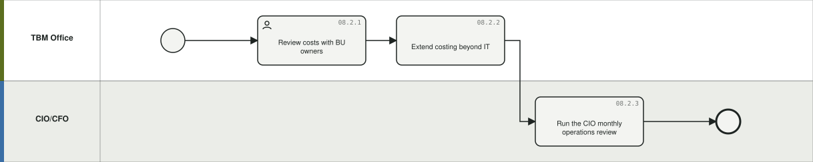

**08.2.1 Review costs with BU owners** `P-0125` — Run consumption conversations with business partners using cost driver insight to shape demand.
- What you get: demand decisions, behavior change
- BPMN: lane *TBM Office*, User task | Delivery model: Any | Product: Costing (+ Cloudability) | Who: TBM Office & analysts, Business, app & service owners (TBM Office, BU Owners) | When: Monthly (Monthly/quarterly)
- Inputs: Bill of IT, drivers → Outputs: Demand decisions, behavior change
- Config: BU reports, cost driver drill-downs, per-employee spend views
- Framework: TBM: Shaping Demand, four value conversations | Flows: — | Evidence: TBM assessment (Engagement, Taxonomy)

**08.2.2 Extend costing beyond IT** `P-0126` (was 08.3.1) — Model total spend (tech + non-tech) to TCO of business processes, products and services; align digital KPIs to enterprise workflows.
- What you get: business process/product TCO
- BPMN: lane *TBM Office*, Task | Delivery model: Any | Product: Costing (EBM) | Who: IT Finance & FP&A, TBM Office & analysts (Enterprise Finance, TBM Office) | When: Quarterly (Quarterly+)
- Inputs: Enterprise cost data → Outputs: Business process/product TCO
- Config: EBM Costing & Billing, EIW alignment, digital KPIs (unit cost, flow velocity, volumes)
- Framework: TBM->EBM evolution | Flows: — | Evidence: TBMC25 EBM section; ApptioOne CFD EBM

**08.2.3 Run the CIO monthly operations review** `P-0127` (was 08.4.1) — Operate the monthly executive dashboard cycle: financial attainment, vendor, app run-vs-grow, cloud consumption and workforce analytics - actuals from Costing/ATP, plans from Planning.
- What you get: executive decisions & actions
- BPMN: lane *CIO/CFO*, Task | Delivery model: Any | Product: All four (+ PowerBI) | Who: Executive leadership, TBM Office & analysts, FinOps practitioners, Business, app & service owners (CIO, TBM Office, FinOps focals, App/Platform owners) | When: Monthly (Monthly)
- Inputs: All product outputs → Outputs: Executive decisions & actions
- Config: CIO Monthly Operations Dashboard: IT Financial Attainment (CT + Planning), IT Vendor Report, App & Run-vs-Grow (APM+CT), Cloud Consumption (Cloudability), Workforce Analytics
- Framework: TBM: Reporting | SPM: Value Realization | Flows: ZBB | Evidence: TBMC25 Client Zero dashboard

## L0-10 Platform Configuration, Data & Administration

*The enabling processes: configure each product, operate the data pipelines and integrations, and run the TBM/FinOps/SPM practices that govern adoption and maturity.* Primary: **All four**. Band: enable. Lanes: Platform Admins; TBM Office; FinOps Team; SPM Governance; Integration Team.

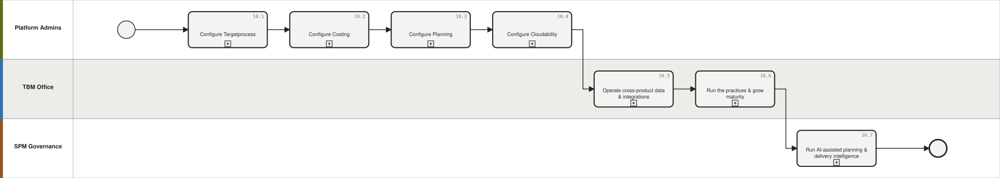

Diagrams: [BPMN](../diagrams/bpmn/generated/L0-10.bpmn) · [Mermaid](../diagrams/mermaid/area-10.md)

### 10.1 Configure Targetprocess `G-101`

Original name: Targetprocess Configuration. BPMN: [`10.1.bpmn`](../diagrams/bpmn/generated/10.1.bpmn) · 

**10.1.1 Design org, portfolio & team structure** `P-0128` — Configure portfolios/projects, teams, ARTs/groups and access model to mirror the operating model.
- What you get: configured structure
- BPMN: lane *Platform Admins*, Task | Delivery model: Any | Product: Targetprocess | Who: Product management, Platform admins & integration (ATP Admin, ATP Product Owner) | When: Event-driven (Implementation + evolution)
- Inputs: Operating model → Outputs: Configured structure
- Config: Portfolios (Projects), Teams, ART/Groups, team-project assignment, user types, roles & per-process permissions, RBAC
- Framework: SPM journey: Initiate/Discover | Flows: — | Evidence: SPM journey map; TP guide

**10.1.2 Configure processes, workflows & fields** `P-0129` — Set entity workflows/states, terminology, custom & calculated fields and metrics per entity type.
- What you get: configured processes
- BPMN: lane *Platform Admins*, Task | Delivery model: Any | Product: Targetprocess | Who: Platform admins & integration (ATP Admin) | When: Event-driven (Implementation + change)
- Inputs: Process design → Outputs: Configured processes
- Config: Process editor, entity states & per-state permissions, terminology renames, custom fields, calculated fields, Metrics engine
- Framework: Enabling | Flows: — | Evidence: TP guide

**10.1.3 Install & tailor Solution Library packages** `P-0130` — Deploy packaged solutions (SAFe, OKR, PI Planning, Demand & Capacity, Budgeting, Time Tracking, Scenario Planning, WFM) and tailor them.
- What you get: installed, tailored solutions
- BPMN: lane *Platform Admins*, Task | Delivery model: Any | Product: Targetprocess | Who: Platform admins & integration (ATP Admin, consultants) | When: Event-driven (Per capability rollout)
- Inputs: Capability roadmap → Outputs: Installed, tailored solutions
- Config: Solutions Library, solution components, extensions, versioning/upgradability
- Framework: Enabling | Flows: — | Evidence: TP Solutions Library; solution sheets

**10.1.4 Build views, dashboards & automation** `P-0131` — Create role-based views/boards/timelines, dashboards and automation/validation rules.
- What you get: role-based UX & automations
- BPMN: lane *Platform Admins*, User task | Delivery model: Any | Product: Targetprocess | Who: Platform admins & integration (ATP Admin) | When: Continuous (Continuous)
- Inputs: Audience needs → Outputs: Role-based UX & automations
- Config: Board/list/timeline views, view sharing, dashboards, automation rules (JS logic, webhooks), validation rules
- Framework: Enabling | Flows: — | Evidence: TP guide; Customer PowerUp

**10.1.5 Manage integrations & environments** `P-0132` — Configure Jira/ADO/ServiceNow/email/SSO integrations and promote configuration Sandbox > Pre-Prod > Prod.
- What you get: working integrations, promoted config
- BPMN: lane *Platform Admins*, Task | Delivery model: Any | Product: Targetprocess (+ Jira, ADO, ServiceNow) | Who: Platform admins & integration (ATP Admin, Integration team) | When: Event-driven (Per integration + release)
- Inputs: Integration requirements → Outputs: Working integrations, promoted config
- Config: Native connectors, REST API/webhooks, SSO/SAML, environment promotion (incl. validation & automation rules)
- Framework: Enabling | Flows: — | Evidence: Customer PowerUp (env promotion); TP integrations

### 10.2 Configure Costing `G-102`

Original name: Costing Configuration. BPMN: [`10.2.bpmn`](../diagrams/bpmn/generated/10.2.bpmn) · 

**10.2.1 Implement the cost model** `P-0133` — Create the Costing project, configure master data, map GL to cost pools, build allocation strategies and reports.
- What you get: working TBM model
- BPMN: lane *Platform Admins*, Task | Delivery model: Any | Product: Costing | Who: TBM Office & analysts, Platform admins & integration (Costing Admin, TBM consultants) | When: Event-driven (Implementation (10-12 wks) + evolution)
- Inputs: GL, org & asset data → Outputs: Working TBM model
- Config: Costing Standard project, Cost Source/Labor/Fixed Asset/Vendors/Projects master data, Cost Pool Reference List, account mapping tables, Model Studio strategies, Report Studio/Apptio BI
- Framework: TBM Foundations | Flows: — | Evidence: IBM Docs; onboarding packages

**10.2.2 Operate data pipelines (Datalink)** `P-0134` — Onboard sources via Datalink connectors/agent, schedule loads, monitor and troubleshoot; validate data quality.
- What you get: reliable automated feeds (5-15 sources)
- BPMN: lane *Platform Admins*, Service task | Delivery model: Any | Product: Costing (+ All sources) | Who: TBM Office & analysts, Platform admins & integration (Costing Admin, Integration team) | When: Continuous (Continuous)
- Inputs: Source systems → Outputs: Reliable automated feeds (5-15 sources)
- Config: Datalink app + Agent (Boomi), connectors (REST, SAP, ServiceNow...), ULS, schedules, Data Studio transforms & quality checks
- Framework: TBM: Automation dimension | Flows: — | Evidence: IBM Docs Datalink; TBM assessment

### 10.3 Configure Planning `G-103`

Original name: Planning Configuration. BPMN: [`10.3.bpmn`](../diagrams/bpmn/generated/10.3.bpmn) · 

**10.3.1 Configure planning structures** `P-0135` — Set reference data/hierarchies, line items, GL-to-IT mappings, calendars, currencies, permissions and restricted fields. For ZBB add the decision-unit register, 'Decision Package' / 'Service Level Tier' / 'Cost Category Owner' custom lists and package scoring fields (see 05.8).
- What you get: configured planning environment
- BPMN: lane *Platform Admins*, Task | Delivery model: Any | Product: Planning | Who: Platform admins & integration (Planning Admin) | When: Event-driven (Implementation (~4 wks) + evolution)
- Inputs: Finance structures → Outputs: Configured planning environment
- Config: Reference data/schemas/custom lists, line-item config, working calendar, multi-currency, cost object permissions, Restricted Access dims; ZBB custom lists & scoring fields
- Framework: Enabling | Flows: — | Evidence: Planning docs

**10.3.2 Configure workflow & integrations** `P-0136` — Set approval workflows, plan lifecycle, and integrations (Costing actuals, Cloudability, Planning Analytics, APIs).
- What you get: working workflow & feeds
- BPMN: lane *Platform Admins*, Task | Delivery model: Any | Product: Planning (+ Costing, Cloudability) | Who: Platform admins & integration (Planning Admin) | When: Event-driven (Implementation + change)
- Inputs: Governance design → Outputs: Working workflow & feeds
- Config: Approval workflow config, plan states, Costing/Cloudability/Planning Analytics connectors, REST APIs
- Framework: Enabling | Flows: — | Evidence: Planning docs

### 10.4 Configure Cloudability `G-104`

Original name: Cloudability Configuration. BPMN: [`10.4.bpmn`](../diagrams/bpmn/generated/10.4.bpmn) · 

**10.4.1 Configure cloud data, mappings & views** `P-0137` (was 10.4.1 (split)) — Set vendor credentials, business mappings and metrics, tags, account groups, views, cost-sharing rules, container agents and ATUM dimensions so every cloud dollar lands in the right place.
- What you get: allocated, view-scoped cloud cost data
- BPMN: lane *Platform Admins*, Task | Delivery model: Any | Product: Cloudability | Who: FinOps practitioners, Platform admins & integration (FinOps Admin) | When: Event-driven (Implementation + tuning)
- Inputs: Cloud estate, org model → Outputs: Allocated, view-scoped cloud cost data
- Config: Vendor credentials (AWS/Azure/GCP/OCI), Business Mappings/Metrics, tags/account groups/views, cost sharing rules, container agents, users/roles + ATUM dims
- Framework: FinOps: Manage the Practice | Flows: — | Evidence: Cloudability research checklist

**10.4.2 Configure budgets, alerts, optimization & governance** `P-0138` (was 10.4.1 (split)) — Set budgets and forecast settings, anomaly rules, rightsizing preferences, commitment and Savings Automation guardrails, governance policies and workload-planning preferences.
- What you get: tuned FinOps operating controls
- BPMN: lane *Platform Admins*, Task | Delivery model: Any | Product: Cloudability | Who: FinOps practitioners, Platform admins & integration (FinOps Admin) | When: Event-driven (Implementation + tuning)
- Inputs: Cloud estate, org model → Outputs: Tuned FinOps operating controls
- Config: Dashboards/reports/scorecards, budgets & forecast settings, anomaly rules, rightsizing prefs, commitment/SA guardrails, governance policies, workload planning prefs
- Framework: FinOps: Manage the Practice | Flows: — | Evidence: Cloudability research checklist

### 10.5 Operate cross-product data & integrations `G-105`

Original name: Cross-Product Data & Integration Operations. BPMN: [`10.5.bpmn`](../diagrams/bpmn/generated/10.5.bpmn) · 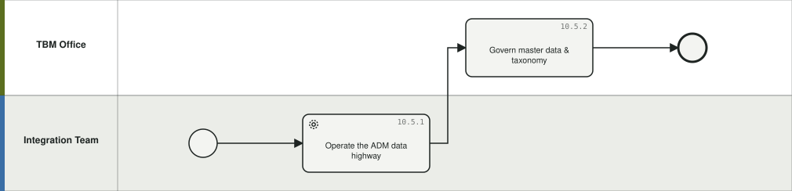

**10.5.1 Operate the ADM data highway** `P-0139` — Run and monitor the cross-product feeds (targets, positions, rates, workforce/work data, cloud cost, investment loop) at their cadences.
- What you get: reliable cross-tool flows
- BPMN: lane *Integration Team*, Service task | Delivery model: Any | Product: All four (+ ADM/Datalink) | Who: Platform admins & integration (Integration team, Platform admins) | When: Continuous (Daily-monthly by feed)
- Inputs: Product data → Outputs: Reliable cross-tool flows
- Config: ADM/data highway feeds & cadences (positions daily/weekly, rates regular, work data monthly, roster daily-monthly by source), monitoring & error handling
- Framework: Enabling all L0-09 flows | Flows: UC3 | Evidence: E2E BPMN; TBMC25 sync cadences

**10.5.2 Govern master data & taxonomy** `P-0140` — Own shared reference data: ATUM taxonomy versions, service/product catalog, cost centers, tags, naming conventions and cross-reference tables.
- What you get: consistent shared taxonomy
- BPMN: lane *TBM Office*, Task | Delivery model: Any | Product: All four | Who: TBM Office & analysts (TBM Office, Data governance) | When: Continuous (Quarterly + on change)
- Inputs: Source-of-truth systems → Outputs: Consistent shared taxonomy
- Config: ATUM taxonomy layers, service catalog as product catalog, tag dictionaries, cross-reference tables, referential integrity checks
- Framework: TBM: Data & Taxonomy dimensions | Flows: — | Evidence: TBM assessment; TBMC25 ATUM catalog

### 10.6 Run the practices & grow maturity `G-106`

Original name: Practice Operations & Maturity. BPMN: [`10.6.bpmn`](../diagrams/bpmn/generated/10.6.bpmn) · 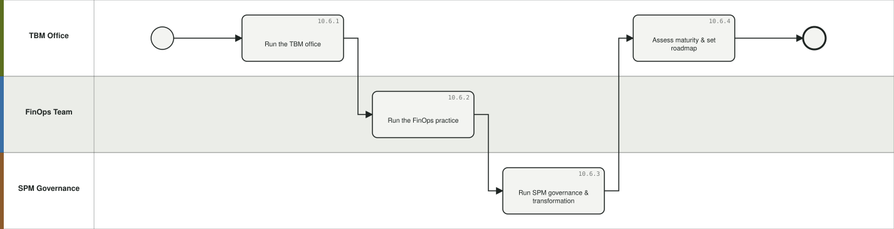

**10.6.1 Run the TBM office** `P-0141` — Operate TBM governance: roles (sponsor, practice lead, analyst, admin, change manager), stakeholder engagement, program roadmap. In a ZBB operating model the TBM office also owns the decision-unit register and hosts the cost-category-owner community.
- What you get: sustained TBM practice
- BPMN: lane *TBM Office*, Task | Delivery model: Any | Product: Costing (practice) | Who: TBM Office & analysts (TBM Office) | When: Continuous (Continuous)
- Inputs: Executive sponsorship → Outputs: Sustained TBM practice
- Config: TBM office roles, governance forums, OCM & training, procurement/vendor alignment; ZBB: cost-category owner matrix, rotation calendar
- Framework: TBM Foundations & Engagement | Flows: — | Evidence: TBM Council; TBM assessment

**10.6.2 Run the FinOps practice** `P-0142` — Operate the FinOps team: policies, education, persona enablement, intersecting disciplines (Security, ITAM, ITSM, Procurement).
- What you get: sustained FinOps practice
- BPMN: lane *FinOps Team*, Task | Delivery model: Any | Product: Cloudability (practice) | Who: FinOps practitioners (FinOps team) | When: Continuous (Continuous)
- Inputs: Cloud operating model → Outputs: Sustained FinOps practice
- Config: FinOps roles/personas, governance policies, training, Crawl/Walk/Run capability plans
- Framework: FinOps: Manage the FinOps Practice | Flows: — | Evidence: FinOps Framework; FinOps assessment

**10.6.3 Run SPM governance & transformation** `P-0143` — Operate SPM governance and the maturity journey (Initiate>Discover>Accelerate>Scale & Evolve); assess maturity and transition to customer governance.
- What you get: advancing SPM maturity
- BPMN: lane *SPM Governance*, Task | Delivery model: Any | Product: Targetprocess (practice) | Who: Agile teams & RTEs, Platform admins & integration (SPM governance, LACE, Transformation office) | When: Quarterly (Quarterly + phases)
- Inputs: Maturity assessments → Outputs: Advancing SPM maturity
- Config: SPM maturity model (6 domains x lenses, Foundational>Scaled), journey map tracks, governance cadences, domain owners
- Framework: SPM maturity model | Flows: — | Evidence: SPM Maturity Assessment; SPM journey map

**10.6.4 Assess maturity & set roadmap** `P-0144` — Run periodic TBM / FinOps / SPM maturity assessments, score against target state and prioritize the capability roadmap.
- What you get: scores, gaps, roadmap
- BPMN: lane *TBM Office*, Task | Delivery model: Any | Product: All four | Who: TBM Office & analysts, FinOps practitioners, Platform admins & integration (TBM Office, FinOps, SPM governance) | When: Annual / per cycle (Annual/semi-annual)
- Inputs: Assessment instruments → Outputs: Scores, gaps, roadmap
- Config: TBM 6-dimension assessment (0-5), FinOps 4-domain Crawl/Walk/Run, SPM 6-domain x lens assessment (1-5), roadmap planning
- Framework: All three frameworks | Flows: — | Evidence: TBM/FinOps/SPM assessment instruments (Metlife examples)

### 10.7 Run AI-assisted planning & delivery intelligence `G-107`

Original name: AI-Assisted Planning & Delivery Intelligence. BPMN: [`10.7.bpmn`](../diagrams/bpmn/generated/10.7.bpmn) · 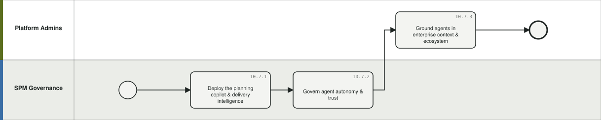

**10.7.1 Deploy the planning copilot & delivery intelligence** `P-0147` — Stand up AI-assisted capabilities over the SPM stack: PI readiness scoring with resolution recommendations, dependency discovery, capacity validation, objective drafting & quality analysis, live planning copilot with real-time impact analysis, commitment tracking and predictive health briefings.
- What you get: readiness scores, dependency heatmaps, briefings, scenario analyses
- BPMN: lane *SPM Governance*, Task | Delivery model: Agile | Product: Targetprocess (+ Jira/ADO, Costing, watsonx) | Who: Portfolio management, Agile teams & RTEs, Platform admins & integration (RTE/STE, Portfolio Mgmt, Transformation office) | When: Event-driven (Implementation + per PI)
- Inputs: Planning & delivery data, historical performance → Outputs: Readiness scores, dependency heatmaps, briefings, scenario analyses
- Config: MVP capability set: readiness assessment & scoring, resolution recommendations, dependency discovery/visualization, capacity validation, objective drafting/quality, live copilot, real-time impact analysis, risk/ROAM facilitation, commitment baseline & tracking, executive/RTE briefings; Targetprocess + Jira/ADO integration
- Framework: SAFe augmentation | SPM | Flows: — | Evidence: PI Planning/EVD Agent requirements (IBM, anonymized) §5, §18 (MVP)

**10.7.2 Govern agent autonomy & trust** `P-0148` — Configure human-in-the-loop governance for AI planning capabilities: the agent analyzes, recommends and drafts but never autonomously approves material planning, funding, scope or commitment changes; recommendations must be explainable (what, why, data evaluated, confidence) and disclose missing or stale data.
- What you get: configured autonomy rules, audit trail
- BPMN: lane *SPM Governance*, Task | Delivery model: Any | Product: All four | Who: Platform admins & integration (Governance, Transformation office, Security) | When: Event-driven (Implementation + reviews)
- Inputs: Governance policies → Outputs: Configured autonomy rules, audit trail
- Config: Configurable autonomy/approval rules, RBAC & data entitlements, separation of duties, action history & recommendation traceability, data-source attribution, model/prompt governance, sensitive-data protection
- Framework: AI governance | Flows: — | Evidence: PI Planning/EVD Agent requirements (IBM, anonymized) §3, §15

**10.7.3 Ground agents in enterprise context & ecosystem** `P-0149` — Maintain the governed local knowledge the agents reason over (planning playbooks, definitions of ready/done, objective templates, taxonomies, funding & capitalization policies) and the integration fabric: core systems, source-of-truth and sync rules, and the broader multi-agent ecosystem (Portfolio, Product, Workforce, Financial agents).
- What you get: version-controlled agent knowledge & integrations
- BPMN: lane *Platform Admins*, Task | Delivery model: Any | Product: All four (+ Jira/ADO, GitHub, HR, BI, Miro) | Who: TBM Office & analysts, Engineering, Platform admins & integration (Platform admins, TBM Office, Architecture) | When: Continuous (Continuous)
- Inputs: Enterprise context, integration inventory → Outputs: Version-controlled agent knowledge & integrations
- Config: Version-controlled context store (journeys, architectures, policies, conventions), MCP-based extensibility (approved tools, customer agents, role-based tool access, auditable actions), source-of-truth & two-way sync governance, stale/conflicting-data disclosure
- Framework: AI architecture | TBM: Data | Flows: — | Evidence: PI Planning/EVD Agent requirements (IBM, anonymized) §13-14
