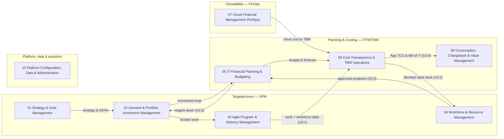
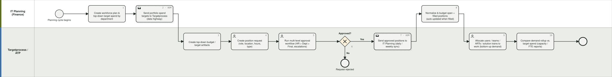
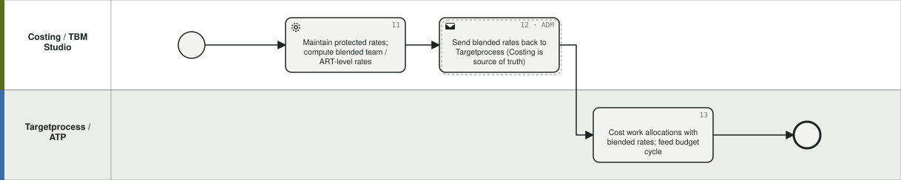
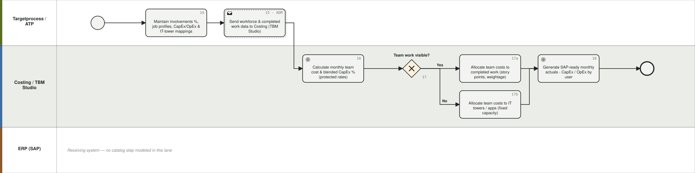
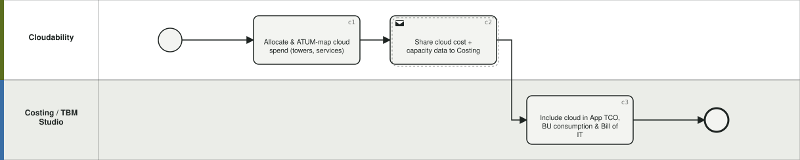
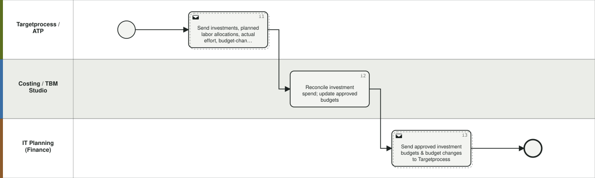
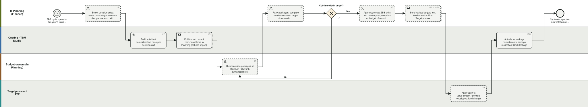

# IBM Apptio Process Catalog — Overview (L0 map) · v0.6.0

Generated from `data/catalog.json` — **edit the JSON, not this file.** Structure: 9 L0 · 45 L1 · 149 L2 · 7 cross-tool flows. Live site: `site/index.html` (GitHub Pages).

| L0 | Area | Primary product | Band | L1 / L2 | Default BPMN lanes |
|---|---|---|---|---|---|
| 01 | **Strategy & Goal Management** | Targetprocess | steer | 2 / 6 | C-Suite/Strategy; Portfolio Management; Finance |
| 02 | **Demand & Portfolio Investment Management** | Targetprocess | core | 5 / 15 | Requesters/Business; Portfolio Management; PMO; Finance |
| 03 | **Agile Program & Delivery Management** | Targetprocess | core | 4 / 15 | RTE/Program; Agile Teams; Product Management; Dev tools (Jira/ADO) |
| 04 | **Workforce & Resource Management** | Targetprocess | enable | 5 / 16 | Resource Management; Portfolio Management; HR/Approvers; Finance (IT Planning) |
| 05 | **IT Financial Planning & Budgeting** | Planning | core | 8 / 29 | IT Finance; Budget Owners; FP&A; CIO |
| 06 | **Cost Transparency & TBM Operations** | Costing | core | 6 / 21 | TBM Office/IT Finance; Costing Admin; App/Service Owners; ERP-GL |
| 07 | **Cloud Financial Management (FinOps)** | Cloudability | core | 6 / 21 | FinOps Practitioner; Engineering; Finance; Cloud vendors |
| 08 | **Consumption, Chargeback & Value Management** | Costing (Billing) | core | 2 / 6 | TBM Office; BU Owners; CIO/CFO; Service Owners |
| 10 | **Platform Configuration, Data & Administration** | All four | enable | 7 / 20 | Platform Admins; TBM Office; FinOps Team; SPM Governance; Integration Team |

## L0 landscape

## Area descriptions

**01 — Strategy & Goal Management.** Define enterprise strategy and cascade it as measurable objectives so every portfolio, program and team has line of sight from work to strategic intent.

**02 — Demand & Portfolio Investment Management.** Capture all demand into one funnel, qualify and prioritize it against strategy and capacity, fund the winning investments, and manage the portfolio roadmap and its value realization.

**03 — Agile Program & Delivery Management.** Plan and execute work on a PI and iteration cadence across ARTs, solution trains and teams, including hybrid/waterfall delivery, release management and value stream flow.

**04 — Workforce & Resource Management.** Maintain the workforce baseline (people, teams, involvements, job profiles), plan capacity against demand, allocate resources to work, govern position requests, and track time.

**05 — IT Financial Planning & Budgeting.** Build the annual IT budget and rolling forecasts on the TBM taxonomy - labor, contracts, assets and investments - manage variance, and publish targets that drive portfolio behavior. The budget can be built incrementally/driver-based (05.1) or zero-based for selected decision units (05.8); both converge on the same review, approval, budget-of-record and target-publication steps.

**06 — Cost Transparency & TBM Operations.** Run the monthly TBM engine: ingest actuals, allocate costs through cost pools and towers to applications, services and business units, cost labor defensibly, and analyze TCO.

**07 — Cloud Financial Management (FinOps).** Operate the FinOps lifecycle - ingest and allocate multi-cloud and container spend, report it, respond to anomalies, optimize usage and rates, and plan cloud budgets and migrations.

**08 — Consumption, Chargeback & Value Management.** Turn transparency into accountability: showback and Bill of IT to business units, price services, shape demand, benchmark against peers, and run the executive value operating rhythm.

**10 — Platform Configuration, Data & Administration.** The enabling processes: configure each product, operate the data pipelines and integrations, and run the TBM/FinOps/SPM practices that govern adoption and maturity.

## Cross-tool flows (overlays on the L2 spine)

The story: **"Targets down. Rates back. Actuals in. TCO up."** — plus cloud-to-TBM, the investment loop and the zero-based re-base. Each flow has a BPMN diagram in `diagrams/bpmn/generated/flow-<ID>.bpmn` (snapshot in `assets/diagrams/`). The reviewed master model is `diagrams/bpmn/custom/apptio-e2e-flow.bpmn`.

### UC3 — Targets down: Portfolio target spend

Finance builds workforce plans and top-down target spend in Planning; targets ride the data highway to Targetprocess as budget artifacts; portfolio allocates teams to work and compares bottom-up demand to targets; position requests round-trip through approval back into the plan.

Cadence: Planning cycle + daily/weekly sync. Lanes: IT Planning (Finance); Targetprocess / ATP. Upstream: —. Downstream: UC2, INV, ZBB.

| Step | Type | Lane | Task / event | Catalog | Notes |
|---|---|---|---|---|---|
| start | Start event | IT Planning (Finance) | Planning cycle begins |  |  |
| 1 | Task | IT Planning (Finance) | Create workforce plan & top-down target spend by department | 05.1.2, 05.4.1 | At whatever level you budget: department, cost center, ART, solution train |
| 2 | Send task (ADM) | IT Planning (Finance) | Send portfolio spend targets to Targetprocess (data highway) | 05.1.2, 10.5.1 | Lane crossing: ADM |
| 3 | Task | Targetprocess / ATP | Create top-down budget / target artifacts | 02.4.2 |  |
| 4 | User task | Targetprocess / ATP | Create position request (role, location, hours, type) | 04.4.1 | Department link ties request to finance budget line |
| 5 | User task | Targetprocess / ATP | Run multi-level approval workflow (HR > Dept > Final, escalations) | 04.4.2 |  |
| 6 | XOR gateway | Targetprocess / ATP | Approved? | 04.4.2 | No: end event 'Request rejected'; Yes: continue |
| 7 | Send task (ADM) | Targetprocess / ATP | Send approved positions to IT Planning (daily / weekly sync) | 04.4.3 | Only approved positions cross |
| 8 | Task | IT Planning (Finance) | Normalize & budget open + filled positions (auto-updated when filled) | 05.4.1, 04.4.3 | Round-trip: fill event in ATP auto-updates Planning record |
| 9 | User task | Targetprocess / ATP | Allocate users / teams / ARTs / solution trains to work (bottom-up demand) | 04.3.1 |  |
| 10 | Task | Targetprocess / ATP | Compare demand rollup vs. target spend (capacity / FTE reports) | 04.2.2, 02.4.3 | Forward-looking: e.g. 3 months out demand exceeds FTE |

### UC2 — Rates back: Work allocation rates

Costing maintains protected individual rates, computes blended team/ART rates and publishes them to Targetprocess so work allocations can be costed without exposing compensation.

Cadence: Regular cadence. Lanes: Costing / TBM Studio; Targetprocess / ATP. Upstream: UC3. Downstream: UC1.

| Step | Type | Lane | Task / event | Catalog | Notes |
|---|---|---|---|---|---|
| 11 | Service task | Costing / TBM Studio | Maintain protected rates; compute blended team / ART-level rates | 06.4.1 | Individual rates never leave Costing |
| 12 | Send task (ADM) | Costing / TBM Studio | Send blended rates back to Targetprocess (Costing is source of truth) | 06.4.2 | Design decision: rate exposure level; true-up pattern |
| 13 | Task | Targetprocess / ATP | Cost work allocations with blended rates; feed budget cycle | 04.3.1, 02.4.3 |  |

### UC1 — Actuals in: Labor capitalization

Targetprocess sends involvements, job profiles, mappings and completed work to Costing; TBM Studio computes monthly team cost and blended CapEx %, allocates to work (story points) or towers (fixed capacity), and generates the SAP-ready CapEx/OpEx actuals file that deprecates time writing.

Cadence: Monthly. Lanes: Targetprocess / ATP; Costing / TBM Studio; ERP (SAP). Upstream: UC2. Downstream: UC4.

| Step | Type | Lane | Task / event | Catalog | Notes |
|---|---|---|---|---|---|
| 14 | Task | Targetprocess / ATP | Maintain involvements %, job profiles, CapEx/OpEx & IT-tower mappings | 04.1.2, 04.1.3 | Three ingredients: job profiles, involvements, protected rates |
| 15 | Send task (ADM) | Targetprocess / ATP | Send workforce & completed work data to Costing (TBM Studio) | 04.5.3, 06.4.3 |  |
| 16 | Service task | Costing / TBM Studio | Calculate monthly team cost & blended CapEx % (protected rates) | 06.4.4 |  |
| 17 | XOR gateway | Costing / TBM Studio | Team work visible? | 06.4.5 | Yes: story-point allocation; No: fixed-capacity |
| 17a | Task | Costing / TBM Studio | Allocate team costs to completed work (story points, weightage) | 06.4.5 | Same allocation principles as TBM |
| 17b | Task | Costing / TBM Studio | Allocate team costs to IT towers / apps (fixed capacity) | 06.4.5 | Ops teams without visible backlog (e.g. ServiceNow) |
| 18 | Service task | Costing / TBM Studio | Generate SAP-ready monthly actuals - CapEx / OpEx by user | 06.4.6 | Deprecates time writing; join gateway before this step |

### UC4 — TCO up: Cost actuals to application TCO

All cost actuals roll up to Application TCO; because labor arrives attached to work, run vs change attribution is driven by real delivery data rather than a story-level Jira import.

Cadence: Monthly. Lanes: Costing / TBM Studio. Upstream: UC1, CLD. Downstream: ZBB.

| Step | Type | Lane | Task / event | Catalog | Notes |
|---|---|---|---|---|---|
| 19 | Task | Costing / TBM Studio | Roll cost actuals up to Application TCO | 06.3.2, 06.3.3 |  |
| 20 | Task | Costing / TBM Studio | Attribute labor cost to run vs. change in App TCO view | 06.3.3, 06.2.3 | Driven by real delivery data, not story-level Jira import |
| end | End event | Costing / TBM Studio | Finance & App TCO reporting | 06.1.4, 08.1.1 |  |

### CLD — Cloud to TBM: Cloud cost into the TBM model

Cloud cost and capacity data flows from Cloudability into the Costing model, ATUM-aligned, so Application TCO and business-unit consumption include cloud.

Cadence: Monthly. Lanes: Cloudability; Costing / TBM Studio. Upstream: —. Downstream: UC4.

| Step | Type | Lane | Task / event | Catalog | Notes |
|---|---|---|---|---|---|
| c1 | Task | Cloudability | Allocate & ATUM-map cloud spend (towers, services) | 07.2.3, 07.2.4 |  |
| c2 | Send task | Cloudability | Share cloud cost + capacity data to Costing | 07.2.4 | Monthly |
| c3 | Task | Costing / TBM Studio | Include cloud in App TCO, BU consumption & Bill of IT | 06.3.3, 08.1.1, 08.1.2 |  |

### INV — Investment loop: Portfolio-finance investment round-trip

Investments, planned allocations and actual effort flow from Targetprocess to Costing/Planning; approved budgets and budget changes flow back - continuous portfolio-finance reconciliation.

Cadence: Continuous. Lanes: Targetprocess / ATP; Costing / TBM Studio; IT Planning (Finance). Upstream: UC3. Downstream: —.

| Step | Type | Lane | Task / event | Catalog | Notes |
|---|---|---|---|---|---|
| i1 | Send task | Targetprocess / ATP | Send investments, planned labor allocations, actual effort, budget-change requests to Costing/Planning | 02.2.3, 05.7.3 |  |
| i2 | Task | Costing / TBM Studio | Reconcile investment spend; update approved budgets | 05.7.1, 05.7.3 |  |
| i3 | Send task | IT Planning (Finance) | Send approved investment budgets & budget changes to Targetprocess | 05.7.3, 02.4.2 | Budgets, Labor Data, Objectives, Financial Guidance down; Progress, Actuals, Key Results up |

### ZBB — ZBB re-base: Zero-based re-base to investment uplift

The zero-based cycle as a cross-tool flow: Costing supplies the fact base for in-scope decision units; Planning hosts package build, ranking, cut-line and approval; freed run spend rides the existing UC3 target feed to Targetprocess as an uplift; monthly actuals return via UC4 to police package commitments. Reuses UC3 and UC4 - no new integration.

Cadence: Per ZBB cycle (annual, rotational) + monthly monitoring. Lanes: IT Planning (Finance); Costing / TBM Studio; Budget owners (in Planning); Targetprocess / ATP. Upstream: UC3, UC4. Downstream: UC3.

| Step | Type | Lane | Task / event | Catalog | Notes |
|---|---|---|---|---|---|
| z0 | Start event (timer) | IT Planning (Finance) | ZBB cycle opens for this year's rotation slice | 05.8.1 | Rotational: each decision unit every 2-3 years |
| z1 | User task | IT Planning (Finance) | Select decision units; name cost-category owners x budget owners; define zero base | 05.8.1 |  |
| z2 | Service task | Costing / TBM Studio | Build activity & cost-driver fact base per decision unit | 05.8.2, 07.5.1 | Same allocated model as UC4; Cloudability rightsizing sets the cloud zero base |
| z3 | Send task | Costing / TBM Studio | Publish fact base & zero-base floors to Planning (actuals import) | 05.3.1 | Reuses Costing to Planning actuals integration |
| z4 | User task | Budget owners (in Planning) | Build decision packages at Minimum / Current / Enhanced tiers | 05.8.3 | Labor positions come from Targetprocess via UC3 steps 7-8 |
| z5 | User task | IT Planning (Finance) | Rank packages; compare cumulative cost to target; draw cut-line; pressure-test | 05.8.4 | One Planning version per cut-line scenario |
| z6 | XOR gateway | IT Planning (Finance) | Cut-line within target? | 05.8.4 | No: return packages for rework (loop to z4); Yes: continue |
| z7 | User task | IT Planning (Finance) | Approve; merge ZBB units into master plan; snapshot as budget of record & savings baseline | 05.8.5, 05.1.4, 05.1.5 |  |
| z8 | Send task (ADM) | IT Planning (Finance) | Send revised targets incl. freed-spend uplift to Targetprocess | 05.8.5 | = UC3 step 2, re-run with the post-ZBB target |
| z9 | Task | Targetprocess / ATP | Apply uplift to value-stream / portfolio envelopes; fund change | 02.4.2, 02.2.3 |  |
| z10 | Task (monthly) | Costing / TBM Studio | Actuals vs package commitments; savings realization; block leakage | 05.8.6, 06.2.2, 05.3.2, 08.2.3 |  |
| end | End event | IT Planning (Finance) | Cycle retrospective; next rotation slice selected | 05.8.6 |  |

## Hybrid planning vs agile-only

Every L2 carries a Delivery Model tag: Any (methodology-agnostic), Agile (PI planning, Portfolio Kanban, WSJF, story-point capitalization), Traditional (stage-gate/milestone governance), or Hybrid (both governed side by side: 02.3.4 hybrid portfolio view, 02.4.1/02.2.3 dual funding, 04.2.1/04.3.4 team- and role-based capacity, 06.4.5 multi-approach capitalization).

## Budgeting methods

Budgeting-related L2s (02.4, 05.1, 05.8, 07.6) carry a Budgeting-method tag (Incremental, Driver-based, ZBB, Rolling, Lean/participatory, Any). ZBB re-bases the run base; lean/participatory budgeting governs the change envelope; FinOps rolling budgets absorb the variable cloud tail. See flow ZBB and group 05.8.

## Framework framing

**TBM** — Foundations (Roles, Data, Tools, Methods, Change) | TBM Model | TBM Taxonomy (Cost Pools > Resource/IT Towers > Solutions > Consumers) | Outcomes | Value Drivers

- Disciplines/capabilities: Cost Transparency; Delivering Value (Bill of IT, TCO); Planning & Governance; Benchmarking; Shaping Demand; Run/Grow/Transform
- Maturity: TBM practice assessment: 6 dimensions (Engagement, Taxonomy, Data, Automation, Reporting & Metrics, Value), scale 0-5 (NA, Initial, Developing, Defined, Managed, Optimized)

**FinOps** — Domains: Understand Usage & Cost; Quantify Business Value; Optimize Usage & Cost; Manage the FinOps Practice. Phases: Inform > Optimize > Operate

- Disciplines/capabilities: Capabilities: Data Ingestion, Allocation, Reporting & Analytics, Anomaly Mgmt | Planning & Estimating, Forecasting, Budgeting, KPIs & Benchmarking, Unit Economics | Architecting & Workload Placement, Usage Optimization, Rate Optimization, Licensing & SaaS, Sustainability | Practice Operations, Governance Policy & Risk, Education, Invoicing & Chargeback, Assessment, Tools & Services, Intersecting Disciplines
- Maturity: Crawl / Walk / Run per capability; personas: Practitioner, Engineering, Finance, Leadership, Procurement, Product + allied (ITAM, ITFM/TBM, ITSM, Security, Sustainability)

**SPM** — Market (SPM) > Products > Solution Areas (WFM, HPM, EAP, FPM, POM) > Domains (Strategic Planning, Portfolio Mgmt, Resource Mgmt, Financial Mgmt) > Use Cases

- Disciplines/capabilities: 6 business processes: Demand Intake/Funding Requests; OKR Prioritization; Demand & Capacity Mgmt; Dependency Mgmt; Capitalization; Value Stream Mgmt. 16 capabilities across the 4 solution areas
- Maturity: SPM maturity: 6 domains (Strategic Planning, Portfolio Mgmt, Financial Mgmt, Demand Intake, Value Realization, Organization) x lenses (Knowledge, Process, Adoption, Metrics, Automation, Skills/Governance), scale 1-5 Foundational > Structured > Managed > Optimized > Scaled

**SAFe** — Lean Portfolio Management: Strategy & Investment Funding; Agile Portfolio Operations; Lean Governance

- Disciplines/capabilities: Portfolio Kanban, WSJF, Lean Budgets & Guardrails, Participatory Budgeting, PI Planning, ARTs/Solution Trains, OKRs, Value Stream Management, flow metrics
- Maturity: Measure & Grow assessments
