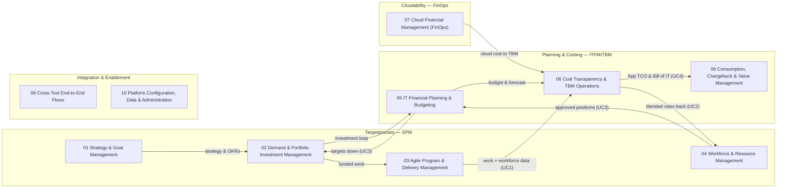

# IBM Apptio Process Catalog — Overview (L0 Map)

Generated from `data/` — **edit the YAML, not this file.**

| L0 | Area | Primary tool | Framing |
|---|---|---|---|
| 01 | **Strategy & Goal Management** | Targetprocess | SPM: Strategic Planning | SAFe: Strategic Themes, OKRs | TBM: Business-Aligned Portfolio |
| 02 | **Demand & Portfolio Investment Management** | Targetprocess | SPM: Demand Intake, Portfolio Mgmt, Financial Mgmt | SAFe: LPM, Portfolio Kanban, WSJF | TBM: Investment in Innovation |
| 03 | **Agile Program & Delivery Management** | Targetprocess | SPM: Portfolio Mgmt | SAFe: PI Planning, ART, VSM | EAP |
| 04 | **Workforce & Resource Management** | Targetprocess | SPM: Workforce/Resource Mgmt (WFM) | TBM: Internal/External Labor cost pools |
| 05 | **IT Financial Planning & Budgeting** | Planning | TBM: Plan & Govern | ITFM: budgeting, forecasting, variance | FinOps: Budgeting/Forecasting (intersect) |
| 06 | **Cost Transparency & TBM Operations** | Costing | TBM: Cost Transparency, taxonomy (ATUM) | ITFM | FinOps: Allocation (intersect) |
| 07 | **Cloud Financial Management (FinOps)** | Cloudability | FinOps: all four domains, Inform-Optimize-Operate | TBM: cloud cost pool |
| 08 | **Consumption, Chargeback & Value Management** | Costing (Billing) | TBM: Delivering Value, Shaping Demand, Benchmarking | FinOps: Invoicing & Chargeback, Unit Economics |
| 09 | **Cross-Tool End-to-End Flows** | All four | TBM + SPM + FinOps integrated; ADM/Datalink as integration fabric |
| 10 | **Platform Configuration, Data & Administration** | All four | TBM Foundations (Roles, Data, Tools, Methods, Change) | FinOps: Manage the Practice | SPM maturity model |

## L0 landscape

## Cross-tool E2E flows

The story: **"Targets down. Rates back. Actuals in. TCO up."** Full step tables in `data/flows.yaml`; the reviewed master model is `diagrams/bpmn/custom/apptio-e2e-flow.bpmn`.

### UC3 — Portfolio Target Spend (targets down)

| Step | Type | Lane | Task / Event | Notes |
|---|---|---|---|---|
| start | Start event | IT Planning (Finance) | Planning cycle begins |  |
| 1 | Task | IT Planning (Finance) | Create workforce plan & top-down target spend by department | At whatever level you budget: department, cost center, ART, solution train |
| 2 | Send task (ADM) | IT Planning (Finance) | Send portfolio spend targets to ATP (data highway) | Lane crossing: ADM |
| 3 | Task | Targetprocess / ATP | Create top-down budget / target artifacts |  |
| 4 | User task | Targetprocess / ATP | Create position request (role, location, hours, type) | Department link ties request to finance budget line |
| 5 | User task | Targetprocess / ATP | Run multi-level approval workflow (HR > Dept > Final, escalations) |  |
| 6 | XOR gateway | Targetprocess / ATP | Approved? | No > end event 'Request rejected'; Yes > continue |
| 7 | Send task (ADM) | Targetprocess / ATP | Send approved positions to IT Planning (daily / weekly sync) | Only approved positions cross |
| 8 | Task | IT Planning (Finance) | Normalize & budget open + filled positions (auto-updated when filled) | Round-trip: fill event in ATP auto-updates Planning record |
| 9 | User task | Targetprocess / ATP | Allocate users / teams / ARTs / solution trains to work (bottom-up demand) |  |
| 10 | Task | Targetprocess / ATP | Compare demand rollup vs. target spend (capacity / FTE reports) | Forward-looking: e.g. 3 months out demand exceeds FTE |

### UC2 — Work Allocation Rates (rates back)

| Step | Type | Lane | Task / Event | Notes |
|---|---|---|---|---|
| 11 | Service task | Costing - Apptio One / TBM Studio | Maintain protected rates; compute blended team / ART-level rates | Individual rates never leave Costing |
| 12 | Send task (ADM) | Costing - Apptio One / TBM Studio | Send blended rates back to ATP (Costing is source of truth) | Design decision: rate exposure level; true-up pattern |
| 13 | Task | Targetprocess / ATP | Cost work allocations with blended rates; feed budget cycle |  |

### UC1 — Labor Capitalization (actuals in)

| Step | Type | Lane | Task / Event | Notes |
|---|---|---|---|---|
| 14 | Task | Targetprocess / ATP | Maintain involvements %, job profiles, CapEx/OpEx & IT-tower mappings | Three ingredients: job profiles, involvements, protected rates |
| 15 | Send task (ADM) | Targetprocess / ATP | Send workforce & completed work data to Costing (TBM Studio) |  |
| 16 | Service task | Costing - Apptio One / TBM Studio | Calculate monthly team cost & blended CapEx % (protected rates) |  |
| 17 | XOR gateway | Costing - Apptio One / TBM Studio | Team work visible? | Yes > story-point allocation; No > fixed-capacity |
| 17a | Task | Costing - Apptio One / TBM Studio | Allocate team costs to completed work (story points, weightage) | Same allocation principles as TBM |
| 17b | Task | Costing - Apptio One / TBM Studio | Allocate team costs to IT towers / apps (fixed capacity) | Ops teams without visible backlog (e.g. ServiceNow) |
| 18 | Service task | Costing - Apptio One / TBM Studio | Generate SAP-ready monthly actuals - CapEx / OpEx by user | Deprecates time writing; join gateway before this step |

### UC4 — Cost Actuals to App TCO (TCO up)

| Step | Type | Lane | Task / Event | Notes |
|---|---|---|---|---|
| 19 | Task | Costing - Apptio One / TBM Studio | Roll cost actuals up to Application TCO |  |
| 20 | Task | Costing - Apptio One / TBM Studio | Attribute labor cost to run vs. change in App TCO view | Driven by real delivery data, not story-level Jira import |
| end | End event | Costing - Apptio One / TBM Studio | Finance & App TCO reporting |  |

### CLD — Cloud-to-TBM

| Step | Type | Lane | Task / Event | Notes |
|---|---|---|---|---|
| c1 | Task | Cloudability | Allocate & ATUM-map cloud spend (towers, services) |  |
| c2 | Send task | Cloudability | Share cloud cost + capacity data to Costing | Monthly |
| c3 | Task | Costing - Apptio One / TBM Studio | Include cloud in App TCO, BU consumption & Bill of IT |  |

### INV — Investment Loop

| Step | Type | Lane | Task / Event | Notes |
|---|---|---|---|---|
| i1 | Send task | Targetprocess / ATP | Send investments, planned labor allocations, actual effort, budget-change requests to Costing/Planning |  |
| i2 | Task | Costing - Apptio One / TBM Studio | Reconcile investment spend; update approved budgets |  |
| i3 | Send task | IT Planning (Finance) | Send approved investment budgets & budget changes to ATP | Desjardins labels: Budgets, Labor Data, Objectives, Financial Guidance down; Progress, Actuals, Key Results up |

## Hybrid planning vs agile-only

Every L2 carries a Delivery Model tag: Any (methodology-agnostic), Agile (PI planning, Portfolio Kanban, WSJF, story-point capitalization), Traditional (stage-gate/milestone governance), or Hybrid (both governed side by side: 02.3.4 hybrid portfolio view, 02.4.1/02.2.3 dual funding, 04.2.1/04.3.4 team- and role-based capacity, 06.4.5 multi-approach capitalization).
